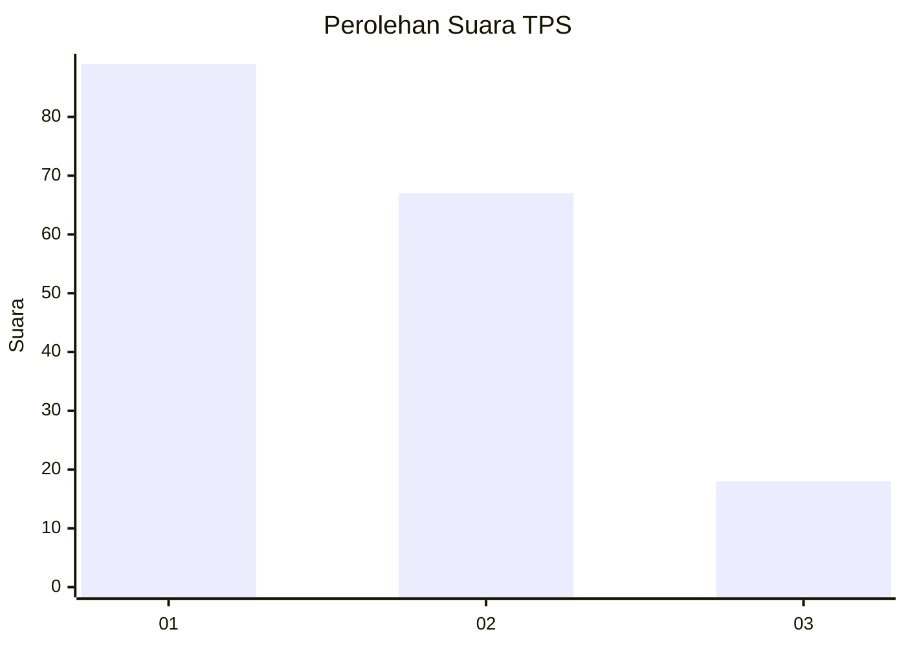
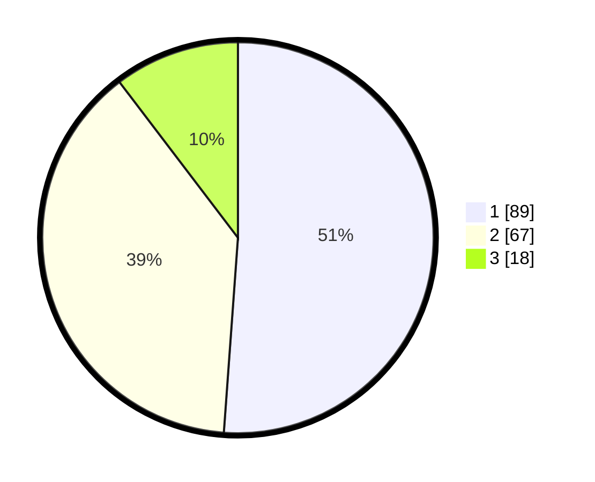

# Hasil

## Grafik

## Tabel

| No. | Nama Paslon    | Suara | Suara (raw) | Persentase |
|:--- |:-------------- | -----:| -----------:| ----------:|
| 1   | ANIES MUHAIMIN | 89    | [89][p-1]   | 51,15      |
| 2   | PRABOWO GIBRAN | 67    | [67][p-2]   | 38,51      |
| 3   | GANJAR MAHFUD  | 18    | [18][p-3]   | 10,34      |

[p-1]: https://github.com/gigit-pemilu/pemilu-2024-35-jawa-timur/blob/main/pilpres/hitung-suara/sub/35-jawa-timur/sub/29-sumenep/sub/17-batuputih/sub/2009-batuputih-daya/sub/004-tps/sub/paslon-1.txt
[p-2]: https://github.com/gigit-pemilu/pemilu-2024-35-jawa-timur/blob/main/pilpres/hitung-suara/sub/35-jawa-timur/sub/29-sumenep/sub/17-batuputih/sub/2009-batuputih-daya/sub/004-tps/sub/paslon-2.txt
[p-3]: https://github.com/gigit-pemilu/pemilu-2024-35-jawa-timur/blob/main/pilpres/hitung-suara/sub/35-jawa-timur/sub/29-sumenep/sub/17-batuputih/sub/2009-batuputih-daya/sub/004-tps/sub/paslon-3.txt

## Foto C Plano

https://sirekap-obj-formc.kpu.go.id/556d/pemilu/ppwp/35/29/17/20/09/3529172009004-20240215-042203--03fbc4f4-0a98-4890-9b68-a45219118c02.jpg

https://sirekap-obj-formc.kpu.go.id/556d/pemilu/ppwp/35/29/17/20/09/3529172009004-20240215-040734--0f1d5fb0-e906-4d93-aae7-c99d31182d7f.jpg

https://sirekap-obj-formc.kpu.go.id/556d/pemilu/ppwp/35/29/17/20/09/3529172009004-20240215-041341--5394125b-5147-46ca-8270-e99cbbb418ec.jpg

## Metadata

| Key        | Value               |
| ---------- | ------------------- |
| Time Stamp | 2024-02-24 22:31:28 |

