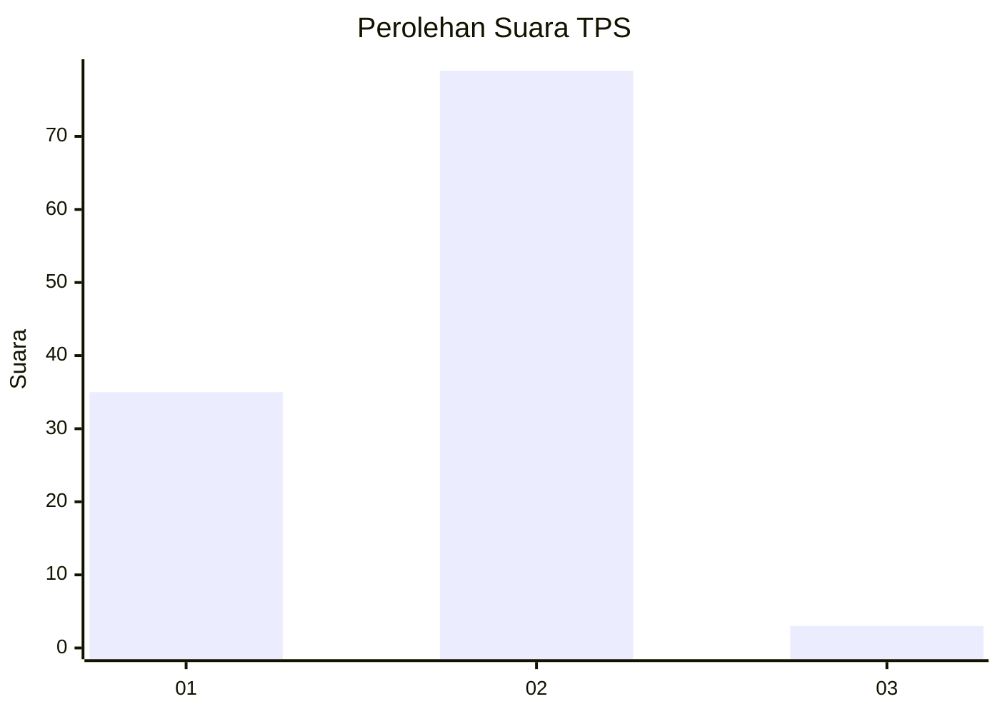
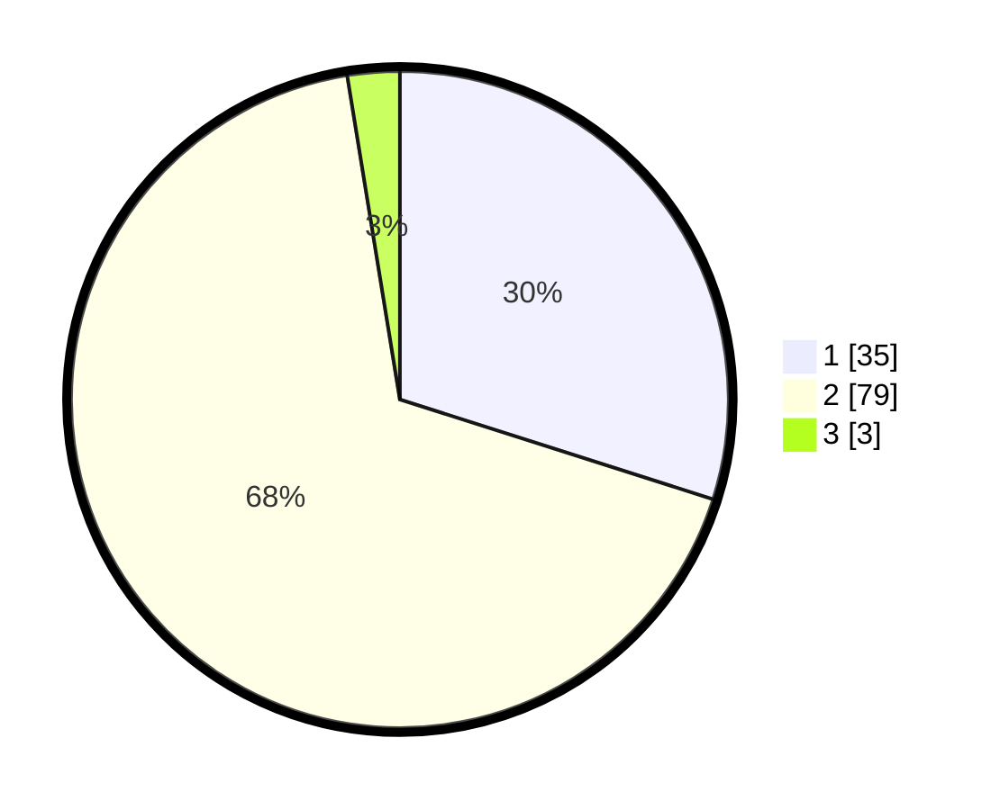

# Hasil

## Grafik

## Tabel

| No. | Nama Paslon    | Suara | Suara (raw) | Persentase |
|:--- |:-------------- | -----:| -----------:| ----------:|
| 1   | ANIES MUHAIMIN | 35    | [35][p-1]   | 29,91      |
| 2   | PRABOWO GIBRAN | 79    | [79][p-2]   | 67,52      |
| 3   | GANJAR MAHFUD  | 3     | [3][p-3]    | 2,56       |

[p-1]: https://github.com/gigit-pemilu/pemilu-2024-35-jawa-timur/blob/main/pilpres/hitung-suara/sub/35-jawa-timur/sub/29-sumenep/sub/17-batuputih/sub/2009-batuputih-daya/sub/005-tps/sub/paslon-1.txt
[p-2]: https://github.com/gigit-pemilu/pemilu-2024-35-jawa-timur/blob/main/pilpres/hitung-suara/sub/35-jawa-timur/sub/29-sumenep/sub/17-batuputih/sub/2009-batuputih-daya/sub/005-tps/sub/paslon-2.txt
[p-3]: https://github.com/gigit-pemilu/pemilu-2024-35-jawa-timur/blob/main/pilpres/hitung-suara/sub/35-jawa-timur/sub/29-sumenep/sub/17-batuputih/sub/2009-batuputih-daya/sub/005-tps/sub/paslon-3.txt

## Foto C Plano

https://sirekap-obj-formc.kpu.go.id/db65/pemilu/ppwp/35/29/17/20/09/3529172009005-20240215-114616--c5a3f0c9-9a39-4cb8-b5e1-175693377db7.jpg

https://sirekap-obj-formc.kpu.go.id/db65/pemilu/ppwp/35/29/17/20/09/3529172009005-20240215-114727--6d5fc241-6b03-49ed-a776-a2fea8f42f88.jpg

https://sirekap-obj-formc.kpu.go.id/db65/pemilu/ppwp/35/29/17/20/09/3529172009005-20240215-114844--64972a36-4100-4388-aa8c-ca34e6a96ded.jpg

## Metadata

| Key        | Value               |
| ---------- | ------------------- |
| Time Stamp | 2024-02-19 06:16:00 |

## DATA PEMILIH TETAP

Jumlah pemilih dalam DPT: **219**.
 * L: **98**.
 * P: **121**.

## DATA PENGGUNA HAK PILIH

Jumlah pengguna hak pilih dalam DPT: **200**.
 * L: **90**.
 * P: **110**.

Jumlah pengguna hak pilih dalam DPTb: **1**.
 * L: **0**.
 * P: **1**.

Jumlah pengguna hak pilih dalam DPK: **0**.
 * L: **0**.
 * P: **0**.

Jumlah pengguna hak pilih: **201**.
 * L: **90**.
 * P: **111**.

## JUMLAH SUARA SAH DAN TIDAK SAH

JUMLAH SELURUH SUARA SAH: **117**.

JUMLAH SUARA TIDAK SAH: **84**.

JUMLAH SELURUH SUARA SAH DAN SUARA TIDAK SAH: **201**.

