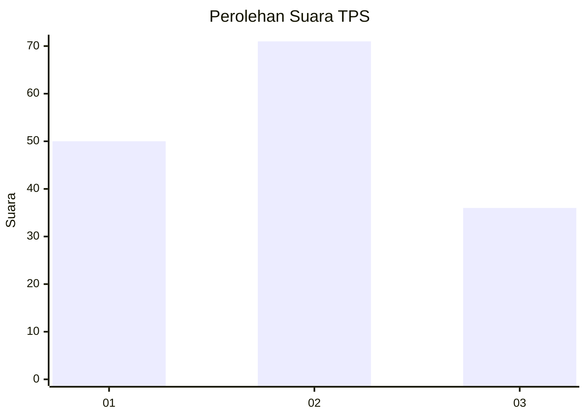
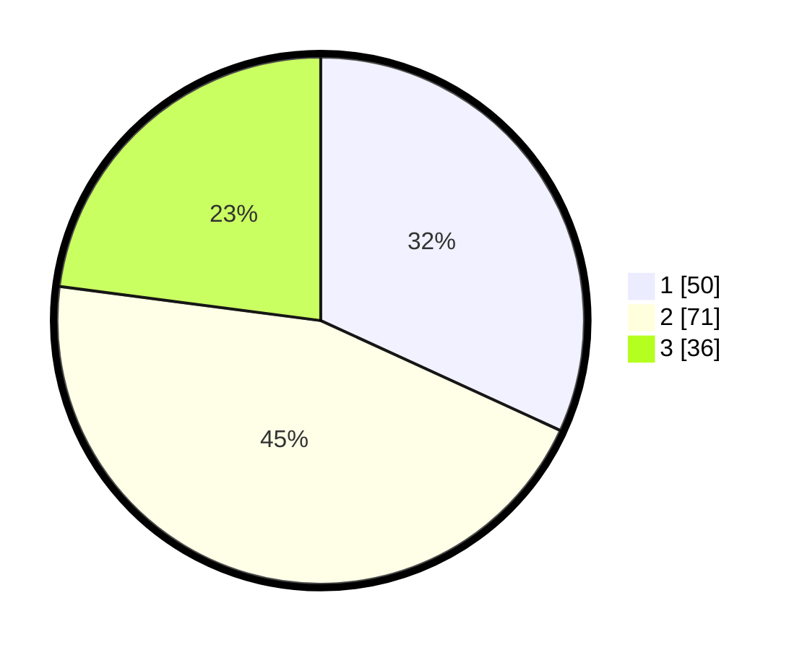

# Hasil

## Grafik

## Tabel

| No. | Nama Paslon    | Suara | Suara (raw) | Persentase |
|:--- |:-------------- | -----:| -----------:| ----------:|
| 1   | ANIES MUHAIMIN | 50    | [50][p-1]   | 31,85      |
| 2   | PRABOWO GIBRAN | 71    | [71][p-2]   | 45,22      |
| 3   | GANJAR MAHFUD  | 36    | [36][p-3]   | 22,93      |

[p-1]: https://github.com/gigit-pemilu/pemilu-2024/blob/main/pilpres/hitung-suara/sub/35-jawa-timur/sub/29-sumenep/sub/17-batuputih/sub/2009-batuputih-daya/sub/007-tps/sub/paslon-1.txt
[p-2]: https://github.com/gigit-pemilu/pemilu-2024/blob/main/pilpres/hitung-suara/sub/35-jawa-timur/sub/29-sumenep/sub/17-batuputih/sub/2009-batuputih-daya/sub/007-tps/sub/paslon-2.txt
[p-3]: https://github.com/gigit-pemilu/pemilu-2024/blob/main/pilpres/hitung-suara/sub/35-jawa-timur/sub/29-sumenep/sub/17-batuputih/sub/2009-batuputih-daya/sub/007-tps/sub/paslon-3.txt

## Foto C Plano

https://sirekap-obj-formc.kpu.go.id/1bfb/pemilu/ppwp/35/29/17/20/09/3529172009007-20240215-084838--8b88a91f-d985-4be2-9bdb-b66dec2fd90b.jpg

https://sirekap-obj-formc.kpu.go.id/1bfb/pemilu/ppwp/35/29/17/20/09/3529172009007-20240215-084916--b72bb978-6579-46f1-b8ea-0edb77aa0f58.jpg

https://sirekap-obj-formc.kpu.go.id/1bfb/pemilu/ppwp/35/29/17/20/09/3529172009007-20240214-213849--f4f77101-383a-47c0-9d46-ce0acf84ef0f.jpg

## Metadata

| Key        | Value               |
| ---------- | ------------------- |
| Time Stamp | 2024-02-16 21:01:00 |

