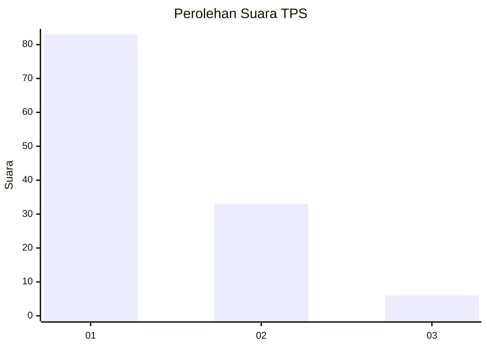
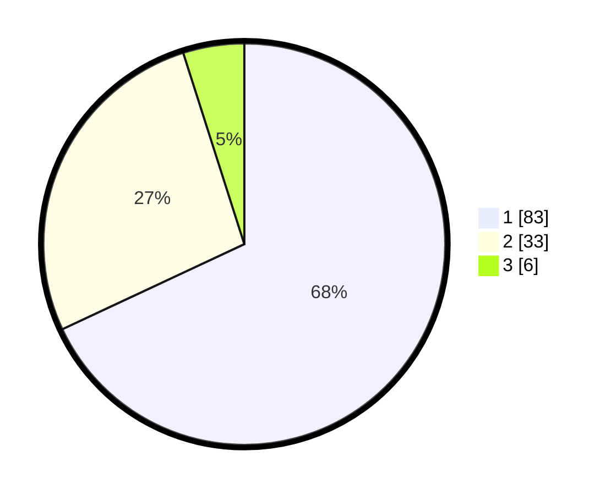

# Hasil

## Grafik

## Tabel

| No. | Nama Paslon    | Suara | Suara (raw) | Persentase |
|:--- |:-------------- | -----:| -----------:| ----------:|
| 1   | ANIES MUHAIMIN | 83    | [83][p-1]   | 68,03      |
| 2   | PRABOWO GIBRAN | 33    | [33][p-2]   | 27,05      |
| 3   | GANJAR MAHFUD  | 6     | [6][p-3]    | 4,92       |

[p-1]: https://github.com/gigit-pemilu/pemilu-2024/blob/main/pilpres/hitung-suara/sub/35-jawa-timur/sub/29-sumenep/sub/18-dungkek/sub/2007-bicabbi/sub/007-tps/sub/paslon-1.txt
[p-2]: https://github.com/gigit-pemilu/pemilu-2024/blob/main/pilpres/hitung-suara/sub/35-jawa-timur/sub/29-sumenep/sub/18-dungkek/sub/2007-bicabbi/sub/007-tps/sub/paslon-2.txt
[p-3]: https://github.com/gigit-pemilu/pemilu-2024/blob/main/pilpres/hitung-suara/sub/35-jawa-timur/sub/29-sumenep/sub/18-dungkek/sub/2007-bicabbi/sub/007-tps/sub/paslon-3.txt

## Foto C Plano

https://sirekap-obj-formc.kpu.go.id/80b8/pemilu/ppwp/35/29/18/20/07/3529182007007-20240216-142552--25055f09-d141-48d8-b17d-b893f756f9f2.jpg

https://sirekap-obj-formc.kpu.go.id/80b8/pemilu/ppwp/35/29/18/20/07/3529182007007-20240216-142554--0d623b84-a756-490f-a709-ce6f66b5fe74.jpg

https://sirekap-obj-formc.kpu.go.id/80b8/pemilu/ppwp/35/29/18/20/07/3529182007007-20240216-142553--7275df72-5691-42af-89d3-b415c6710d34.jpg

## Metadata

| Key        | Value               |
| ---------- | ------------------- |
| Time Stamp | 2024-02-16 21:01:00 |

## DATA PEMILIH TETAP

Jumlah pemilih dalam DPT: **231**.
 * L: **109**.
 * P: **122**.

## DATA PENGGUNA HAK PILIH

Jumlah pengguna hak pilih dalam DPT: **208**.
 * L: **95**.
 * P: **113**.

Jumlah pengguna hak pilih dalam DPTb: **0**.
 * L: **0**.
 * P: **0**.

Jumlah pengguna hak pilih dalam DPK: **0**.
 * L: **0**.
 * P: **0**.

Jumlah pengguna hak pilih: **208**.
 * L: **95**.
 * P: **113**.

## JUMLAH SUARA SAH DAN TIDAK SAH

JUMLAH SELURUH SUARA SAH: **122**.

JUMLAH SUARA TIDAK SAH: **86**.

JUMLAH SELURUH SUARA SAH DAN SUARA TIDAK SAH: **208**.

