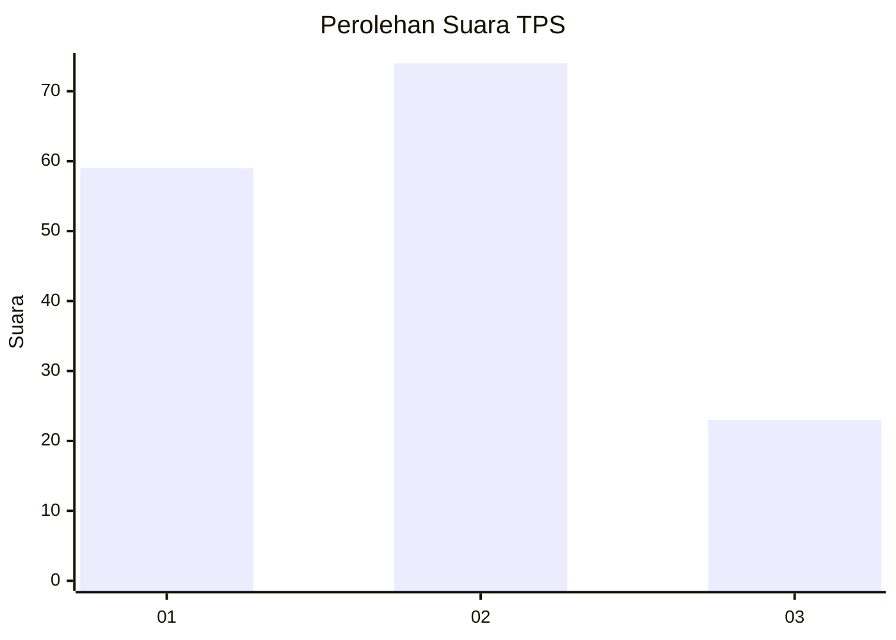
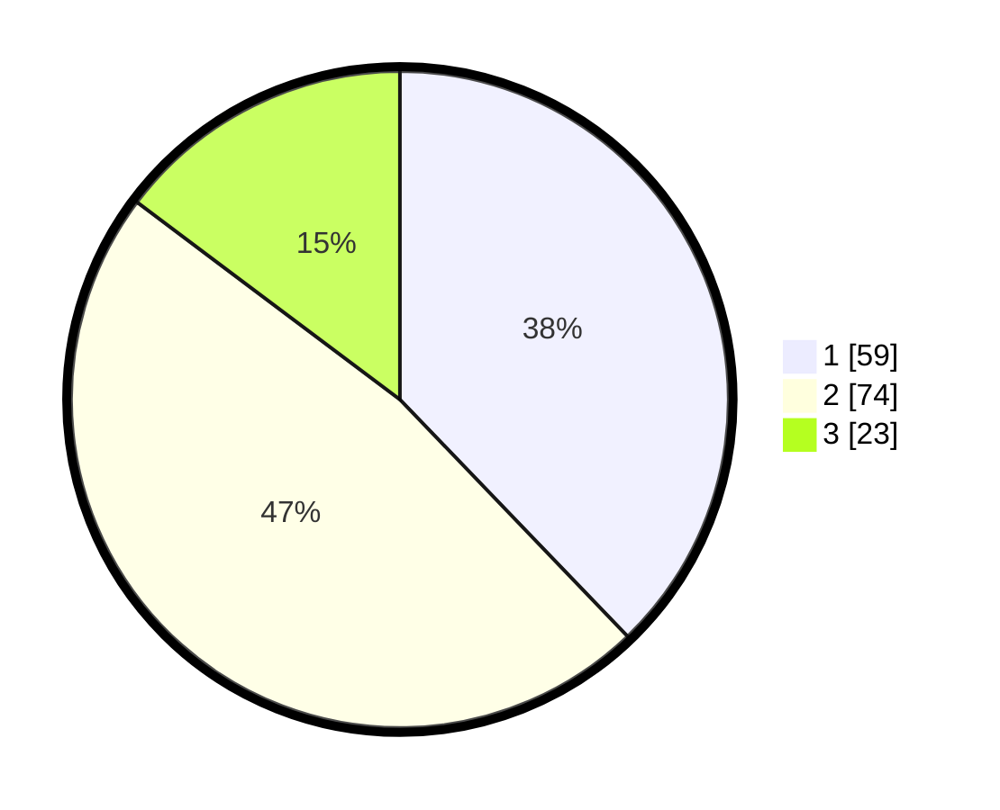

# Hasil

## Grafik

## Tabel

| No. | Nama Paslon    | Suara | Suara (raw) | Persentase |
|:--- |:-------------- | -----:| -----------:| ----------:|
| 1   | ANIES MUHAIMIN | 59    | [59][p-1]   | 37,82      |
| 2   | PRABOWO GIBRAN | 74    | [74][p-2]   | 47,44      |
| 3   | GANJAR MAHFUD  | 23    | [23][p-3]   | 14,74      |

[p-1]: https://github.com/gigit-pemilu/pemilu-2024-35-jawa-timur/blob/main/pilpres/hitung-suara/sub/35-jawa-timur/sub/29-sumenep/sub/18-dungkek/sub/2008-dungkek/sub/006-tps/sub/paslon-1.txt
[p-2]: https://github.com/gigit-pemilu/pemilu-2024-35-jawa-timur/blob/main/pilpres/hitung-suara/sub/35-jawa-timur/sub/29-sumenep/sub/18-dungkek/sub/2008-dungkek/sub/006-tps/sub/paslon-2.txt
[p-3]: https://github.com/gigit-pemilu/pemilu-2024-35-jawa-timur/blob/main/pilpres/hitung-suara/sub/35-jawa-timur/sub/29-sumenep/sub/18-dungkek/sub/2008-dungkek/sub/006-tps/sub/paslon-3.txt

## Foto C Plano

https://sirekap-obj-formc.kpu.go.id/99d4/pemilu/ppwp/35/29/18/20/08/3529182008006-20240215-124702--cd964537-be24-4737-8b7f-a579d574d06e.jpg

https://sirekap-obj-formc.kpu.go.id/99d4/pemilu/ppwp/35/29/18/20/08/3529182008006-20240215-124854--bd907f2a-385a-44cf-a2de-f07892b55a8a.jpg

https://sirekap-obj-formc.kpu.go.id/99d4/pemilu/ppwp/35/29/18/20/08/3529182008006-20240215-124958--e8d679e5-7c1f-45c2-8b42-287b7dd114f9.jpg

## Metadata

| Key        | Value               |
| ---------- | ------------------- |
| Time Stamp | 2024-02-25 22:00:00 |

