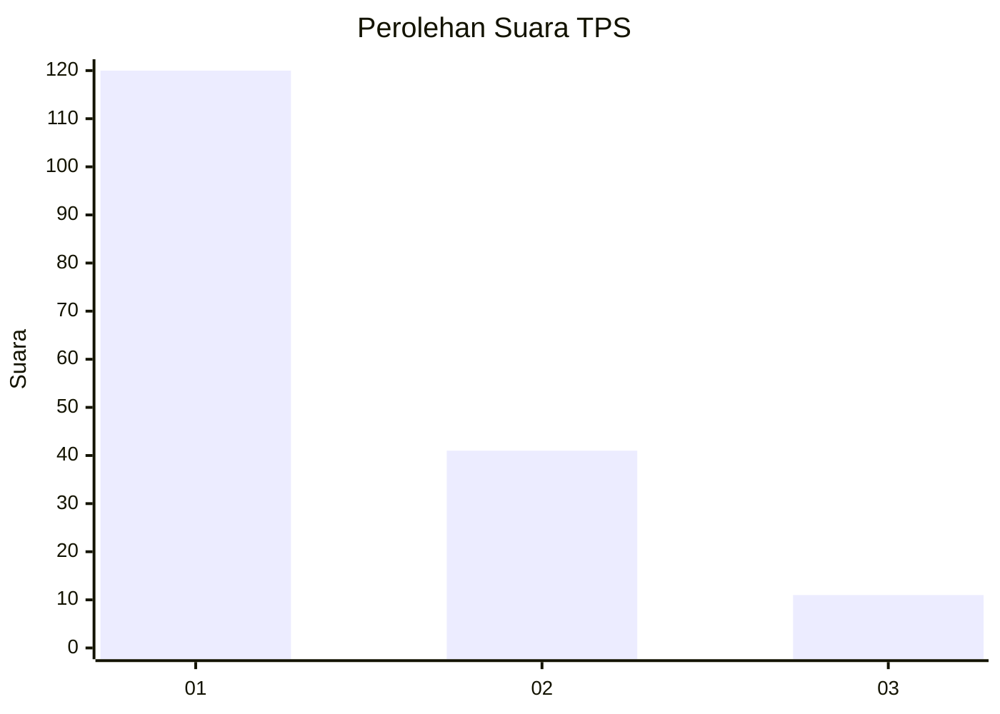
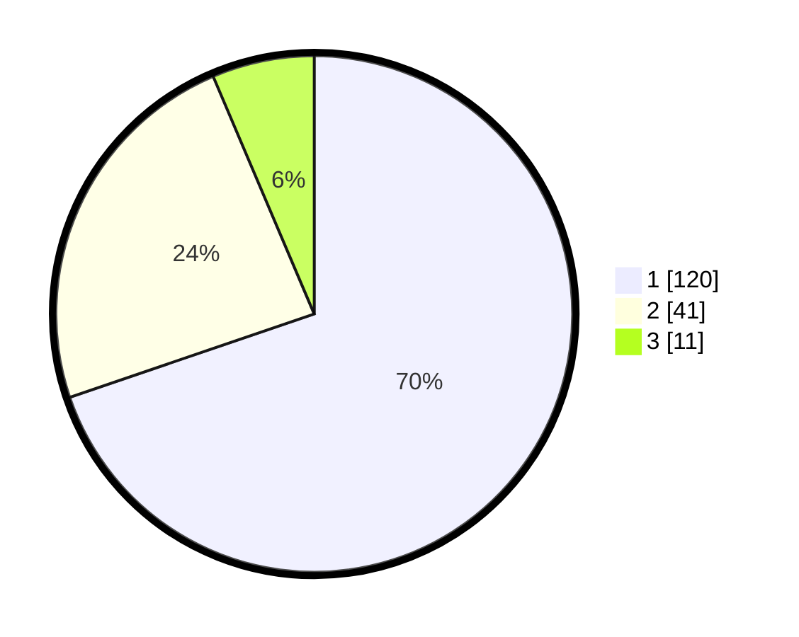

# Hasil

## Grafik

## Tabel

| No. | Nama Paslon    | Suara | Suara (raw) | Persentase |
|:--- |:-------------- | -----:| -----------:| ----------:|
| 1   | ANIES MUHAIMIN | 120   | [120][p-1]  | 69,77      |
| 2   | PRABOWO GIBRAN | 41    | [41][p-2]   | 23,84      |
| 3   | GANJAR MAHFUD  | 11    | [11][p-3]   | 6,40       |

[p-1]: https://github.com/gigit-pemilu/pemilu-2024-35-jawa-timur/blob/main/pilpres/hitung-suara/sub/35-jawa-timur/sub/29-sumenep/sub/18-dungkek/sub/2009-bunpenang/sub/004-tps/sub/paslon-1.txt
[p-2]: https://github.com/gigit-pemilu/pemilu-2024-35-jawa-timur/blob/main/pilpres/hitung-suara/sub/35-jawa-timur/sub/29-sumenep/sub/18-dungkek/sub/2009-bunpenang/sub/004-tps/sub/paslon-2.txt
[p-3]: https://github.com/gigit-pemilu/pemilu-2024-35-jawa-timur/blob/main/pilpres/hitung-suara/sub/35-jawa-timur/sub/29-sumenep/sub/18-dungkek/sub/2009-bunpenang/sub/004-tps/sub/paslon-3.txt

## Foto C Plano

https://sirekap-obj-formc.kpu.go.id/a965/pemilu/ppwp/35/29/18/20/09/3529182009004-20240215-102013--225efd2c-181b-4868-a961-21a5c2bc62ad.jpg

https://sirekap-obj-formc.kpu.go.id/a965/pemilu/ppwp/35/29/18/20/09/3529182009004-20240215-102142--b891edbc-9651-4576-aa9e-ed442add6dee.jpg

https://sirekap-obj-formc.kpu.go.id/a965/pemilu/ppwp/35/29/18/20/09/3529182009004-20240215-102236--a58f3100-3cd6-47a1-b86b-c284fbaeb81e.jpg

## Metadata

| Key        | Value               |
| ---------- | ------------------- |
| Time Stamp | 2024-02-25 22:00:00 |

