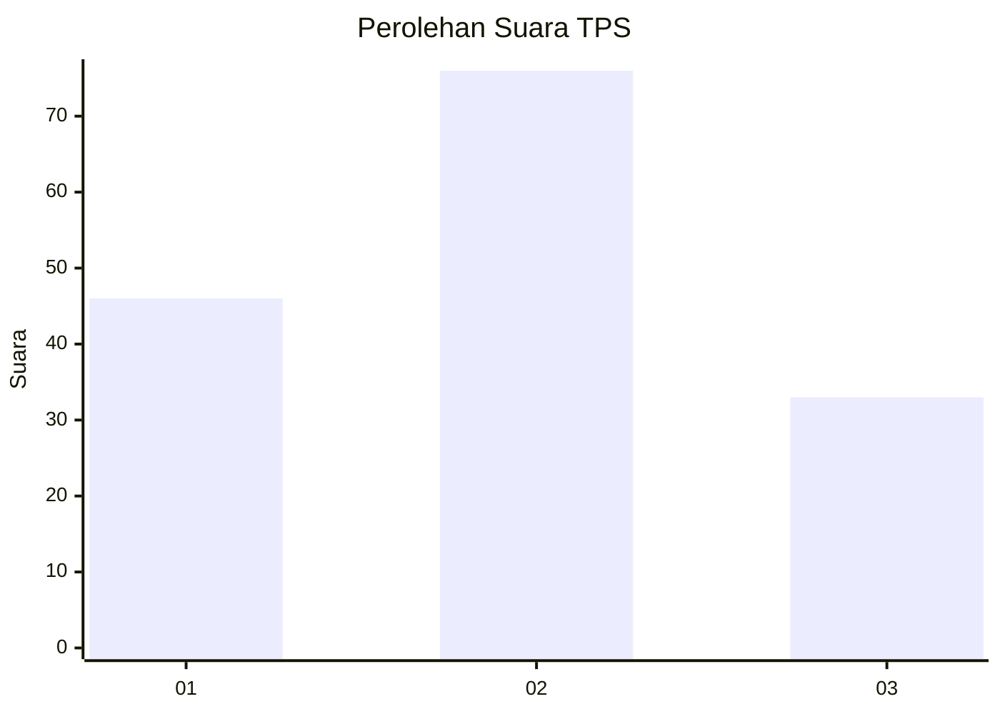
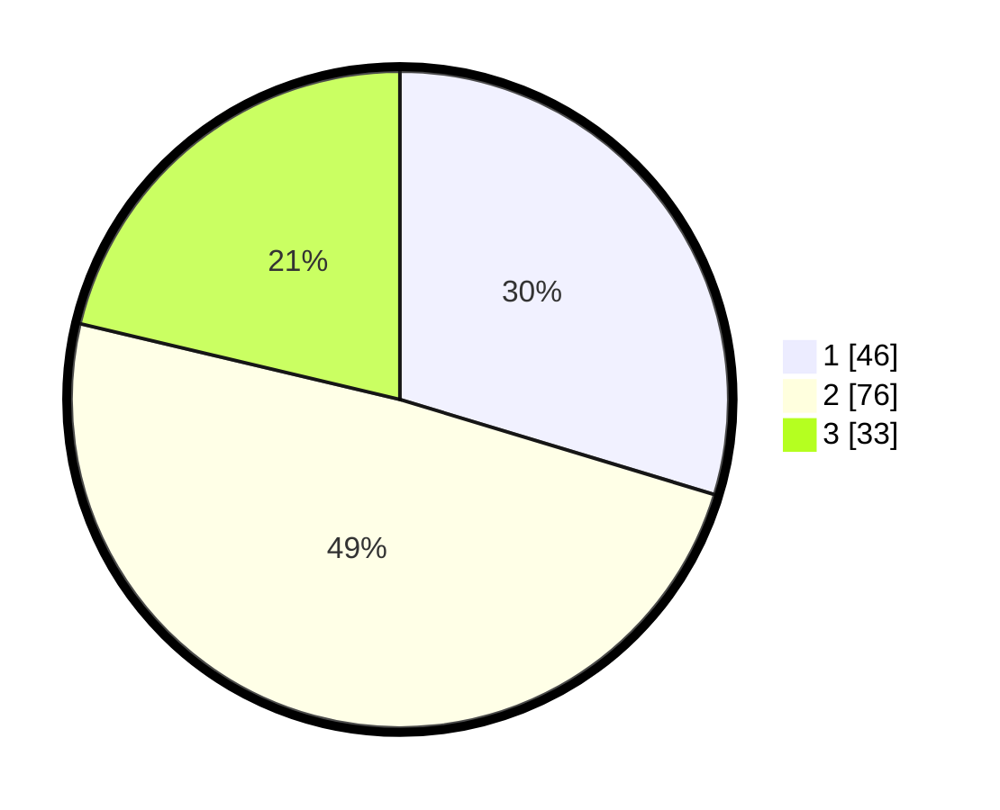

# Hasil

## Grafik

## Tabel

| No. | Nama Paslon    | Suara | Suara (raw) | Persentase |
|:--- |:-------------- | -----:| -----------:| ----------:|
| 1   | ANIES MUHAIMIN | 46    | [46][p-1]   | 29,68      |
| 2   | PRABOWO GIBRAN | 76    | [76][p-2]   | 49,03      |
| 3   | GANJAR MAHFUD  | 33    | [33][p-3]   | 21,29      |

[p-1]: https://github.com/gigit-pemilu/pemilu-2024-35-jawa-timur/blob/main/pilpres/hitung-suara/sub/35-jawa-timur/sub/29-sumenep/sub/18-dungkek/sub/2011-lapa-taman/sub/002-tps/sub/paslon-1.txt
[p-2]: https://github.com/gigit-pemilu/pemilu-2024-35-jawa-timur/blob/main/pilpres/hitung-suara/sub/35-jawa-timur/sub/29-sumenep/sub/18-dungkek/sub/2011-lapa-taman/sub/002-tps/sub/paslon-2.txt
[p-3]: https://github.com/gigit-pemilu/pemilu-2024-35-jawa-timur/blob/main/pilpres/hitung-suara/sub/35-jawa-timur/sub/29-sumenep/sub/18-dungkek/sub/2011-lapa-taman/sub/002-tps/sub/paslon-3.txt

## Foto C Plano

https://sirekap-obj-formc.kpu.go.id/e2f3/pemilu/ppwp/35/29/18/20/11/3529182011002-20240215-164240--2c9b063f-dae9-40a9-b5d6-5a12cdba7623.jpg

https://sirekap-obj-formc.kpu.go.id/e2f3/pemilu/ppwp/35/29/18/20/11/3529182011002-20240215-164321--a2714ff8-df92-4f23-9c9f-451c3d215e71.jpg

https://sirekap-obj-formc.kpu.go.id/e2f3/pemilu/ppwp/35/29/18/20/11/3529182011002-20240215-164342--a1919517-5f52-49bd-8c33-56fcaf45f043.jpg

## Metadata

| Key        | Value               |
| ---------- | ------------------- |
| Time Stamp | 2024-02-16 16:25:10 |

