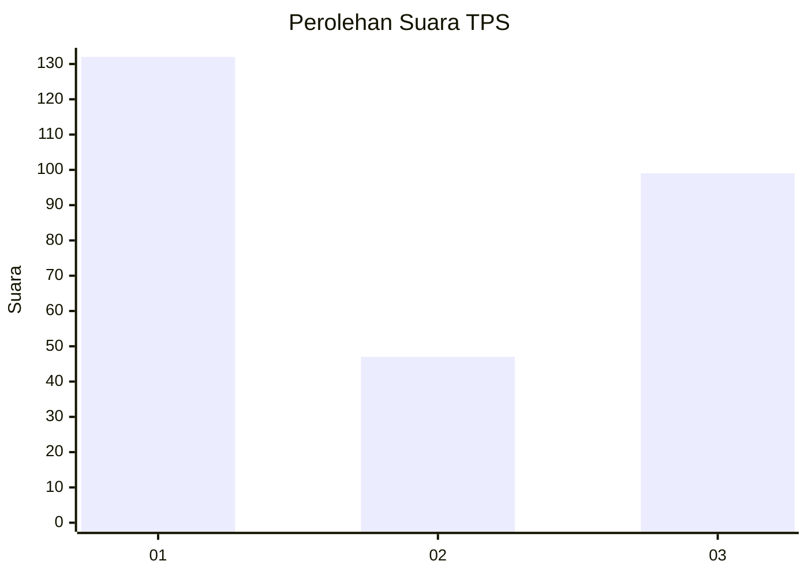
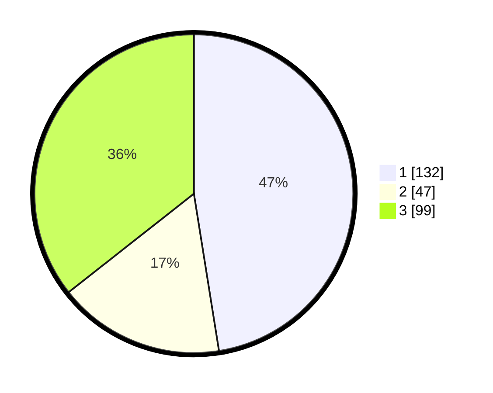

# Hasil

## Grafik

## Tabel

| No. | Nama Paslon    | Suara | Suara (raw) | Persentase |
|:--- |:-------------- | -----:| -----------:| ----------:|
| 1   | ANIES MUHAIMIN | 132   | [132][p-1]  | 47,48      |
| 2   | PRABOWO GIBRAN | 47    | [47][p-2]   | 16,91      |
| 3   | GANJAR MAHFUD  | 99    | [99][p-3]   | 35,61      |

[p-1]: https://github.com/gigit-pemilu/pemilu-2024/blob/main/pilpres/hitung-suara/sub/35-jawa-timur/sub/29-sumenep/sub/19-gapura/sub/2001-grujugan/sub/003-tps/sub/paslon-1.txt
[p-2]: https://github.com/gigit-pemilu/pemilu-2024/blob/main/pilpres/hitung-suara/sub/35-jawa-timur/sub/29-sumenep/sub/19-gapura/sub/2001-grujugan/sub/003-tps/sub/paslon-2.txt
[p-3]: https://github.com/gigit-pemilu/pemilu-2024/blob/main/pilpres/hitung-suara/sub/35-jawa-timur/sub/29-sumenep/sub/19-gapura/sub/2001-grujugan/sub/003-tps/sub/paslon-3.txt

## Foto C Plano

https://sirekap-obj-formc.kpu.go.id/547e/pemilu/ppwp/35/29/19/20/01/3529192001003-20240216-135513--b3f105e0-f75b-49bd-b417-1b62c0a81bff.jpg

https://sirekap-obj-formc.kpu.go.id/547e/pemilu/ppwp/35/29/19/20/01/3529192001003-20240216-135514--27b5c007-9f19-4271-b86b-78ed97773749.jpg

https://sirekap-obj-formc.kpu.go.id/547e/pemilu/ppwp/35/29/19/20/01/3529192001003-20240216-135514--f4b52e6f-1ef5-4049-a957-91a47670bcc9.jpg

## Metadata

| Key        | Value               |
| ---------- | ------------------- |
| Time Stamp | 2024-02-16 21:01:00 |

## DATA PEMILIH TETAP

Jumlah pemilih dalam DPT: **292**.
 * L: **136**.
 * P: **156**.

## DATA PENGGUNA HAK PILIH

Jumlah pengguna hak pilih dalam DPT: **279**.
 * L: **130**.
 * P: **149**.

Jumlah pengguna hak pilih dalam DPTb: **0**.
 * L: **0**.
 * P: **0**.

Jumlah pengguna hak pilih dalam DPK: **0**.
 * L: **0**.
 * P: **0**.

Jumlah pengguna hak pilih: **279**.
 * L: **130**.
 * P: **149**.

## JUMLAH SUARA SAH DAN TIDAK SAH

JUMLAH SELURUH SUARA SAH: **278**.

JUMLAH SUARA TIDAK SAH: **1**.

JUMLAH SELURUH SUARA SAH DAN SUARA TIDAK SAH: **279**.

