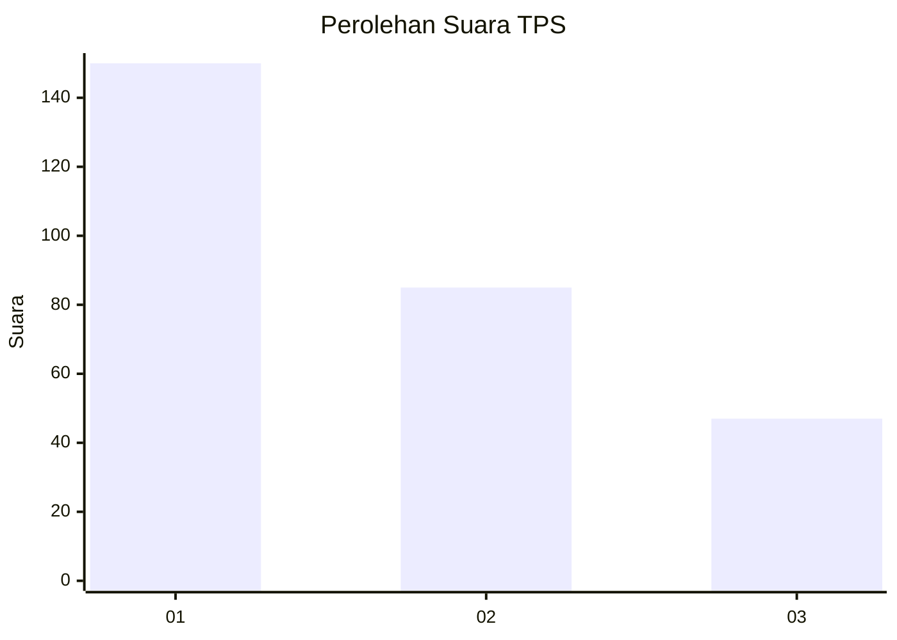
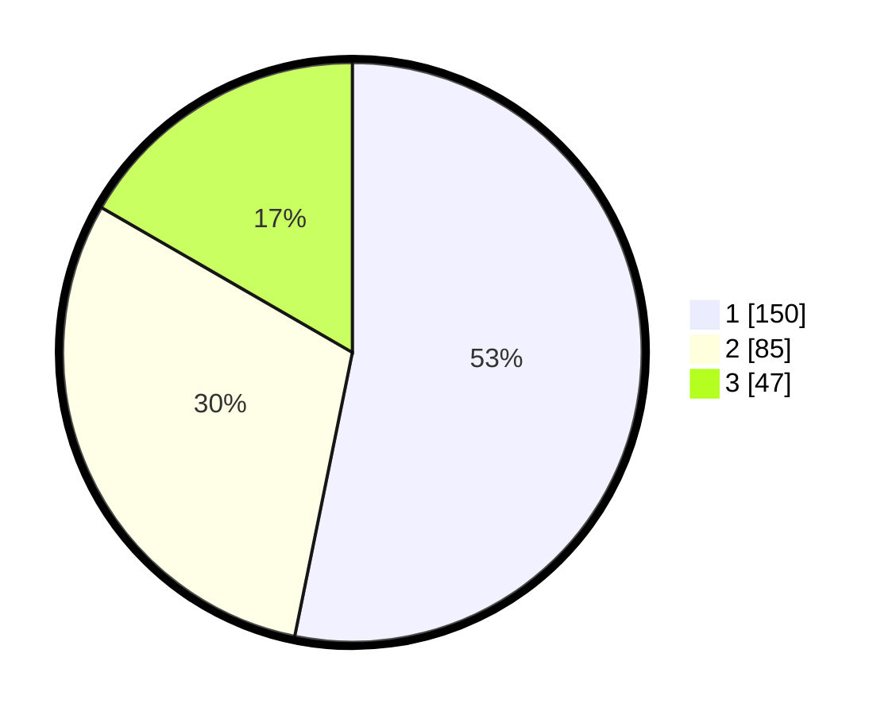

# Hasil

## Grafik

## Tabel

| No. | Nama Paslon    | Suara | Suara (raw) | Persentase |
|:--- |:-------------- | -----:| -----------:| ----------:|
| 1   | ANIES MUHAIMIN | 150   | [150][p-1]  | 53,19      |
| 2   | PRABOWO GIBRAN | 85    | [85][p-2]   | 30,14      |
| 3   | GANJAR MAHFUD  | 47    | [47][p-3]   | 16,67      |

[p-1]: https://github.com/gigit-pemilu/pemilu-2024/blob/main/pilpres/hitung-suara/sub/35-jawa-timur/sub/29-sumenep/sub/19-gapura/sub/2001-grujugan/sub/005-tps/sub/paslon-1.txt
[p-2]: https://github.com/gigit-pemilu/pemilu-2024/blob/main/pilpres/hitung-suara/sub/35-jawa-timur/sub/29-sumenep/sub/19-gapura/sub/2001-grujugan/sub/005-tps/sub/paslon-2.txt
[p-3]: https://github.com/gigit-pemilu/pemilu-2024/blob/main/pilpres/hitung-suara/sub/35-jawa-timur/sub/29-sumenep/sub/19-gapura/sub/2001-grujugan/sub/005-tps/sub/paslon-3.txt

## Foto C Plano

https://sirekap-obj-formc.kpu.go.id/9916/pemilu/ppwp/35/29/19/20/01/3529192001005-20240214-222350--46b0de62-4940-4d4d-adaf-e648196507e2.jpg

https://sirekap-obj-formc.kpu.go.id/9916/pemilu/ppwp/35/29/19/20/01/3529192001005-20240214-222915--ecc5f2ee-8451-423d-87ad-d89d7be7d860.jpg

https://sirekap-obj-formc.kpu.go.id/9916/pemilu/ppwp/35/29/19/20/01/3529192001005-20240214-223122--a4175ea2-36f1-4ce0-846a-4f377a4db6f8.jpg

## Metadata

| Key        | Value               |
| ---------- | ------------------- |
| Time Stamp | 2024-02-15 12:00:28 |

