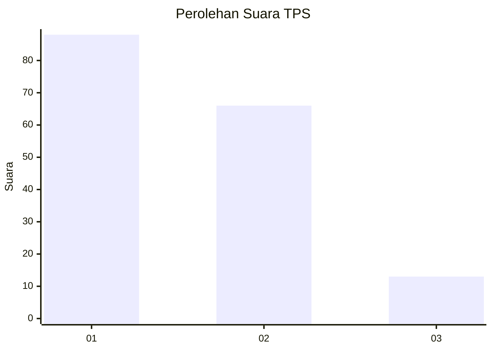
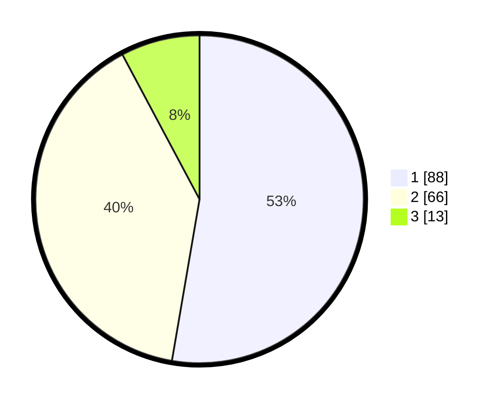

# Hasil

## Grafik

## Tabel

| No. | Nama Paslon    | Suara | Suara (raw) | Persentase |
|:--- |:-------------- | -----:| -----------:| ----------:|
| 1   | ANIES MUHAIMIN | 88    | [88][p-1]   | 52,69      |
| 2   | PRABOWO GIBRAN | 66    | [66][p-2]   | 39,52      |
| 3   | GANJAR MAHFUD  | 13    | [13][p-3]   | 7,78       |

[p-1]: https://github.com/gigit-pemilu/pemilu-2024-35-jawa-timur/blob/main/pilpres/hitung-suara/sub/35-jawa-timur/sub/29-sumenep/sub/19-gapura/sub/2003-andulang/sub/001-tps/sub/paslon-1.txt
[p-2]: https://github.com/gigit-pemilu/pemilu-2024-35-jawa-timur/blob/main/pilpres/hitung-suara/sub/35-jawa-timur/sub/29-sumenep/sub/19-gapura/sub/2003-andulang/sub/001-tps/sub/paslon-2.txt
[p-3]: https://github.com/gigit-pemilu/pemilu-2024-35-jawa-timur/blob/main/pilpres/hitung-suara/sub/35-jawa-timur/sub/29-sumenep/sub/19-gapura/sub/2003-andulang/sub/001-tps/sub/paslon-3.txt

## Foto C Plano

https://sirekap-obj-formc.kpu.go.id/cffb/pemilu/ppwp/35/29/19/20/03/3529192003001-20240215-124926--2eb3ce64-114c-45a7-a7c5-a6d58f636910.jpg

https://sirekap-obj-formc.kpu.go.id/cffb/pemilu/ppwp/35/29/19/20/03/3529192003001-20240215-125048--2e9af281-d69f-4dd7-a683-b6c386a26023.jpg

https://sirekap-obj-formc.kpu.go.id/cffb/pemilu/ppwp/35/29/19/20/03/3529192003001-20240215-125148--df95cb70-ef18-467b-8f05-98cff6ae6b65.jpg

## Metadata

| Key        | Value               |
| ---------- | ------------------- |
| Time Stamp | 2024-02-16 16:25:10 |

