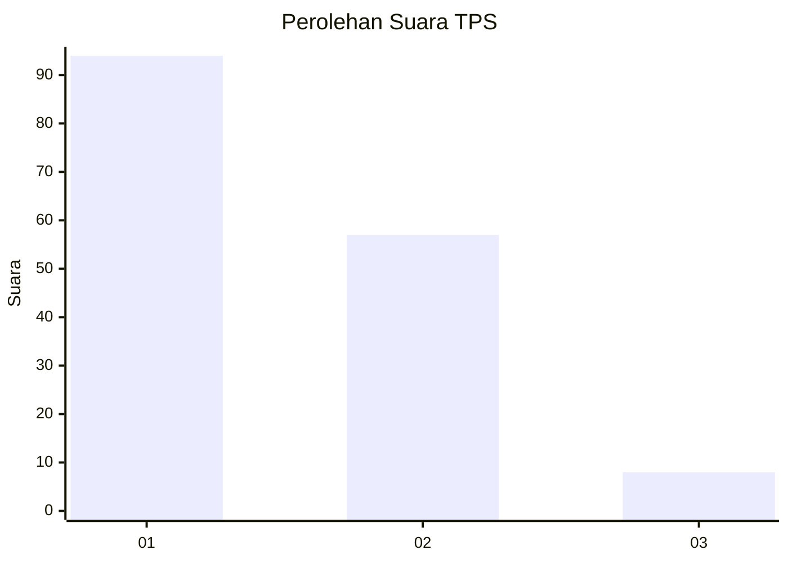
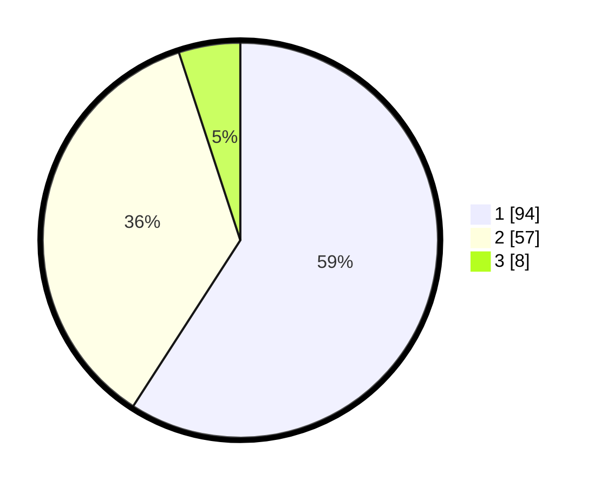

# Hasil

## Grafik

## Tabel

| No. | Nama Paslon    | Suara | Suara (raw) | Persentase |
|:--- |:-------------- | -----:| -----------:| ----------:|
| 1   | ANIES MUHAIMIN | 94    | [94][p-1]   | 59,12      |
| 2   | PRABOWO GIBRAN | 57    | [57][p-2]   | 35,85      |
| 3   | GANJAR MAHFUD  | 8     | [8][p-3]    | 5,03       |

[p-1]: https://github.com/gigit-pemilu/pemilu-2024-35-jawa-timur/blob/main/pilpres/hitung-suara/sub/35-jawa-timur/sub/29-sumenep/sub/19-gapura/sub/2008-gapura-barat/sub/012-tps/sub/paslon-1.txt
[p-2]: https://github.com/gigit-pemilu/pemilu-2024-35-jawa-timur/blob/main/pilpres/hitung-suara/sub/35-jawa-timur/sub/29-sumenep/sub/19-gapura/sub/2008-gapura-barat/sub/012-tps/sub/paslon-2.txt
[p-3]: https://github.com/gigit-pemilu/pemilu-2024-35-jawa-timur/blob/main/pilpres/hitung-suara/sub/35-jawa-timur/sub/29-sumenep/sub/19-gapura/sub/2008-gapura-barat/sub/012-tps/sub/paslon-3.txt

## Foto C Plano

https://sirekap-obj-formc.kpu.go.id/2502/pemilu/ppwp/35/29/19/20/08/3529192008012-20240215-011620--8b40259a-568e-4ef9-8c71-4dcb0c24c2e8.jpg

https://sirekap-obj-formc.kpu.go.id/2502/pemilu/ppwp/35/29/19/20/08/3529192008012-20240215-011504--9c02fcd2-2b56-4911-8dec-7fe3da769a5a.jpg

https://sirekap-obj-formc.kpu.go.id/2502/pemilu/ppwp/35/29/19/20/08/3529192008012-20240215-010302--27905085-06ed-464d-a805-aa60947087ea.jpg

## Metadata

| Key        | Value               |
| ---------- | ------------------- |
| Time Stamp | 2024-02-16 21:01:00 |

