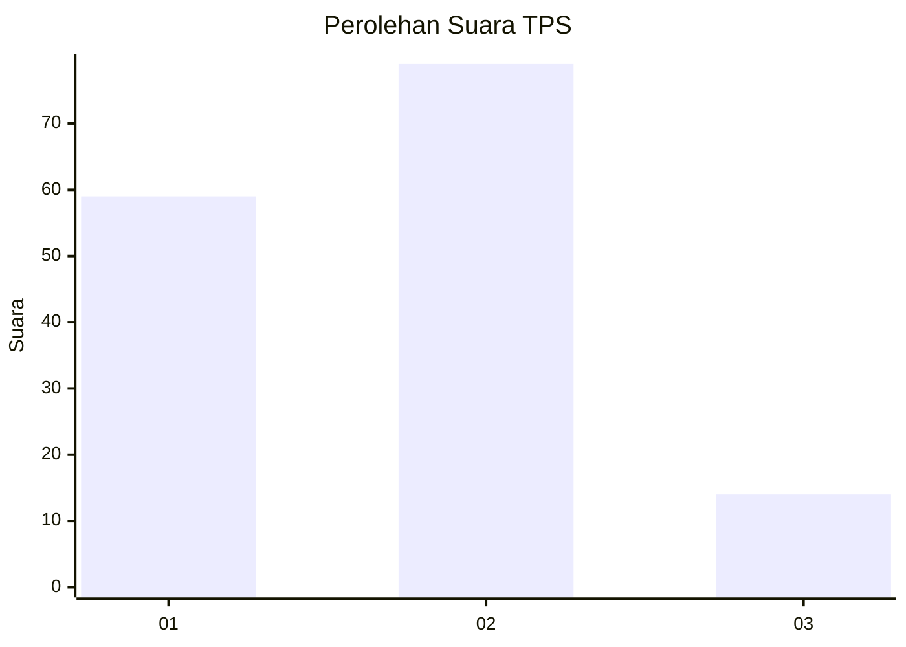
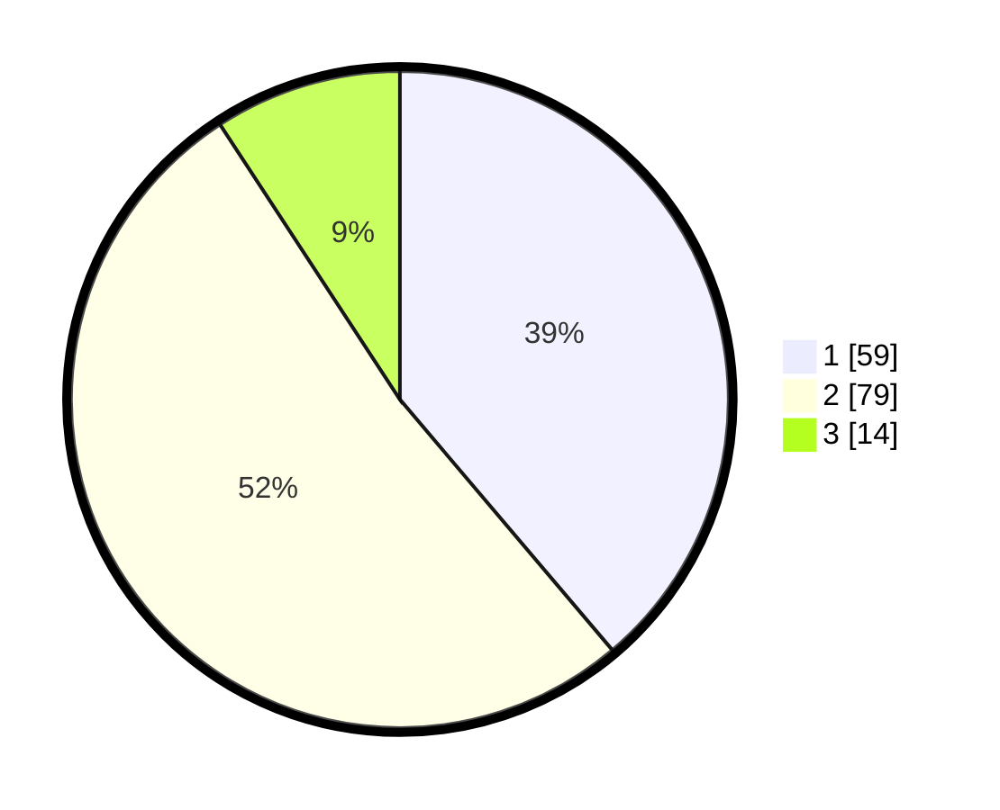

# Hasil

## Grafik

## Tabel

| No. | Nama Paslon    | Suara | Suara (raw) | Persentase |
|:--- |:-------------- | -----:| -----------:| ----------:|
| 1   | ANIES MUHAIMIN | 59    | [59][p-1]   | 38,82      |
| 2   | PRABOWO GIBRAN | 79    | [79][p-2]   | 51,97      |
| 3   | GANJAR MAHFUD  | 14    | [14][p-3]   | 9,21       |

[p-1]: https://github.com/gigit-pemilu/pemilu-2024-35-jawa-timur/blob/main/pilpres/hitung-suara/sub/35-jawa-timur/sub/29-sumenep/sub/20-gayam/sub/2001-pancor/sub/004-tps/sub/paslon-1.txt
[p-2]: https://github.com/gigit-pemilu/pemilu-2024-35-jawa-timur/blob/main/pilpres/hitung-suara/sub/35-jawa-timur/sub/29-sumenep/sub/20-gayam/sub/2001-pancor/sub/004-tps/sub/paslon-2.txt
[p-3]: https://github.com/gigit-pemilu/pemilu-2024-35-jawa-timur/blob/main/pilpres/hitung-suara/sub/35-jawa-timur/sub/29-sumenep/sub/20-gayam/sub/2001-pancor/sub/004-tps/sub/paslon-3.txt

## Foto C Plano

https://sirekap-obj-formc.kpu.go.id/444c/pemilu/ppwp/35/29/20/20/01/3529202001004-20240214-213126--66fe8f4e-85e7-4247-b6d9-c443c128fe8c.jpg

https://sirekap-obj-formc.kpu.go.id/444c/pemilu/ppwp/35/29/20/20/01/3529202001004-20240214-213221--410876ed-3133-4c07-a603-5f4fd288e7ab.jpg

https://sirekap-obj-formc.kpu.go.id/444c/pemilu/ppwp/35/29/20/20/01/3529202001004-20240214-213248--9b529622-c263-4f94-b71f-24c3a60c3365.jpg

## Metadata

| Key        | Value               |
| ---------- | ------------------- |
| Time Stamp | 2024-02-15 20:00:44 |

