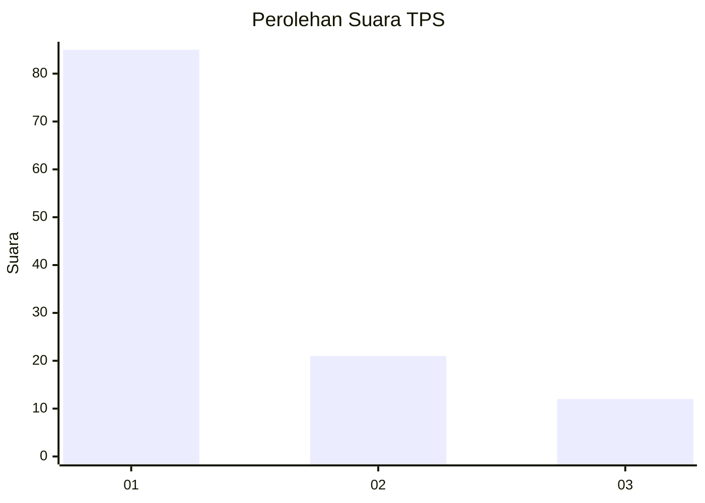
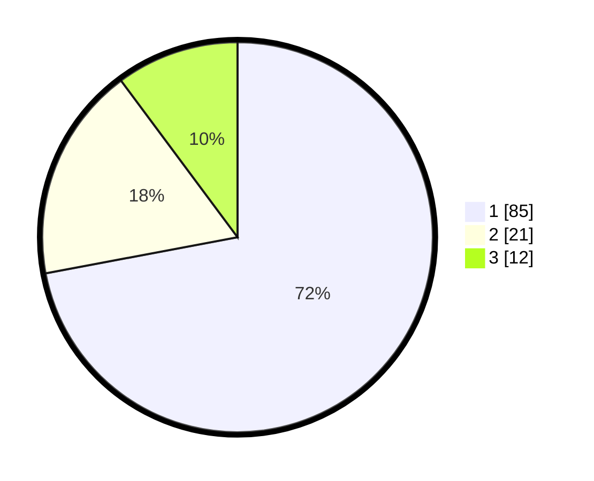

# Hasil

## Grafik

## Tabel

| No. | Nama Paslon    | Suara | Suara (raw) | Persentase |
|:--- |:-------------- | -----:| -----------:| ----------:|
| 1   | ANIES MUHAIMIN | 85    | [85][p-1]   | 72,03      |
| 2   | PRABOWO GIBRAN | 21    | [21][p-2]   | 17,80      |
| 3   | GANJAR MAHFUD  | 12    | [12][p-3]   | 10,17      |

[p-1]: https://github.com/gigit-pemilu/pemilu-2024/blob/main/pilpres/hitung-suara/sub/35-jawa-timur/sub/29-sumenep/sub/20-gayam/sub/2001-pancor/sub/026-tps/sub/paslon-1.txt
[p-2]: https://github.com/gigit-pemilu/pemilu-2024/blob/main/pilpres/hitung-suara/sub/35-jawa-timur/sub/29-sumenep/sub/20-gayam/sub/2001-pancor/sub/026-tps/sub/paslon-2.txt
[p-3]: https://github.com/gigit-pemilu/pemilu-2024/blob/main/pilpres/hitung-suara/sub/35-jawa-timur/sub/29-sumenep/sub/20-gayam/sub/2001-pancor/sub/026-tps/sub/paslon-3.txt

## Foto C Plano

https://sirekap-obj-formc.kpu.go.id/6b04/pemilu/ppwp/35/29/20/20/01/3529202001026-20240214-141145--9c0204d0-988a-40ca-8910-48b09e26438a.jpg

https://sirekap-obj-formc.kpu.go.id/6b04/pemilu/ppwp/35/29/20/20/01/3529202001026-20240214-141306--6060d7b9-0b56-4d20-911c-db84d368271b.jpg

https://sirekap-obj-formc.kpu.go.id/6b04/pemilu/ppwp/35/29/20/20/01/3529202001026-20240214-141429--ba50babc-7187-4f9e-ab01-9afba3ac7961.jpg

## Metadata

| Key        | Value               |
| ---------- | ------------------- |
| Time Stamp | 2024-02-14 21:46:01 |

