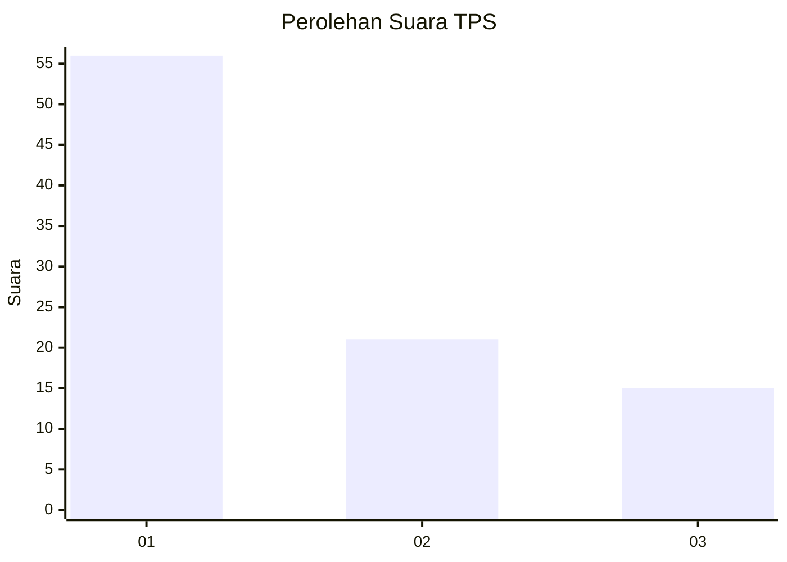
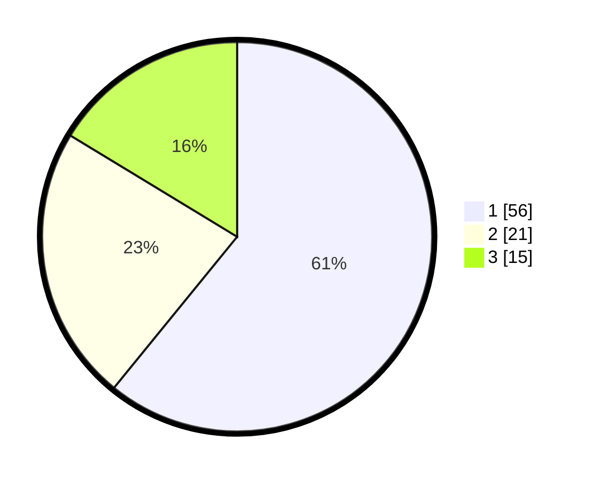

# Hasil

## Grafik

## Tabel

| No. | Nama Paslon    | Suara | Suara (raw) | Persentase |
|:--- |:-------------- | -----:| -----------:| ----------:|
| 1   | ANIES MUHAIMIN | 56    | [56][p-1]   | 60,87      |
| 2   | PRABOWO GIBRAN | 21    | [21][p-2]   | 22,83      |
| 3   | GANJAR MAHFUD  | 15    | [15][p-3]   | 16,30      |

[p-1]: https://github.com/gigit-pemilu/pemilu-2024/blob/main/pilpres/hitung-suara/sub/35-jawa-timur/sub/29-sumenep/sub/21-nonggunong/sub/2004-sokaramme-timur/sub/006-tps/sub/paslon-1.txt
[p-2]: https://github.com/gigit-pemilu/pemilu-2024/blob/main/pilpres/hitung-suara/sub/35-jawa-timur/sub/29-sumenep/sub/21-nonggunong/sub/2004-sokaramme-timur/sub/006-tps/sub/paslon-2.txt
[p-3]: https://github.com/gigit-pemilu/pemilu-2024/blob/main/pilpres/hitung-suara/sub/35-jawa-timur/sub/29-sumenep/sub/21-nonggunong/sub/2004-sokaramme-timur/sub/006-tps/sub/paslon-3.txt

## Foto C Plano

https://sirekap-obj-formc.kpu.go.id/2b53/pemilu/ppwp/35/29/21/20/04/3529212004006-20240215-084417--c179167e-1c32-4541-9324-43b8bead4fdc.jpg

https://sirekap-obj-formc.kpu.go.id/2b53/pemilu/ppwp/35/29/21/20/04/3529212004006-20240215-084528--bbf83b55-38f7-46ac-b8b5-079852d6e5ba.jpg

https://sirekap-obj-formc.kpu.go.id/2b53/pemilu/ppwp/35/29/21/20/04/3529212004006-20240215-084644--3f579ac9-0192-438b-ab8e-a785848aa57a.jpg

## Metadata

| Key        | Value               |
| ---------- | ------------------- |
| Time Stamp | 2024-02-25 16:00:00 |

