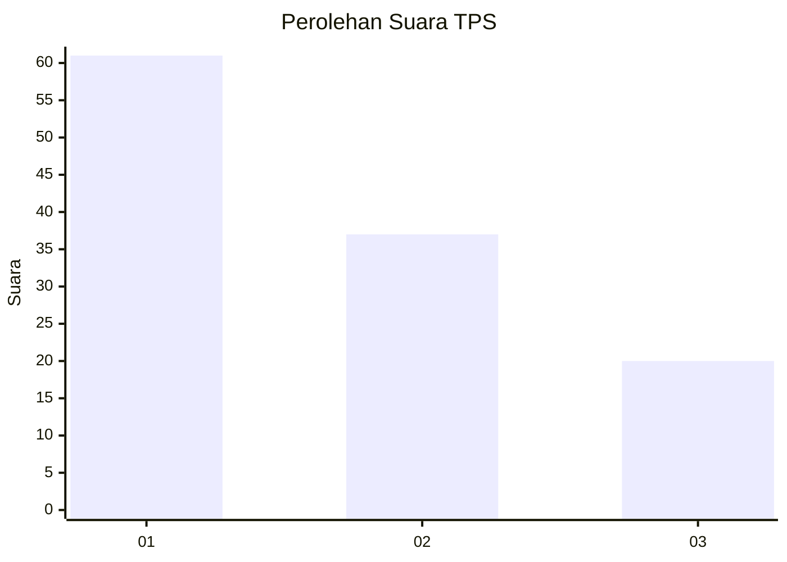
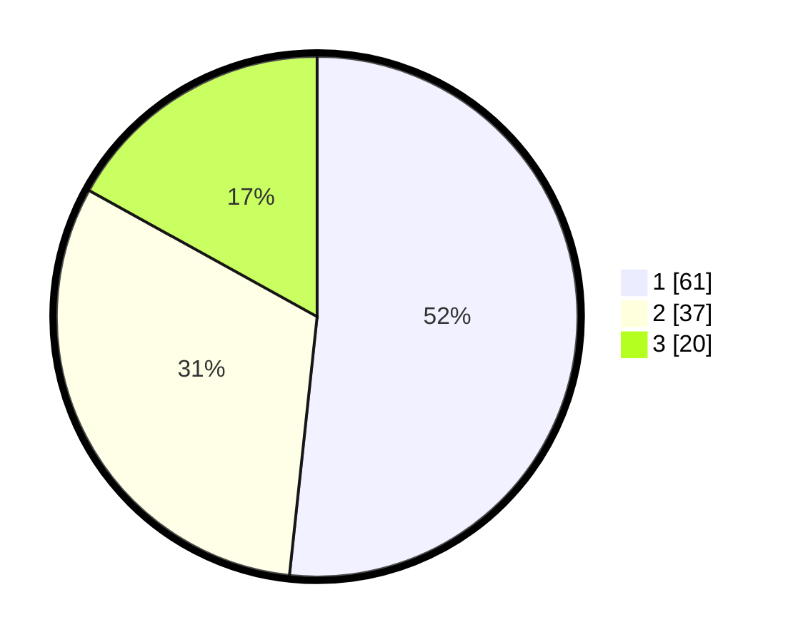

# Hasil

## Grafik

## Tabel

| No. | Nama Paslon    | Suara | Suara (raw) | Persentase |
|:--- |:-------------- | -----:| -----------:| ----------:|
| 1   | ANIES MUHAIMIN | 61    | [61][p-1]   | 51,69      |
| 2   | PRABOWO GIBRAN | 37    | [37][p-2]   | 31,36      |
| 3   | GANJAR MAHFUD  | 20    | [20][p-3]   | 16,95      |

[p-1]: https://github.com/gigit-pemilu/pemilu-2024-35-jawa-timur/blob/main/pilpres/hitung-suara/sub/35-jawa-timur/sub/29-sumenep/sub/21-nonggunong/sub/2005-sokarami-paseser/sub/001-tps/sub/paslon-1.txt
[p-2]: https://github.com/gigit-pemilu/pemilu-2024-35-jawa-timur/blob/main/pilpres/hitung-suara/sub/35-jawa-timur/sub/29-sumenep/sub/21-nonggunong/sub/2005-sokarami-paseser/sub/001-tps/sub/paslon-2.txt
[p-3]: https://github.com/gigit-pemilu/pemilu-2024-35-jawa-timur/blob/main/pilpres/hitung-suara/sub/35-jawa-timur/sub/29-sumenep/sub/21-nonggunong/sub/2005-sokarami-paseser/sub/001-tps/sub/paslon-3.txt

## Foto C Plano

https://sirekap-obj-formc.kpu.go.id/fad3/pemilu/ppwp/35/29/21/20/05/3529212005001-20240215-101227--c5f975cc-c882-407e-9d6f-8cb8294e0bbd.jpg

https://sirekap-obj-formc.kpu.go.id/fad3/pemilu/ppwp/35/29/21/20/05/3529212005001-20240215-101451--796e6e7d-e00a-4b16-ba94-8b3fbb7afd94.jpg

https://sirekap-obj-formc.kpu.go.id/fad3/pemilu/ppwp/35/29/21/20/05/3529212005001-20240215-101632--a69bdd0a-4831-493b-8bf6-740f5f49ad0a.jpg

## Metadata

| Key        | Value               |
| ---------- | ------------------- |
| Time Stamp | 2024-02-15 18:30:25 |

