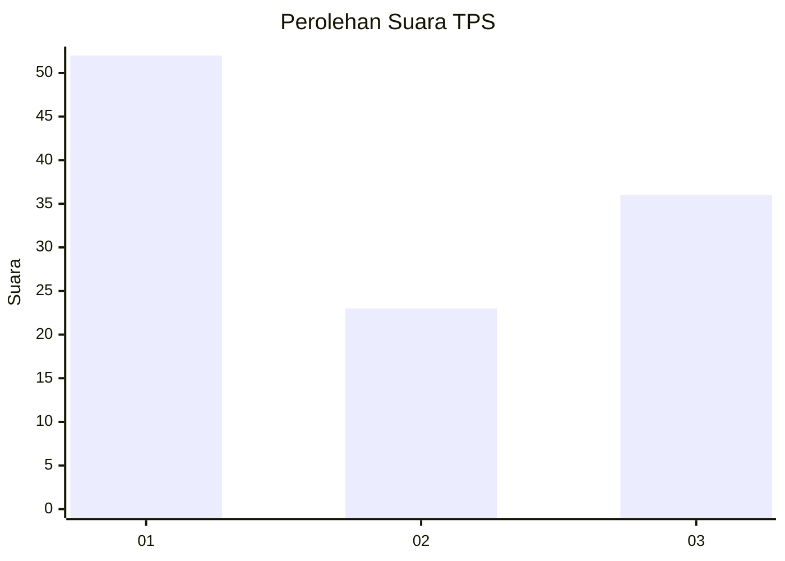
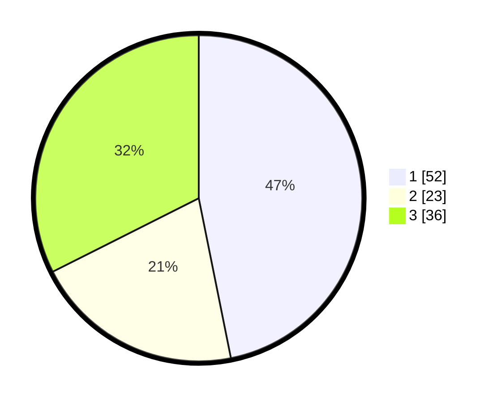

# Hasil

## Grafik

## Tabel

| No. | Nama Paslon    | Suara | Suara (raw) | Persentase |
|:--- |:-------------- | -----:| -----------:| ----------:|
| 1   | ANIES MUHAIMIN | 52    | [52][p-1]   | 46,85      |
| 2   | PRABOWO GIBRAN | 23    | [23][p-2]   | 20,72      |
| 3   | GANJAR MAHFUD  | 36    | [36][p-3]   | 32,43      |

[p-1]: https://github.com/gigit-pemilu/pemilu-2024-35-jawa-timur/blob/main/pilpres/hitung-suara/sub/35-jawa-timur/sub/29-sumenep/sub/21-nonggunong/sub/2005-sokarami-paseser/sub/004-tps/sub/paslon-1.txt
[p-2]: https://github.com/gigit-pemilu/pemilu-2024-35-jawa-timur/blob/main/pilpres/hitung-suara/sub/35-jawa-timur/sub/29-sumenep/sub/21-nonggunong/sub/2005-sokarami-paseser/sub/004-tps/sub/paslon-2.txt
[p-3]: https://github.com/gigit-pemilu/pemilu-2024-35-jawa-timur/blob/main/pilpres/hitung-suara/sub/35-jawa-timur/sub/29-sumenep/sub/21-nonggunong/sub/2005-sokarami-paseser/sub/004-tps/sub/paslon-3.txt

## Foto C Plano

https://sirekap-obj-formc.kpu.go.id/8a2f/pemilu/ppwp/35/29/21/20/05/3529212005004-20240215-200005--08d6aaac-48e4-4b85-9381-75f11888e9a7.jpg

https://sirekap-obj-formc.kpu.go.id/8a2f/pemilu/ppwp/35/29/21/20/05/3529212005004-20240215-083804--f7f5fb29-8099-4902-8fde-329001c41cab.jpg

## Metadata

| Key        | Value               |
| ---------- | ------------------- |
| Time Stamp | 2024-02-16 16:25:10 |

