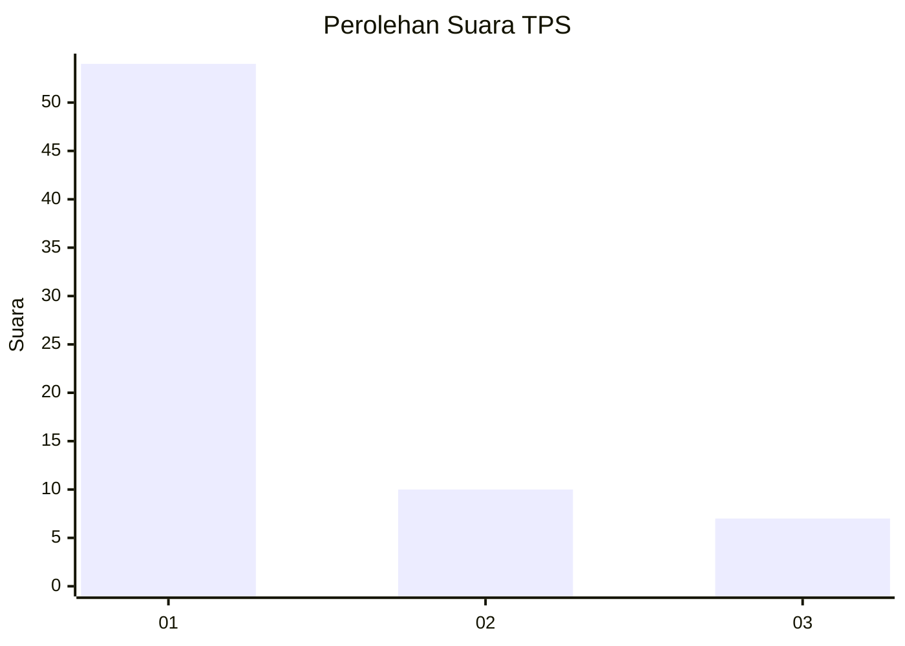
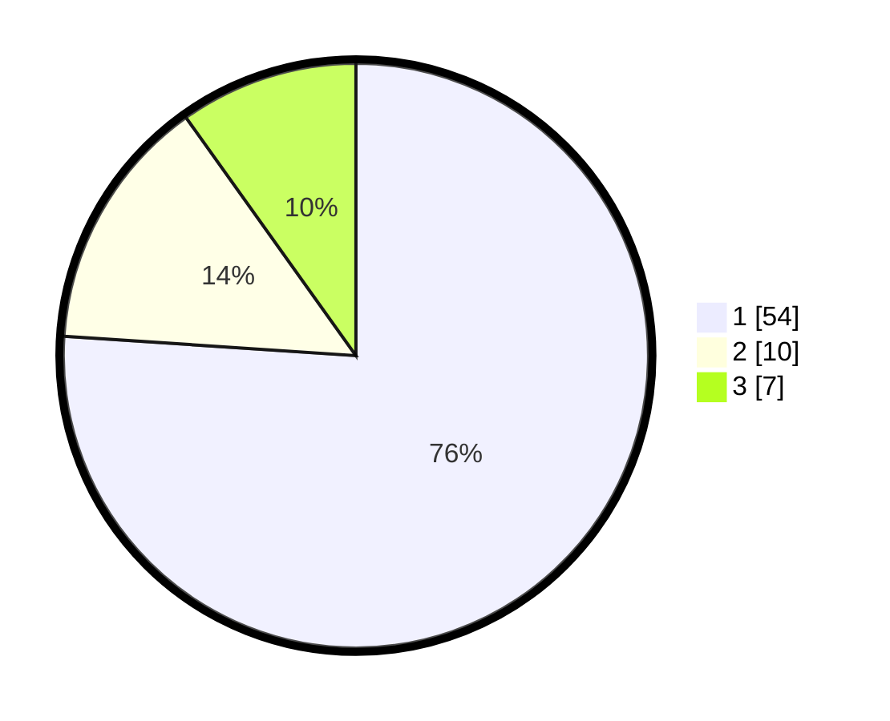

# Hasil

## Grafik

## Tabel

| No. | Nama Paslon    | Suara | Suara (raw) | Persentase |
|:--- |:-------------- | -----:| -----------:| ----------:|
| 1   | ANIES MUHAIMIN | 54    | [54][p-1]   | 76,06      |
| 2   | PRABOWO GIBRAN | 10    | [10][p-2]   | 14,08      |
| 3   | GANJAR MAHFUD  | 7     | [7][p-3]    | 9,86       |

[p-1]: https://github.com/gigit-pemilu/pemilu-2024-35-jawa-timur/blob/main/pilpres/hitung-suara/sub/35-jawa-timur/sub/29-sumenep/sub/21-nonggunong/sub/2005-sokarami-paseser/sub/006-tps/sub/paslon-1.txt
[p-2]: https://github.com/gigit-pemilu/pemilu-2024-35-jawa-timur/blob/main/pilpres/hitung-suara/sub/35-jawa-timur/sub/29-sumenep/sub/21-nonggunong/sub/2005-sokarami-paseser/sub/006-tps/sub/paslon-2.txt
[p-3]: https://github.com/gigit-pemilu/pemilu-2024-35-jawa-timur/blob/main/pilpres/hitung-suara/sub/35-jawa-timur/sub/29-sumenep/sub/21-nonggunong/sub/2005-sokarami-paseser/sub/006-tps/sub/paslon-3.txt

## Foto C Plano

https://sirekap-obj-formc.kpu.go.id/d73d/pemilu/ppwp/35/29/21/20/05/3529212005006-20240215-023701--915ca01b-945d-4ab9-9692-dab622e1a3ef.jpg

https://sirekap-obj-formc.kpu.go.id/d73d/pemilu/ppwp/35/29/21/20/05/3529212005006-20240215-024125--e39d9797-6148-45f1-be7b-ca3e862527f4.jpg

https://sirekap-obj-formc.kpu.go.id/d73d/pemilu/ppwp/35/29/21/20/05/3529212005006-20240215-024246--5721cd36-cefc-4c84-a990-368bdbe0fb8b.jpg

## Metadata

| Key        | Value               |
| ---------- | ------------------- |
| Time Stamp | 2024-02-25 11:00:00 |

## DATA PEMILIH TETAP

Jumlah pemilih dalam DPT: **160**.
 * L: **78**.
 * P: **82**.

## DATA PENGGUNA HAK PILIH

Jumlah pengguna hak pilih dalam DPT: **116**.
 * L: **54**.
 * P: **62**.

Jumlah pengguna hak pilih dalam DPTb: **0**.
 * L: **0**.
 * P: **0**.

Jumlah pengguna hak pilih dalam DPK: **2**.
 * L: **1**.
 * P: **1**.

Jumlah pengguna hak pilih: **118**.
 * L: **1**.
 * P: **1**.

## JUMLAH SUARA SAH DAN TIDAK SAH

JUMLAH SELURUH SUARA SAH: **71**.

JUMLAH SUARA TIDAK SAH: **47**.

JUMLAH SELURUH SUARA SAH DAN SUARA TIDAK SAH: **118**.

