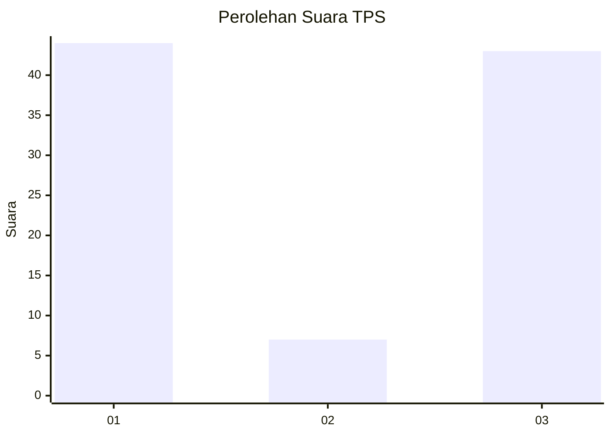
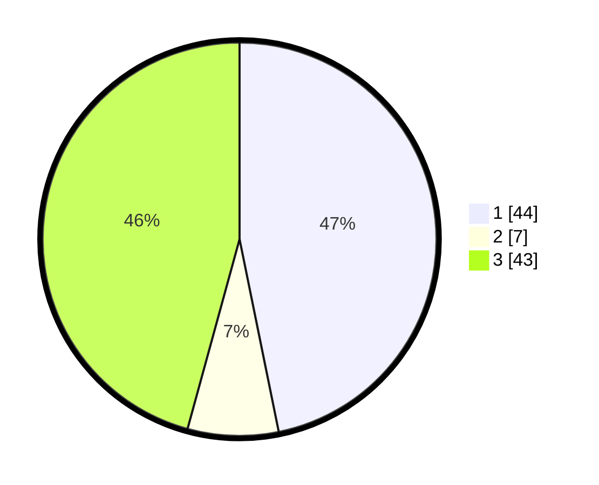

# Hasil

## Grafik

## Tabel

| No. | Nama Paslon    | Suara | Suara (raw) | Persentase |
|:--- |:-------------- | -----:| -----------:| ----------:|
| 1   | ANIES MUHAIMIN | 44    | [44][p-1]   | 46,81      |
| 2   | PRABOWO GIBRAN | 7     | [7][p-2]    | 7,45       |
| 3   | GANJAR MAHFUD  | 43    | [43][p-3]   | 45,74      |

[p-1]: https://github.com/gigit-pemilu/pemilu-2024/blob/main/pilpres/hitung-suara/sub/35-jawa-timur/sub/29-sumenep/sub/21-nonggunong/sub/2005-sokarami-paseser/sub/008-tps/sub/paslon-1.txt
[p-2]: https://github.com/gigit-pemilu/pemilu-2024/blob/main/pilpres/hitung-suara/sub/35-jawa-timur/sub/29-sumenep/sub/21-nonggunong/sub/2005-sokarami-paseser/sub/008-tps/sub/paslon-2.txt
[p-3]: https://github.com/gigit-pemilu/pemilu-2024/blob/main/pilpres/hitung-suara/sub/35-jawa-timur/sub/29-sumenep/sub/21-nonggunong/sub/2005-sokarami-paseser/sub/008-tps/sub/paslon-3.txt

## Foto C Plano

https://sirekap-obj-formc.kpu.go.id/f9aa/pemilu/ppwp/35/29/21/20/05/3529212005008-20240215-201211--bbb35883-1cd7-4263-805a-cf14887d68bc.jpg

https://sirekap-obj-formc.kpu.go.id/f9aa/pemilu/ppwp/35/29/21/20/05/3529212005008-20240215-201442--5613c6c4-1cb9-4a96-a371-7b8f26b0ce53.jpg

https://sirekap-obj-formc.kpu.go.id/f9aa/pemilu/ppwp/35/29/21/20/05/3529212005008-20240215-201601--935ef811-3bb6-4510-9813-6ec435531e5a.jpg

## Metadata

| Key        | Value               |
| ---------- | ------------------- |
| Time Stamp | 2024-02-16 16:25:10 |

