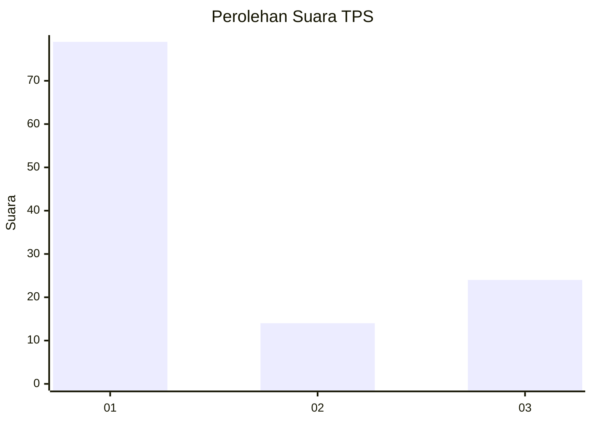
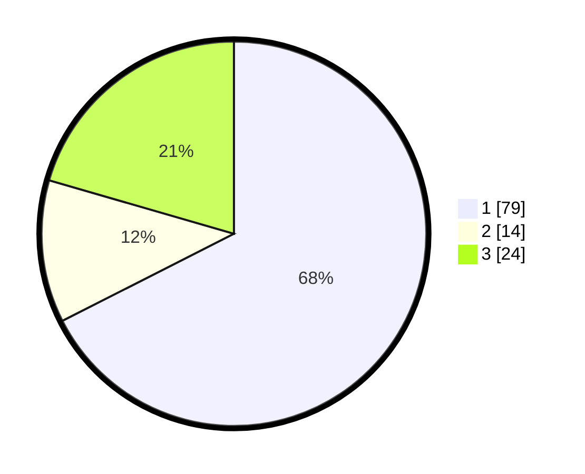

# Hasil

## Grafik

## Tabel

| No. | Nama Paslon    | Suara | Suara (raw) | Persentase |
|:--- |:-------------- | -----:| -----------:| ----------:|
| 1   | ANIES MUHAIMIN | 79    | [79][p-1]   | 67,52      |
| 2   | PRABOWO GIBRAN | 14    | [14][p-2]   | 11,97      |
| 3   | GANJAR MAHFUD  | 24    | [24][p-3]   | 20,51      |

[p-1]: https://github.com/gigit-pemilu/pemilu-2024-35-jawa-timur/blob/main/pilpres/hitung-suara/sub/35-jawa-timur/sub/29-sumenep/sub/21-nonggunong/sub/2005-sokarami-paseser/sub/009-tps/sub/paslon-1.txt
[p-2]: https://github.com/gigit-pemilu/pemilu-2024-35-jawa-timur/blob/main/pilpres/hitung-suara/sub/35-jawa-timur/sub/29-sumenep/sub/21-nonggunong/sub/2005-sokarami-paseser/sub/009-tps/sub/paslon-2.txt
[p-3]: https://github.com/gigit-pemilu/pemilu-2024-35-jawa-timur/blob/main/pilpres/hitung-suara/sub/35-jawa-timur/sub/29-sumenep/sub/21-nonggunong/sub/2005-sokarami-paseser/sub/009-tps/sub/paslon-3.txt

## Foto C Plano

https://sirekap-obj-formc.kpu.go.id/d970/pemilu/ppwp/35/29/21/20/05/3529212005009-20240215-121833--3067323b-6358-4592-90f7-4d37c12c1508.jpg

https://sirekap-obj-formc.kpu.go.id/d970/pemilu/ppwp/35/29/21/20/05/3529212005009-20240215-121831--437432e8-5680-41ce-83c8-9b31bb2a780f.jpg

https://sirekap-obj-formc.kpu.go.id/d970/pemilu/ppwp/35/29/21/20/05/3529212005009-20240215-122009--52ce15af-b450-40e7-b543-0eb18639d8c8.jpg

## Metadata

| Key        | Value               |
| ---------- | ------------------- |
| Time Stamp | 2024-02-16 21:01:00 |

