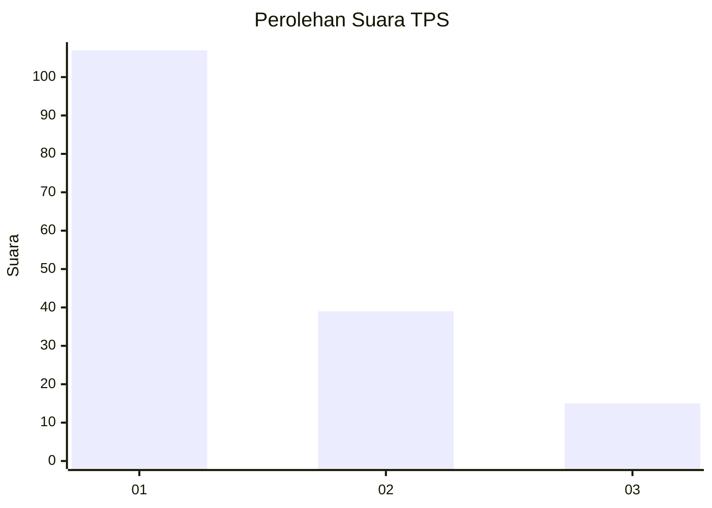
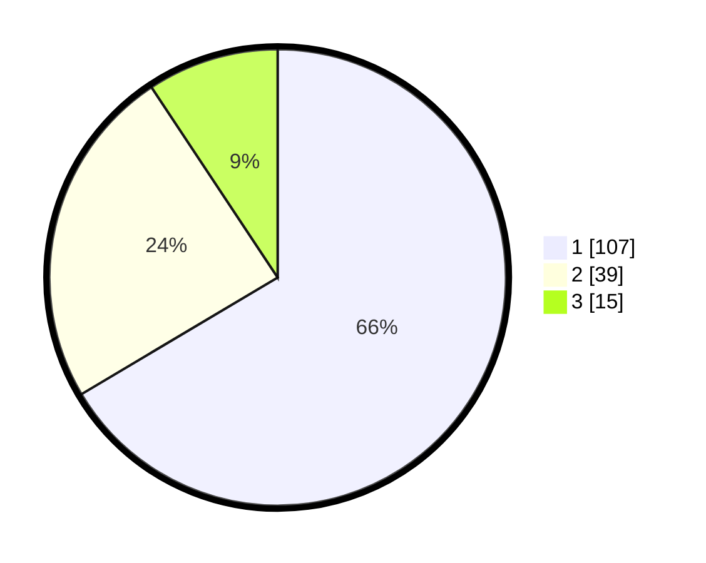

# Hasil

## Grafik

## Tabel

| No. | Nama Paslon    | Suara | Suara (raw) | Persentase |
|:--- |:-------------- | -----:| -----------:| ----------:|
| 1   | ANIES MUHAIMIN | 107   | [107][p-1]  | 66,46      |
| 2   | PRABOWO GIBRAN | 39    | [39][p-2]   | 24,22      |
| 3   | GANJAR MAHFUD  | 15    | [15][p-3]   | 9,32       |

[p-1]: https://github.com/gigit-pemilu/pemilu-2024-35-jawa-timur/blob/main/pilpres/hitung-suara/sub/35-jawa-timur/sub/29-sumenep/sub/21-nonggunong/sub/2006-talaga/sub/001-tps/sub/paslon-1.txt
[p-2]: https://github.com/gigit-pemilu/pemilu-2024-35-jawa-timur/blob/main/pilpres/hitung-suara/sub/35-jawa-timur/sub/29-sumenep/sub/21-nonggunong/sub/2006-talaga/sub/001-tps/sub/paslon-2.txt
[p-3]: https://github.com/gigit-pemilu/pemilu-2024-35-jawa-timur/blob/main/pilpres/hitung-suara/sub/35-jawa-timur/sub/29-sumenep/sub/21-nonggunong/sub/2006-talaga/sub/001-tps/sub/paslon-3.txt

## Foto C Plano

https://sirekap-obj-formc.kpu.go.id/49bd/pemilu/ppwp/35/29/21/20/06/3529212006001-20240220-132440--ebc8e56f-269c-4448-b42b-53b5e45a5e61.jpg

https://sirekap-obj-formc.kpu.go.id/49bd/pemilu/ppwp/35/29/21/20/06/3529212006001-20240215-115046--8fbe2ac6-9c5b-483b-8c03-47ad19119ed0.jpg

https://sirekap-obj-formc.kpu.go.id/49bd/pemilu/ppwp/35/29/21/20/06/3529212006001-20240215-115101--36975192-344d-4c23-90a6-e038d4efa6f6.jpg

## Metadata

| Key        | Value               |
| ---------- | ------------------- |
| Time Stamp | 2024-02-25 11:00:00 |

## DATA PEMILIH TETAP

Jumlah pemilih dalam DPT: **555**.
 * L: **732**.
 * P: **775**.

## DATA PENGGUNA HAK PILIH

Jumlah pengguna hak pilih dalam DPT: **522**.
 * L: **0**.
 * P: **526**.

Jumlah pengguna hak pilih dalam DPTb: **522**.
 * L: **930**.
 * P: **976**.

Jumlah pengguna hak pilih dalam DPK: **222**.
 * L: **0**.
 * P: **5**.

Jumlah pengguna hak pilih: **2**.
 * L: **0**.
 * P: **5**.

## JUMLAH SUARA SAH DAN TIDAK SAH

JUMLAH SELURUH SUARA SAH: **161**.

JUMLAH SUARA TIDAK SAH: **31**.

JUMLAH SELURUH SUARA SAH DAN SUARA TIDAK SAH: **192**.

