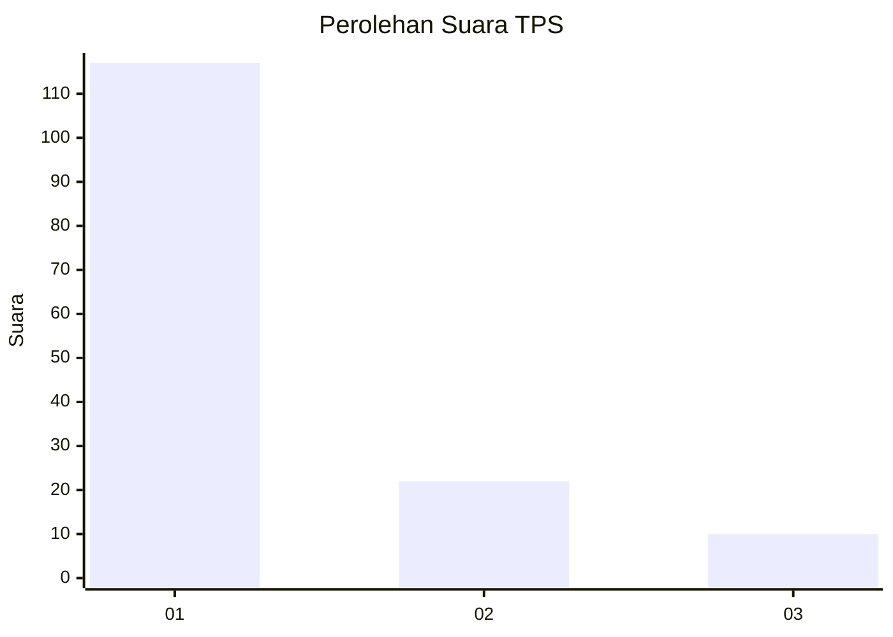
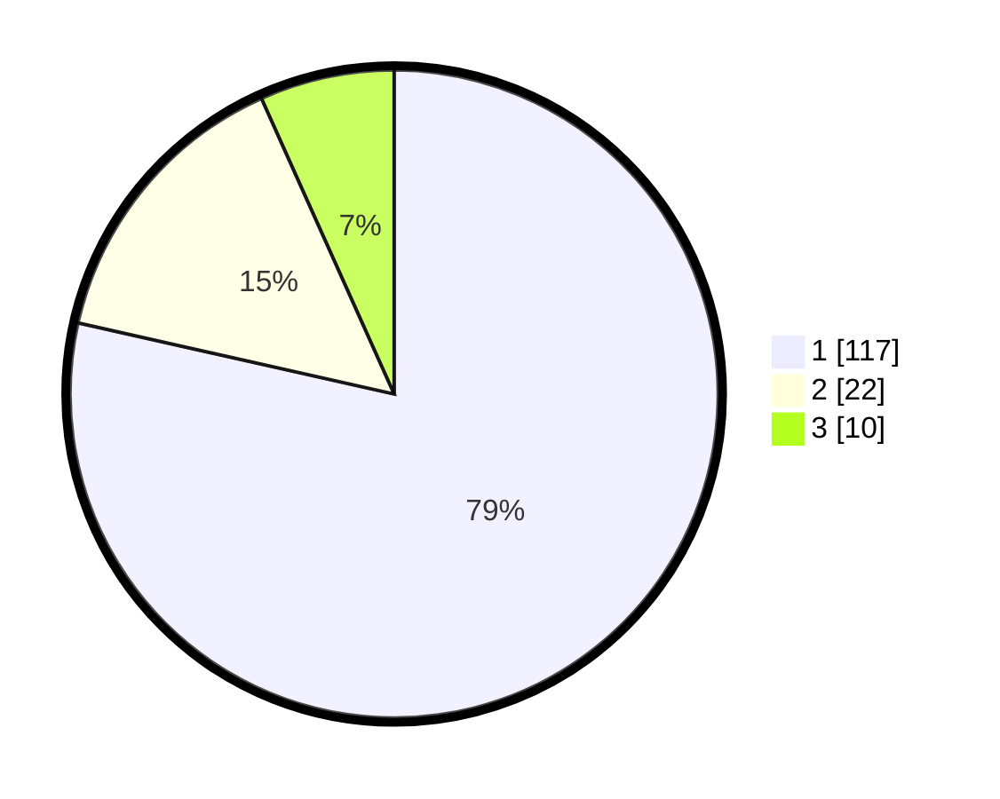

# Hasil

## Grafik

## Tabel

| No. | Nama Paslon    | Suara | Suara (raw) | Persentase |
|:--- |:-------------- | -----:| -----------:| ----------:|
| 1   | ANIES MUHAIMIN | 117   | [117][p-1]  | 78,52      |
| 2   | PRABOWO GIBRAN | 22    | [22][p-2]   | 14,77      |
| 3   | GANJAR MAHFUD  | 10    | [10][p-3]   | 6,71       |

[p-1]: https://github.com/gigit-pemilu/pemilu-2024-35-jawa-timur/blob/main/pilpres/hitung-suara/sub/35-jawa-timur/sub/29-sumenep/sub/21-nonggunong/sub/2007-rosong/sub/003-tps/sub/paslon-1.txt
[p-2]: https://github.com/gigit-pemilu/pemilu-2024-35-jawa-timur/blob/main/pilpres/hitung-suara/sub/35-jawa-timur/sub/29-sumenep/sub/21-nonggunong/sub/2007-rosong/sub/003-tps/sub/paslon-2.txt
[p-3]: https://github.com/gigit-pemilu/pemilu-2024-35-jawa-timur/blob/main/pilpres/hitung-suara/sub/35-jawa-timur/sub/29-sumenep/sub/21-nonggunong/sub/2007-rosong/sub/003-tps/sub/paslon-3.txt

## Foto C Plano

https://sirekap-obj-formc.kpu.go.id/5229/pemilu/ppwp/35/29/21/20/07/3529212007003-20240214-203459--3e2823aa-bb4d-4655-aaad-766dae24689c.jpg

https://sirekap-obj-formc.kpu.go.id/5229/pemilu/ppwp/35/29/21/20/07/3529212007003-20240215-101657--437ea4a0-20d3-4487-ab5e-ae7cc3247759.jpg

## Metadata

| Key        | Value               |
| ---------- | ------------------- |
| Time Stamp | 2024-02-15 22:00:27 |

