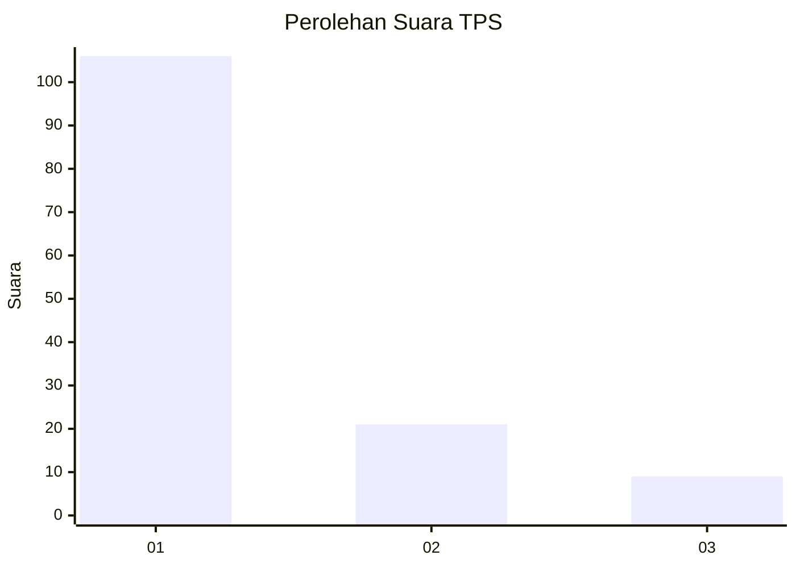
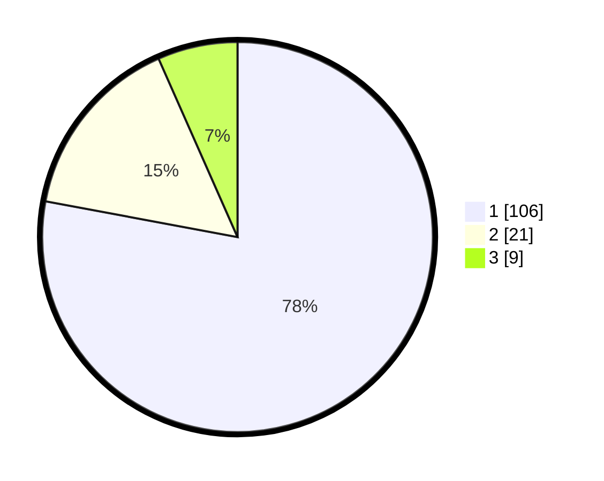

# Hasil

## Grafik

## Tabel

| No. | Nama Paslon    | Suara | Suara (raw) | Persentase |
|:--- |:-------------- | -----:| -----------:| ----------:|
| 1   | ANIES MUHAIMIN | 106   | [106][p-1]  | 77,94      |
| 2   | PRABOWO GIBRAN | 21    | [21][p-2]   | 15,44      |
| 3   | GANJAR MAHFUD  | 9     | [9][p-3]    | 6,62       |

[p-1]: https://github.com/gigit-pemilu/pemilu-2024/blob/main/pilpres/hitung-suara/sub/35-jawa-timur/sub/29-sumenep/sub/22-ra'as/sub/2001-ketupat/sub/002-tps/sub/paslon-1.txt
[p-2]: https://github.com/gigit-pemilu/pemilu-2024/blob/main/pilpres/hitung-suara/sub/35-jawa-timur/sub/29-sumenep/sub/22-ra'as/sub/2001-ketupat/sub/002-tps/sub/paslon-2.txt
[p-3]: https://github.com/gigit-pemilu/pemilu-2024/blob/main/pilpres/hitung-suara/sub/35-jawa-timur/sub/29-sumenep/sub/22-ra'as/sub/2001-ketupat/sub/002-tps/sub/paslon-3.txt

## Foto C Plano

https://sirekap-obj-formc.kpu.go.id/e2d0/pemilu/ppwp/35/29/22/20/01/3529222001002-20240226-171934--bd8fb64b-e523-4bc4-8854-7154e0c7f8cb.jpg

https://sirekap-obj-formc.kpu.go.id/e2d0/pemilu/ppwp/35/29/22/20/01/3529222001002-20240226-171936--c86691cb-b951-43df-b5e3-5ae47b63aea6.jpg

https://sirekap-obj-formc.kpu.go.id/e2d0/pemilu/ppwp/35/29/22/20/01/3529222001002-20240226-171935--9e3963bd-1d09-47f8-8bad-0af228ee353c.jpg

## Metadata

| Key        | Value               |
| ---------- | ------------------- |
| Time Stamp | 2024-02-27 01:00:00 |

## DATA PEMILIH TETAP

Jumlah pemilih dalam DPT: **178**.
 * L: **89**.
 * P: **89**.

## DATA PENGGUNA HAK PILIH

Jumlah pengguna hak pilih dalam DPT: **170**.
 * L: **73**.
 * P: **97**.

Jumlah pengguna hak pilih dalam DPTb: **0**.
 * L: **0**.
 * P: **0**.

Jumlah pengguna hak pilih dalam DPK: **0**.
 * L: **0**.
 * P: **0**.

Jumlah pengguna hak pilih: **170**.
 * L: **73**.
 * P: **79**.

## JUMLAH SUARA SAH DAN TIDAK SAH

JUMLAH SELURUH SUARA SAH: **136**.

JUMLAH SUARA TIDAK SAH: **34**.

JUMLAH SELURUH SUARA SAH DAN SUARA TIDAK SAH: **170**.

