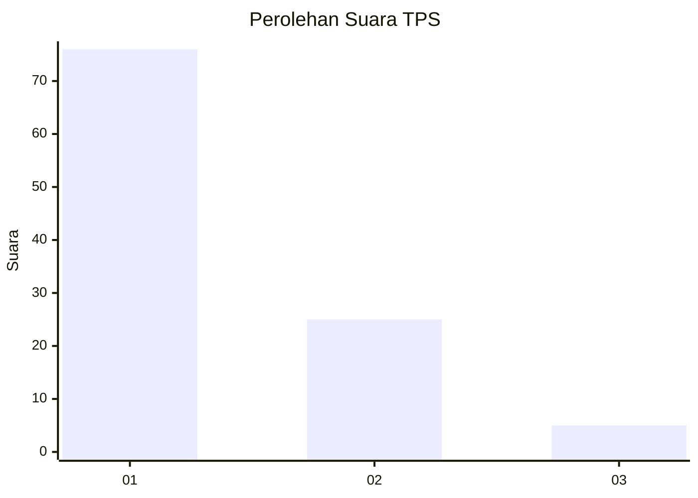
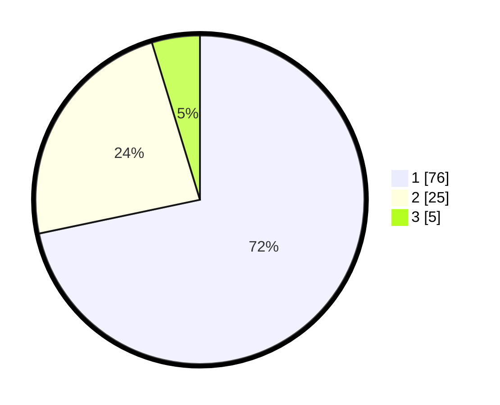

# Hasil

## Grafik

## Tabel

| No. | Nama Paslon    | Suara | Suara (raw) | Persentase |
|:--- |:-------------- | -----:| -----------:| ----------:|
| 1   | ANIES MUHAIMIN | 76    | [76][p-1]   | 71,70      |
| 2   | PRABOWO GIBRAN | 25    | [25][p-2]   | 23,58      |
| 3   | GANJAR MAHFUD  | 5     | [5][p-3]    | 4,72       |

[p-1]: https://github.com/gigit-pemilu/pemilu-2024/blob/main/pilpres/hitung-suara/sub/35-jawa-timur/sub/29-sumenep/sub/22-ra'as/sub/2001-ketupat/sub/003-tps/sub/paslon-1.txt
[p-2]: https://github.com/gigit-pemilu/pemilu-2024/blob/main/pilpres/hitung-suara/sub/35-jawa-timur/sub/29-sumenep/sub/22-ra'as/sub/2001-ketupat/sub/003-tps/sub/paslon-2.txt
[p-3]: https://github.com/gigit-pemilu/pemilu-2024/blob/main/pilpres/hitung-suara/sub/35-jawa-timur/sub/29-sumenep/sub/22-ra'as/sub/2001-ketupat/sub/003-tps/sub/paslon-3.txt

## Foto C Plano

https://sirekap-obj-formc.kpu.go.id/5b95/pemilu/ppwp/35/29/22/20/01/3529222001003-20240226-163424--198e42c2-aa1f-4536-a7fe-d9b178ce3273.jpg

https://sirekap-obj-formc.kpu.go.id/5b95/pemilu/ppwp/35/29/22/20/01/3529222001003-20240223-160123--25ce54d7-2be1-4c32-b283-08169a3d23da.jpg

https://sirekap-obj-formc.kpu.go.id/5b95/pemilu/ppwp/35/29/22/20/01/3529222001003-20240226-163425--28282fa7-dd01-442d-a59b-f63d7d2dcfb5.jpg

## Metadata

| Key        | Value               |
| ---------- | ------------------- |
| Time Stamp | 2024-02-26 17:00:04 |

## DATA PEMILIH TETAP

Jumlah pemilih dalam DPT: **182**.
 * L: **93**.
 * P: **89**.

## DATA PENGGUNA HAK PILIH

Jumlah pengguna hak pilih dalam DPT: **123**.
 * L: **55**.
 * P: **68**.

Jumlah pengguna hak pilih dalam DPTb: **0**.
 * L: **0**.
 * P: **0**.

Jumlah pengguna hak pilih dalam DPK: **0**.
 * L: **0**.
 * P: **0**.

Jumlah pengguna hak pilih: **123**.
 * L: **55**.
 * P: **68**.

## JUMLAH SUARA SAH DAN TIDAK SAH

JUMLAH SELURUH SUARA SAH: **106**.

JUMLAH SUARA TIDAK SAH: **17**.

JUMLAH SELURUH SUARA SAH DAN SUARA TIDAK SAH: **123**.

