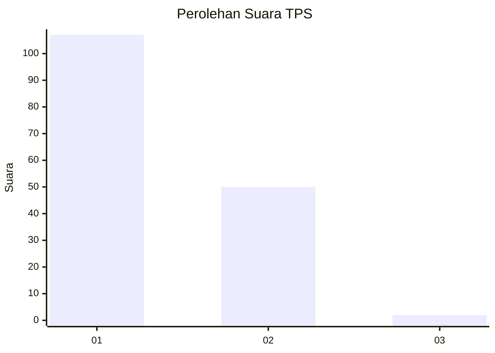
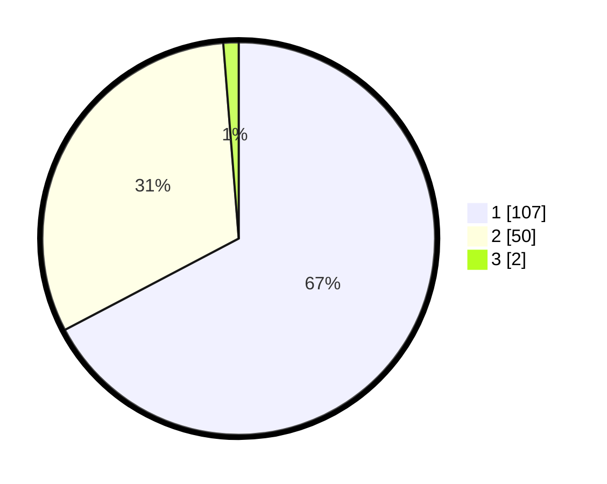

# Hasil

## Grafik

## Tabel

| No. | Nama Paslon    | Suara | Suara (raw) | Persentase |
|:--- |:-------------- | -----:| -----------:| ----------:|
| 1   | ANIES MUHAIMIN | 107   | [107][p-1]  | 67,30      |
| 2   | PRABOWO GIBRAN | 50    | [50][p-2]   | 31,45      |
| 3   | GANJAR MAHFUD  | 2     | [2][p-3]    | 1,26       |

[p-1]: https://github.com/gigit-pemilu/pemilu-2024-35-jawa-timur/blob/main/pilpres/hitung-suara/sub/35-jawa-timur/sub/29-sumenep/sub/22-ra'as/sub/2006-poteran/sub/003-tps/sub/paslon-1.txt
[p-2]: https://github.com/gigit-pemilu/pemilu-2024-35-jawa-timur/blob/main/pilpres/hitung-suara/sub/35-jawa-timur/sub/29-sumenep/sub/22-ra'as/sub/2006-poteran/sub/003-tps/sub/paslon-2.txt
[p-3]: https://github.com/gigit-pemilu/pemilu-2024-35-jawa-timur/blob/main/pilpres/hitung-suara/sub/35-jawa-timur/sub/29-sumenep/sub/22-ra'as/sub/2006-poteran/sub/003-tps/sub/paslon-3.txt

## Foto C Plano

https://sirekap-obj-formc.kpu.go.id/2181/pemilu/ppwp/35/29/22/20/06/3529222006003-20240224-111806--e7032b08-3aee-46ce-a3a8-7f18b84cb096.jpg

https://sirekap-obj-formc.kpu.go.id/2181/pemilu/ppwp/35/29/22/20/06/3529222006003-20240224-111921--710f4abb-42bd-4e4b-83f5-56f999058b3f.jpg

https://sirekap-obj-formc.kpu.go.id/2181/pemilu/ppwp/35/29/22/20/06/3529222006003-20240224-112127--b3f827a2-fedb-448f-a286-70c13ec6b33a.jpg

## Metadata

| Key        | Value               |
| ---------- | ------------------- |
| Time Stamp | 2024-03-01 21:00:00 |

