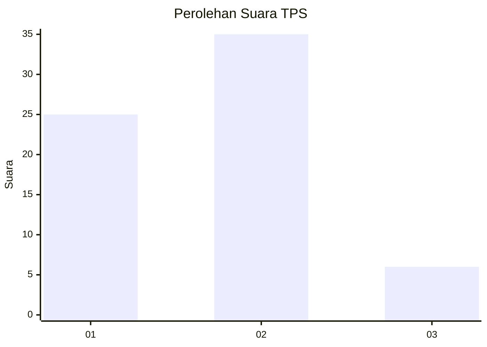

# Hasil

## Grafik

## Tabel

| No. | Nama Paslon    | Suara | Suara (raw) | Persentase |
|:--- |:-------------- | -----:| -----------:| ----------:|
| 1   | ANIES MUHAIMIN | 25    | [25][p-1]   | 37,88      |
| 2   | PRABOWO GIBRAN | 35    | [35][p-2]   | 53,03      |
| 3   | GANJAR MAHFUD  | 6     | [6][p-3]    | 9,09       |

[p-1]: https://github.com/gigit-pemilu/pemilu-2024/blob/main/pilpres/hitung-suara/sub/35-jawa-timur/sub/29-sumenep/sub/22-ra'as/sub/2009-guwa-guwa/sub/005-tps/sub/paslon-1.txt
[p-2]: https://github.com/gigit-pemilu/pemilu-2024/blob/main/pilpres/hitung-suara/sub/35-jawa-timur/sub/29-sumenep/sub/22-ra'as/sub/2009-guwa-guwa/sub/005-tps/sub/paslon-2.txt
[p-3]: https://github.com/gigit-pemilu/pemilu-2024/blob/main/pilpres/hitung-suara/sub/35-jawa-timur/sub/29-sumenep/sub/22-ra'as/sub/2009-guwa-guwa/sub/005-tps/sub/paslon-3.txt

## Foto C Plano

https://sirekap-obj-formc.kpu.go.id/fb84/pemilu/ppwp/35/29/22/20/09/3529222009005-20240226-233747--6056d1f6-5644-4fda-98bb-17e575f57184.jpg

https://sirekap-obj-formc.kpu.go.id/fb84/pemilu/ppwp/35/29/22/20/09/3529222009005-20240226-233749--4ce90a2c-27f4-4c95-9b5b-3d8b533ff2cd.jpg

https://sirekap-obj-formc.kpu.go.id/fb84/pemilu/ppwp/35/29/22/20/09/3529222009005-20240226-233748--6a071cac-00dd-48d2-a280-538eb7bf1ad9.jpg

## Metadata

| Key        | Value               |
| ---------- | ------------------- |
| Time Stamp | 2024-02-27 22:00:00 |

## DATA PEMILIH TETAP

Jumlah pemilih dalam DPT: **179**.
 * L: **85**.
 * P: **94**.

## DATA PENGGUNA HAK PILIH

Jumlah pengguna hak pilih dalam DPT: **163**.
 * L: **80**.
 * P: **83**.

Jumlah pengguna hak pilih dalam DPTb: **0**.
 * L: **0**.
 * P: **0**.

Jumlah pengguna hak pilih dalam DPK: **0**.
 * L: **0**.
 * P: **0**.

Jumlah pengguna hak pilih: **163**.
 * L: **80**.
 * P: **83**.

## JUMLAH SUARA SAH DAN TIDAK SAH

JUMLAH SELURUH SUARA SAH: **66**.

JUMLAH SUARA TIDAK SAH: **91**.

JUMLAH SELURUH SUARA SAH DAN SUARA TIDAK SAH: **163**.

