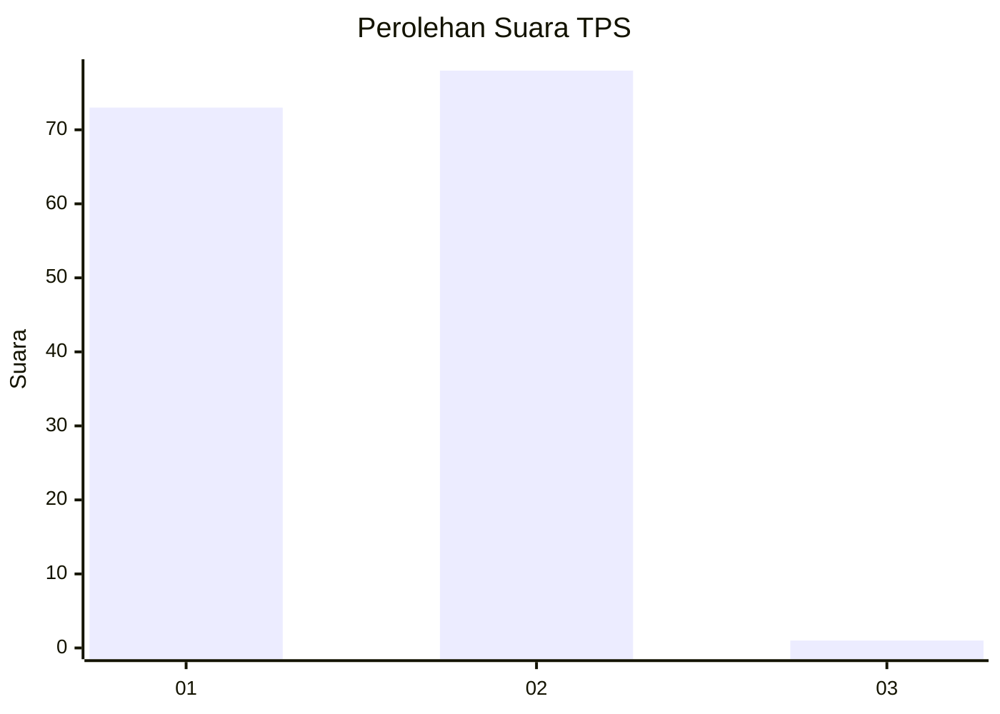
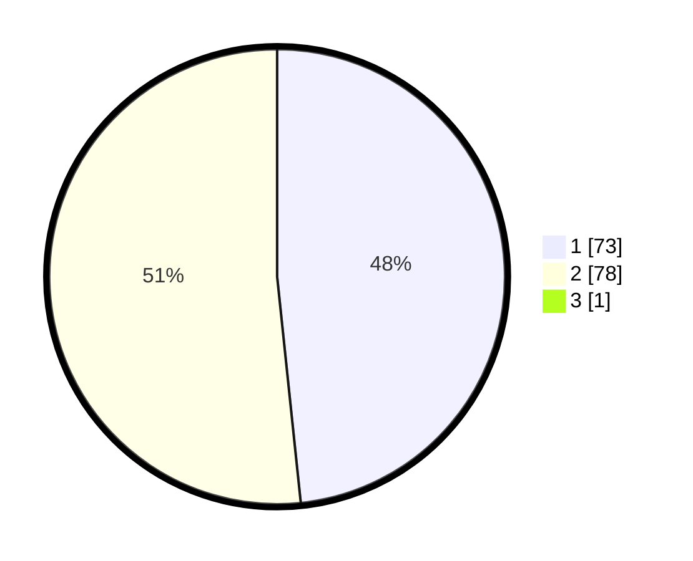

# Hasil

## Grafik

## Tabel

| No. | Nama Paslon    | Suara | Suara (raw) | Persentase |
|:--- |:-------------- | -----:| -----------:| ----------:|
| 1   | ANIES MUHAIMIN | 73    | [73][p-1]   | 48,03      |
| 2   | PRABOWO GIBRAN | 78    | [78][p-2]   | 51,32      |
| 3   | GANJAR MAHFUD  | 1     | [1][p-3]    | 0,66       |

[p-1]: https://github.com/gigit-pemilu/pemilu-2024-35-jawa-timur/blob/main/pilpres/hitung-suara/sub/35-jawa-timur/sub/29-sumenep/sub/24-arjasa/sub/2008-sawah-sumur/sub/004-tps/sub/paslon-1.txt
[p-2]: https://github.com/gigit-pemilu/pemilu-2024-35-jawa-timur/blob/main/pilpres/hitung-suara/sub/35-jawa-timur/sub/29-sumenep/sub/24-arjasa/sub/2008-sawah-sumur/sub/004-tps/sub/paslon-2.txt
[p-3]: https://github.com/gigit-pemilu/pemilu-2024-35-jawa-timur/blob/main/pilpres/hitung-suara/sub/35-jawa-timur/sub/29-sumenep/sub/24-arjasa/sub/2008-sawah-sumur/sub/004-tps/sub/paslon-3.txt

## Foto C Plano

https://sirekap-obj-formc.kpu.go.id/57c0/pemilu/ppwp/35/29/24/20/08/3529242008004-20240215-160545--16767f0e-d354-45c2-8f72-b5bd8606f69e.jpg

https://sirekap-obj-formc.kpu.go.id/57c0/pemilu/ppwp/35/29/24/20/08/3529242008004-20240215-160524--f525c302-3d6f-44af-99bd-e3e1bd2c304c.jpg

https://sirekap-obj-formc.kpu.go.id/57c0/pemilu/ppwp/35/29/24/20/08/3529242008004-20240215-160443--697c99f4-70c9-4be5-8cd4-ab773d0f5f6f.jpg

## Metadata

| Key        | Value               |
| ---------- | ------------------- |
| Time Stamp | 2024-02-24 22:31:28 |

