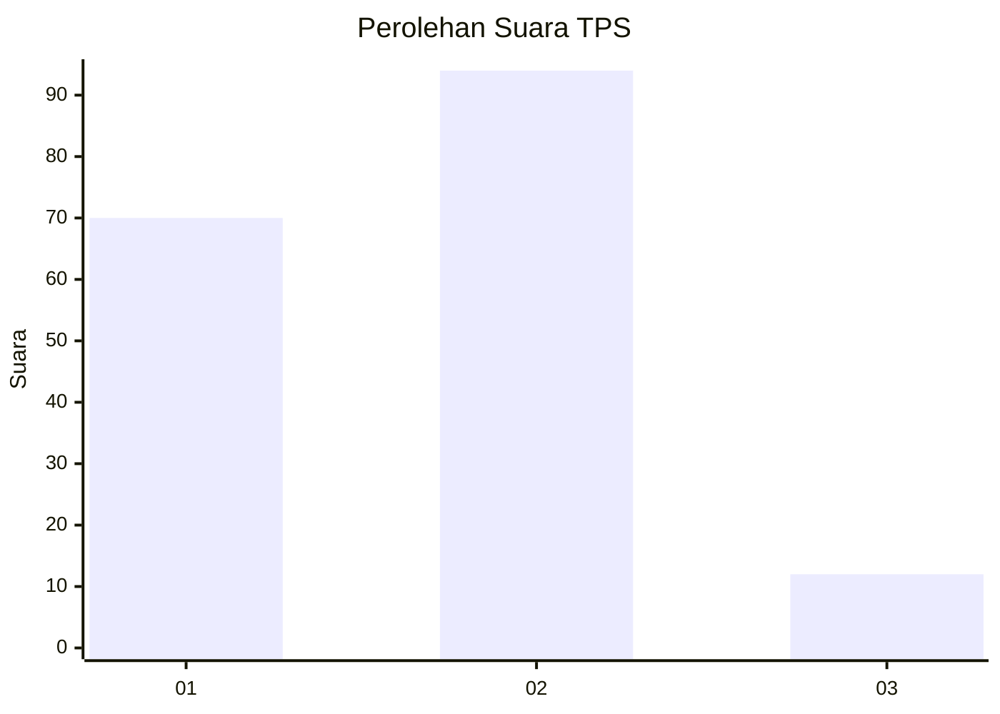

# Hasil

## Grafik

## Tabel

| No. | Nama Paslon    | Suara | Suara (raw) | Persentase |
|:--- |:-------------- | -----:| -----------:| ----------:|
| 1   | ANIES MUHAIMIN | 70    | [70][p-1]   | 39,77      |
| 2   | PRABOWO GIBRAN | 94    | [94][p-2]   | 53,41      |
| 3   | GANJAR MAHFUD  | 12    | [12][p-3]   | 6,82       |

[p-1]: https://github.com/gigit-pemilu/pemilu-2024-35-jawa-timur/blob/main/pilpres/hitung-suara/sub/35-jawa-timur/sub/29-sumenep/sub/24-arjasa/sub/2016-laok-jang-jang/sub/003-tps/sub/paslon-1.txt
[p-2]: https://github.com/gigit-pemilu/pemilu-2024-35-jawa-timur/blob/main/pilpres/hitung-suara/sub/35-jawa-timur/sub/29-sumenep/sub/24-arjasa/sub/2016-laok-jang-jang/sub/003-tps/sub/paslon-2.txt
[p-3]: https://github.com/gigit-pemilu/pemilu-2024-35-jawa-timur/blob/main/pilpres/hitung-suara/sub/35-jawa-timur/sub/29-sumenep/sub/24-arjasa/sub/2016-laok-jang-jang/sub/003-tps/sub/paslon-3.txt

## Foto C Plano

https://sirekap-obj-formc.kpu.go.id/1ff9/pemilu/ppwp/35/29/24/20/16/3529242016003-20240215-113913--09d9e4ac-ee97-4729-b769-3ec95b254d27.jpg

https://sirekap-obj-formc.kpu.go.id/1ff9/pemilu/ppwp/35/29/24/20/16/3529242016003-20240215-114030--5a0a94a0-70e4-423a-8234-2df5912b2e5f.jpg

## Metadata

| Key        | Value               |
| ---------- | ------------------- |
| Time Stamp | 2024-02-24 22:31:28 |

