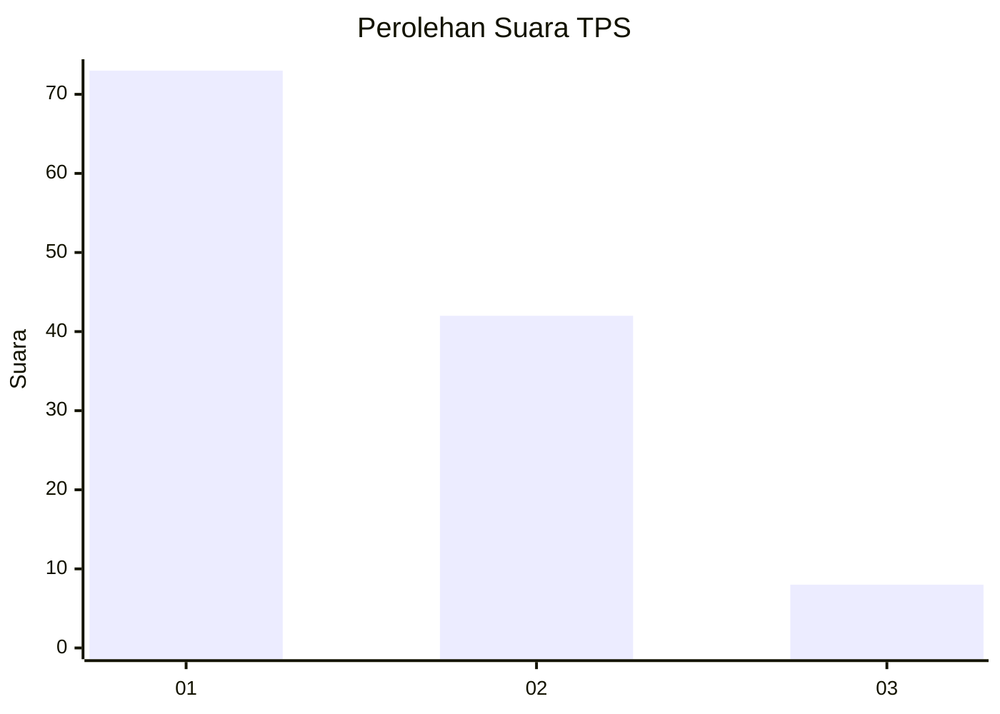
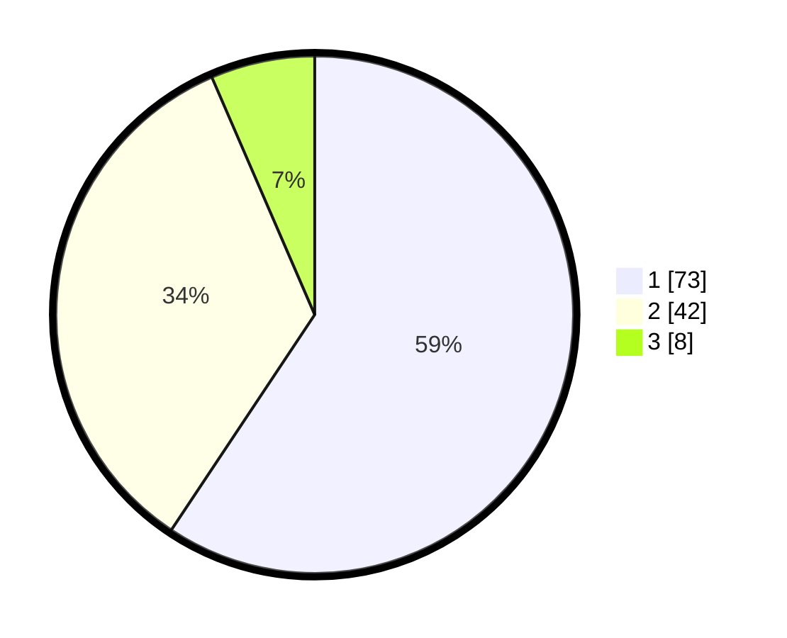

# Hasil

## Grafik

## Tabel

| No. | Nama Paslon    | Suara | Suara (raw) | Persentase |
|:--- |:-------------- | -----:| -----------:| ----------:|
| 1   | ANIES MUHAIMIN | 73    | [73][p-1]   | 59,35      |
| 2   | PRABOWO GIBRAN | 42    | [42][p-2]   | 34,15      |
| 3   | GANJAR MAHFUD  | 8     | [8][p-3]    | 6,50       |

[p-1]: https://github.com/gigit-pemilu/pemilu-2024-35-jawa-timur/blob/main/pilpres/hitung-suara/sub/35-jawa-timur/sub/29-sumenep/sub/24-arjasa/sub/2016-laok-jang-jang/sub/014-tps/sub/paslon-1.txt
[p-2]: https://github.com/gigit-pemilu/pemilu-2024-35-jawa-timur/blob/main/pilpres/hitung-suara/sub/35-jawa-timur/sub/29-sumenep/sub/24-arjasa/sub/2016-laok-jang-jang/sub/014-tps/sub/paslon-2.txt
[p-3]: https://github.com/gigit-pemilu/pemilu-2024-35-jawa-timur/blob/main/pilpres/hitung-suara/sub/35-jawa-timur/sub/29-sumenep/sub/24-arjasa/sub/2016-laok-jang-jang/sub/014-tps/sub/paslon-3.txt

## Foto C Plano

https://sirekap-obj-formc.kpu.go.id/c6b4/pemilu/ppwp/35/29/24/20/16/3529242016014-20240214-231811--c2899922-2ee7-4009-8967-349c1b19c955.jpg

https://sirekap-obj-formc.kpu.go.id/c6b4/pemilu/ppwp/35/29/24/20/16/3529242016014-20240214-231844--8713295d-fd7f-4cca-ad62-7c5f15871d0c.jpg

## Metadata

| Key        | Value               |
| ---------- | ------------------- |
| Time Stamp | 2024-02-25 11:00:00 |

