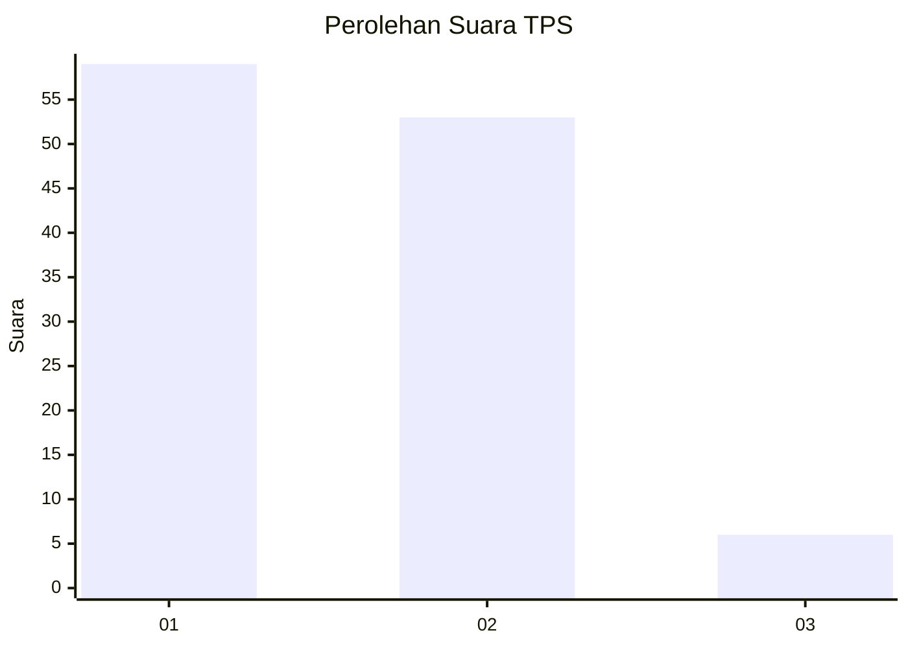
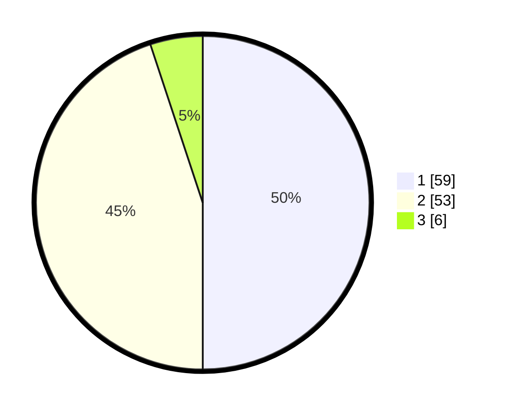

# Hasil

## Grafik

## Tabel

| No. | Nama Paslon    | Suara | Suara (raw) | Persentase |
|:--- |:-------------- | -----:| -----------:| ----------:|
| 1   | ANIES MUHAIMIN | 59    | [59][p-1]   | 50,00      |
| 2   | PRABOWO GIBRAN | 53    | [53][p-2]   | 44,92      |
| 3   | GANJAR MAHFUD  | 6     | [6][p-3]    | 5,08       |

[p-1]: https://github.com/gigit-pemilu/pemilu-2024/blob/main/pilpres/hitung-suara/sub/35-jawa-timur/sub/29-sumenep/sub/24-arjasa/sub/2019-kalikatak/sub/023-tps/sub/paslon-1.txt
[p-2]: https://github.com/gigit-pemilu/pemilu-2024/blob/main/pilpres/hitung-suara/sub/35-jawa-timur/sub/29-sumenep/sub/24-arjasa/sub/2019-kalikatak/sub/023-tps/sub/paslon-2.txt
[p-3]: https://github.com/gigit-pemilu/pemilu-2024/blob/main/pilpres/hitung-suara/sub/35-jawa-timur/sub/29-sumenep/sub/24-arjasa/sub/2019-kalikatak/sub/023-tps/sub/paslon-3.txt

## Foto C Plano

https://sirekap-obj-formc.kpu.go.id/8394/pemilu/ppwp/35/29/24/20/19/3529242019023-20240225-230940--1db843bc-b6d2-4c60-889d-d084fb9e0833.jpg

https://sirekap-obj-formc.kpu.go.id/8394/pemilu/ppwp/35/29/24/20/19/3529242019023-20240225-231059--7a03904c-301c-40c7-9b45-0c3c68aa0ec2.jpg

https://sirekap-obj-formc.kpu.go.id/8394/pemilu/ppwp/35/29/24/20/19/3529242019023-20240225-231416--2ee20cd0-32cd-48fd-a3dc-261722892059.jpg

## Metadata

| Key        | Value               |
| ---------- | ------------------- |
| Time Stamp | 2024-02-28 19:00:00 |

