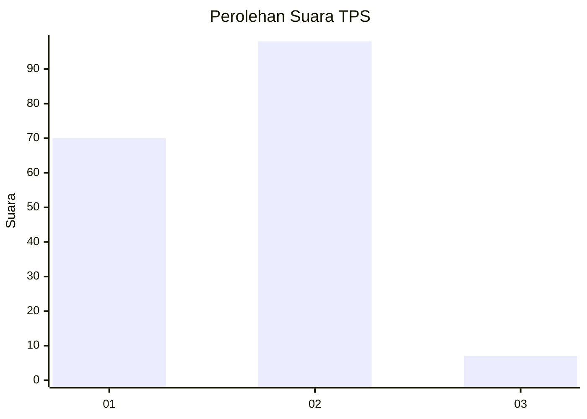
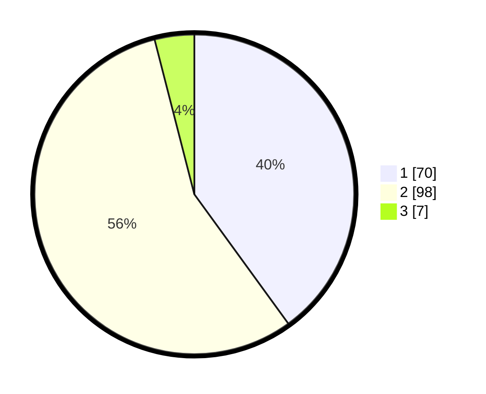

# Hasil

## Grafik

## Tabel

| No. | Nama Paslon    | Suara | Suara (raw) | Persentase |
|:--- |:-------------- | -----:| -----------:| ----------:|
| 1   | ANIES MUHAIMIN | 70    | [70][p-1]   | 40,00      |
| 2   | PRABOWO GIBRAN | 98    | [98][p-2]   | 56,00      |
| 3   | GANJAR MAHFUD  | 7     | [7][p-3]    | 4,00       |

[p-1]: https://github.com/gigit-pemilu/pemilu-2024-35-jawa-timur/blob/main/pilpres/hitung-suara/sub/35-jawa-timur/sub/29-sumenep/sub/24-arjasa/sub/2020-arjasa/sub/004-tps/sub/paslon-1.txt
[p-2]: https://github.com/gigit-pemilu/pemilu-2024-35-jawa-timur/blob/main/pilpres/hitung-suara/sub/35-jawa-timur/sub/29-sumenep/sub/24-arjasa/sub/2020-arjasa/sub/004-tps/sub/paslon-2.txt
[p-3]: https://github.com/gigit-pemilu/pemilu-2024-35-jawa-timur/blob/main/pilpres/hitung-suara/sub/35-jawa-timur/sub/29-sumenep/sub/24-arjasa/sub/2020-arjasa/sub/004-tps/sub/paslon-3.txt

## Foto C Plano

https://sirekap-obj-formc.kpu.go.id/ede8/pemilu/ppwp/35/29/24/20/20/3529242020004-20240214-215935--0e4de3c1-ffd5-4e63-8bec-d1c36f27e6ce.jpg

https://sirekap-obj-formc.kpu.go.id/ede8/pemilu/ppwp/35/29/24/20/20/3529242020004-20240214-220012--05b8c1a9-a978-40e0-b786-9ca2f30b22e2.jpg

https://sirekap-obj-formc.kpu.go.id/ede8/pemilu/ppwp/35/29/24/20/20/3529242020004-20240214-220050--108ec247-4e95-4581-93ff-daa1226fb050.jpg

## Metadata

| Key        | Value               |
| ---------- | ------------------- |
| Time Stamp | 2024-03-01 22:00:00 |

