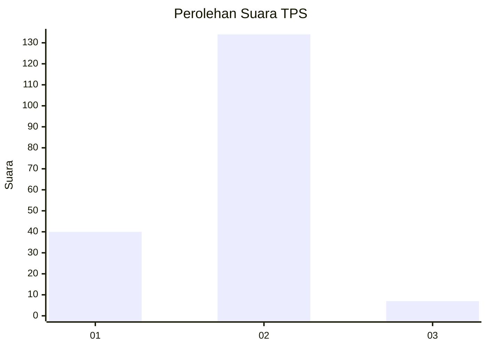

# Hasil

## Grafik

## Tabel

| No. | Nama Paslon    | Suara | Suara (raw) | Persentase |
|:--- |:-------------- | -----:| -----------:| ----------:|
| 1   | ANIES MUHAIMIN | 40    | [40][p-1]   | 22,10      |
| 2   | PRABOWO GIBRAN | 134   | [134][p-2]  | 74,03      |
| 3   | GANJAR MAHFUD  | 7     | [7][p-3]    | 3,87       |

[p-1]: https://github.com/gigit-pemilu/pemilu-2024-35-jawa-timur/blob/main/pilpres/hitung-suara/sub/35-jawa-timur/sub/29-sumenep/sub/25-sapeken/sub/2001-sepanjang/sub/019-tps/sub/paslon-1.txt
[p-2]: https://github.com/gigit-pemilu/pemilu-2024-35-jawa-timur/blob/main/pilpres/hitung-suara/sub/35-jawa-timur/sub/29-sumenep/sub/25-sapeken/sub/2001-sepanjang/sub/019-tps/sub/paslon-2.txt
[p-3]: https://github.com/gigit-pemilu/pemilu-2024-35-jawa-timur/blob/main/pilpres/hitung-suara/sub/35-jawa-timur/sub/29-sumenep/sub/25-sapeken/sub/2001-sepanjang/sub/019-tps/sub/paslon-3.txt

## Foto C Plano

https://sirekap-obj-formc.kpu.go.id/9201/pemilu/ppwp/35/29/25/20/01/3529252001019-20240214-204345--03c9ad54-16d2-4d0b-82c3-3f8342af7012.jpg

https://sirekap-obj-formc.kpu.go.id/9201/pemilu/ppwp/35/29/25/20/01/3529252001019-20240214-204624--25a2bf63-80b7-413a-8e26-0992afa1a6bb.jpg

https://sirekap-obj-formc.kpu.go.id/9201/pemilu/ppwp/35/29/25/20/01/3529252001019-20240214-204829--7de905c4-72e5-4085-adab-da83d88f237c.jpg

## Metadata

| Key        | Value               |
| ---------- | ------------------- |
| Time Stamp | 2024-02-25 16:00:00 |

