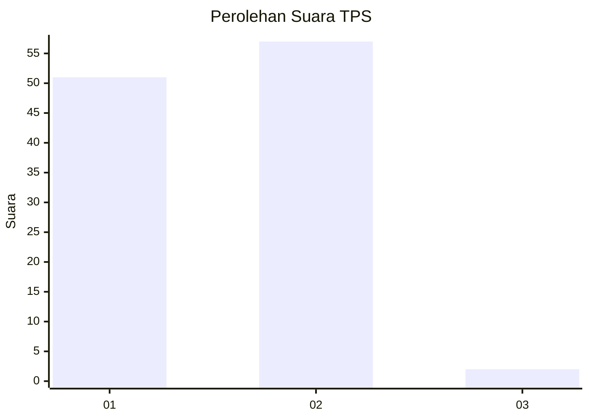
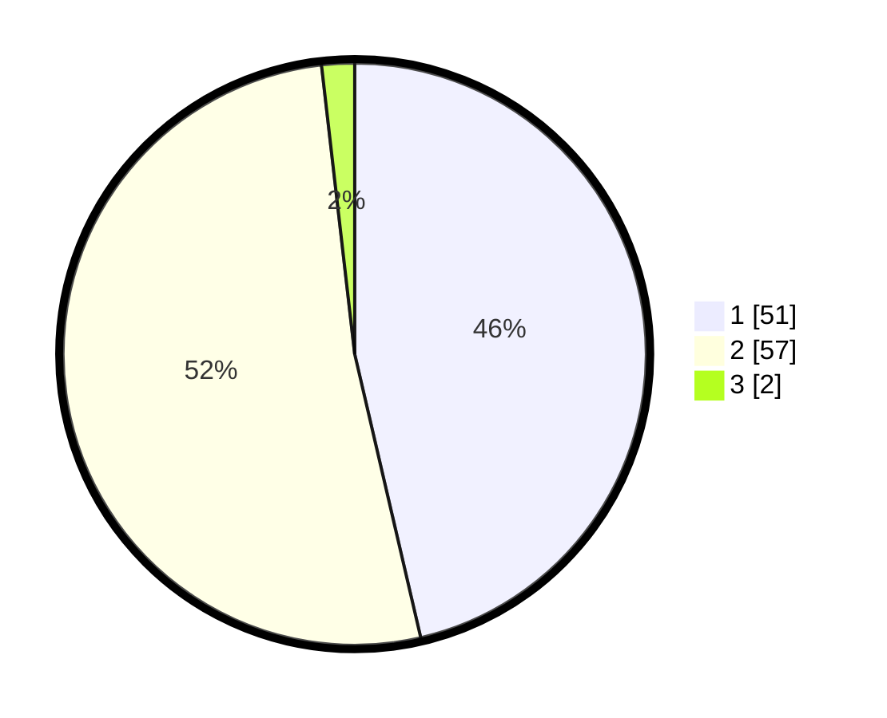

# Hasil

## Grafik

## Tabel

| No. | Nama Paslon    | Suara | Suara (raw) | Persentase |
|:--- |:-------------- | -----:| -----------:| ----------:|
| 1   | ANIES MUHAIMIN | 51    | [51][p-1]   | 46,36      |
| 2   | PRABOWO GIBRAN | 57    | [57][p-2]   | 51,82      |
| 3   | GANJAR MAHFUD  | 2     | [2][p-3]    | 1,82       |

[p-1]: https://github.com/gigit-pemilu/pemilu-2024/blob/main/pilpres/hitung-suara/sub/35-jawa-timur/sub/29-sumenep/sub/25-sapeken/sub/2004-pagerungan-besar/sub/019-tps/sub/paslon-1.txt
[p-2]: https://github.com/gigit-pemilu/pemilu-2024/blob/main/pilpres/hitung-suara/sub/35-jawa-timur/sub/29-sumenep/sub/25-sapeken/sub/2004-pagerungan-besar/sub/019-tps/sub/paslon-2.txt
[p-3]: https://github.com/gigit-pemilu/pemilu-2024/blob/main/pilpres/hitung-suara/sub/35-jawa-timur/sub/29-sumenep/sub/25-sapeken/sub/2004-pagerungan-besar/sub/019-tps/sub/paslon-3.txt

## Foto C Plano

https://sirekap-obj-formc.kpu.go.id/3d38/pemilu/ppwp/35/29/25/20/04/3529252004019-20240215-130544--87e05061-c1d1-4101-a23e-0d5fb6e273f5.jpg

https://sirekap-obj-formc.kpu.go.id/3d38/pemilu/ppwp/35/29/25/20/04/3529252004019-20240215-131627--67db22b0-e687-41ec-866a-ef1b7dd6a964.jpg

https://sirekap-obj-formc.kpu.go.id/3d38/pemilu/ppwp/35/29/25/20/04/3529252004019-20240215-102313--35bf4125-687d-419e-b20b-4f21c85adf39.jpg

## Metadata

| Key        | Value               |
| ---------- | ------------------- |
| Time Stamp | 2024-02-15 21:30:27 |

