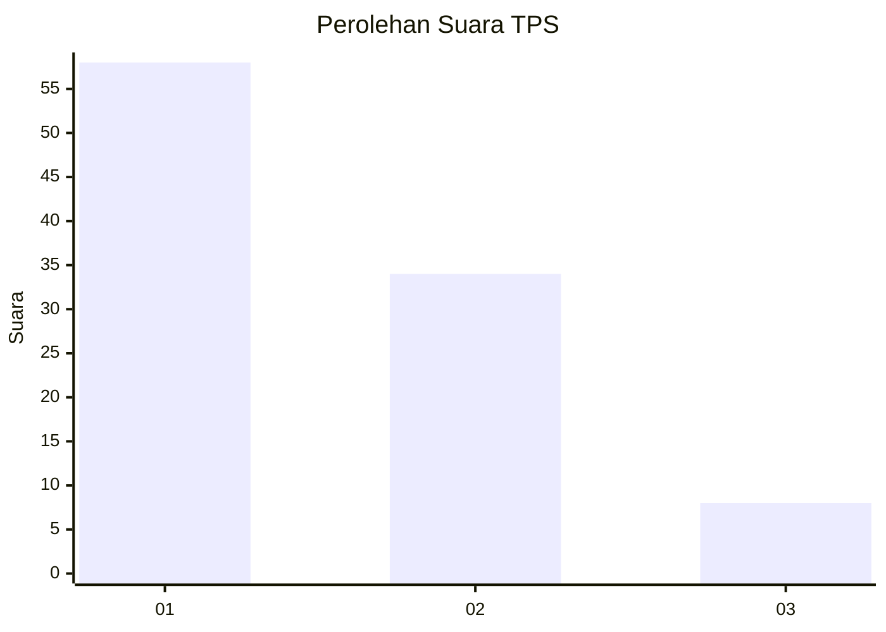
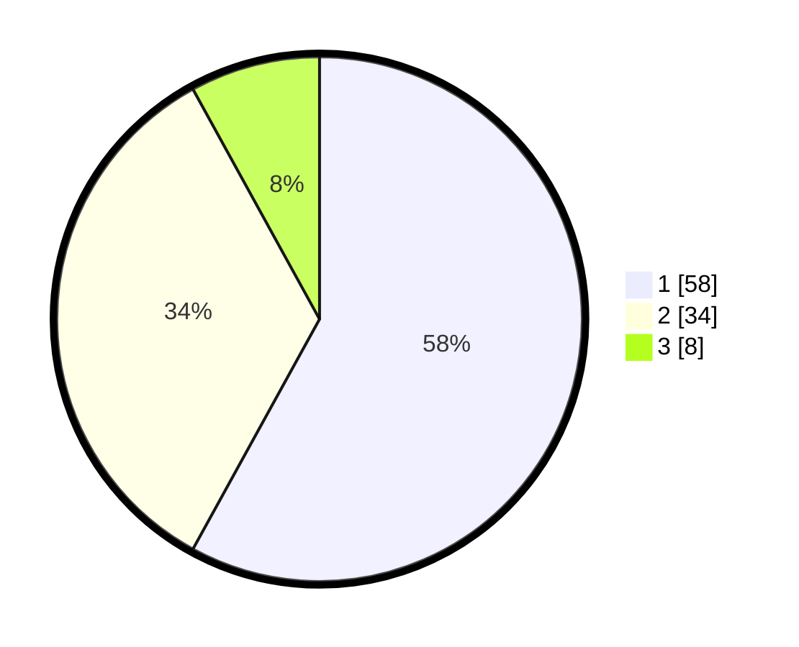

# Hasil

## Grafik

## Tabel

| No. | Nama Paslon    | Suara | Suara (raw) | Persentase |
|:--- |:-------------- | -----:| -----------:| ----------:|
| 1   | ANIES MUHAIMIN | 58    | [58][p-1]   | 58,00      |
| 2   | PRABOWO GIBRAN | 34    | [34][p-2]   | 34,00      |
| 3   | GANJAR MAHFUD  | 8     | [8][p-3]    | 8,00       |

[p-1]: https://github.com/gigit-pemilu/pemilu-2024-35-jawa-timur/blob/main/pilpres/hitung-suara/sub/35-jawa-timur/sub/29-sumenep/sub/25-sapeken/sub/2004-pagerungan-besar/sub/021-tps/sub/paslon-1.txt
[p-2]: https://github.com/gigit-pemilu/pemilu-2024-35-jawa-timur/blob/main/pilpres/hitung-suara/sub/35-jawa-timur/sub/29-sumenep/sub/25-sapeken/sub/2004-pagerungan-besar/sub/021-tps/sub/paslon-2.txt
[p-3]: https://github.com/gigit-pemilu/pemilu-2024-35-jawa-timur/blob/main/pilpres/hitung-suara/sub/35-jawa-timur/sub/29-sumenep/sub/25-sapeken/sub/2004-pagerungan-besar/sub/021-tps/sub/paslon-3.txt

## Foto C Plano

https://sirekap-obj-formc.kpu.go.id/b4e8/pemilu/ppwp/35/29/25/20/04/3529252004021-20240215-145559--2e3d7c4f-6ea8-47ac-a438-a4e6e19ad144.jpg

https://sirekap-obj-formc.kpu.go.id/b4e8/pemilu/ppwp/35/29/25/20/04/3529252004021-20240215-145937--17e965d1-5c9c-47f1-8ecd-9e81e6b07186.jpg

https://sirekap-obj-formc.kpu.go.id/b4e8/pemilu/ppwp/35/29/25/20/04/3529252004021-20240215-145509--524b4d27-a015-47ad-a064-4bf8fe32a019.jpg

## Metadata

| Key        | Value               |
| ---------- | ------------------- |
| Time Stamp | 2024-02-17 19:30:00 |

