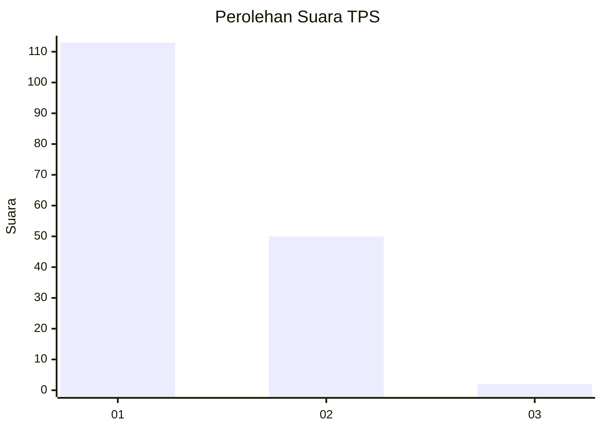
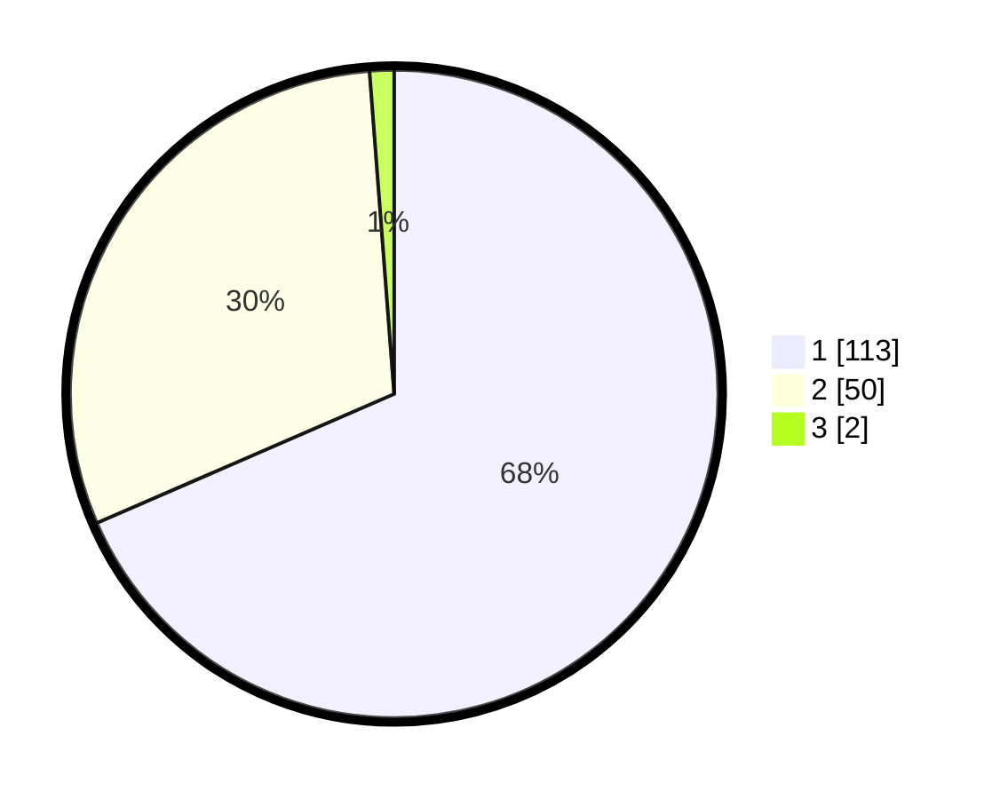

# Hasil

## Grafik

## Tabel

| No. | Nama Paslon    | Suara | Suara (raw) | Persentase |
|:--- |:-------------- | -----:| -----------:| ----------:|
| 1   | ANIES MUHAIMIN | 113   | [113][p-1]  | 68,48      |
| 2   | PRABOWO GIBRAN | 50    | [50][p-2]   | 30,30      |
| 3   | GANJAR MAHFUD  | 2     | [2][p-3]    | 1,21       |

[p-1]: https://github.com/gigit-pemilu/pemilu-2024-35-jawa-timur/blob/main/pilpres/hitung-suara/sub/35-jawa-timur/sub/29-sumenep/sub/25-sapeken/sub/2005-pagerungan-kecil/sub/020-tps/sub/paslon-1.txt
[p-2]: https://github.com/gigit-pemilu/pemilu-2024-35-jawa-timur/blob/main/pilpres/hitung-suara/sub/35-jawa-timur/sub/29-sumenep/sub/25-sapeken/sub/2005-pagerungan-kecil/sub/020-tps/sub/paslon-2.txt
[p-3]: https://github.com/gigit-pemilu/pemilu-2024-35-jawa-timur/blob/main/pilpres/hitung-suara/sub/35-jawa-timur/sub/29-sumenep/sub/25-sapeken/sub/2005-pagerungan-kecil/sub/020-tps/sub/paslon-3.txt

## Foto C Plano

https://sirekap-obj-formc.kpu.go.id/c623/pemilu/ppwp/35/29/25/20/05/3529252005020-20240215-214215--0128f8be-fadc-4cc9-bb45-339728aa405d.jpg

https://sirekap-obj-formc.kpu.go.id/c623/pemilu/ppwp/35/29/25/20/05/3529252005020-20240215-161631--e616259d-a117-4409-a537-efaafc3510f6.jpg

https://sirekap-obj-formc.kpu.go.id/c623/pemilu/ppwp/35/29/25/20/05/3529252005020-20240215-161728--0258f4f1-1717-4ac4-a940-d20ac5c10b9b.jpg

## Metadata

| Key        | Value               |
| ---------- | ------------------- |
| Time Stamp | 2024-02-15 22:00:27 |

