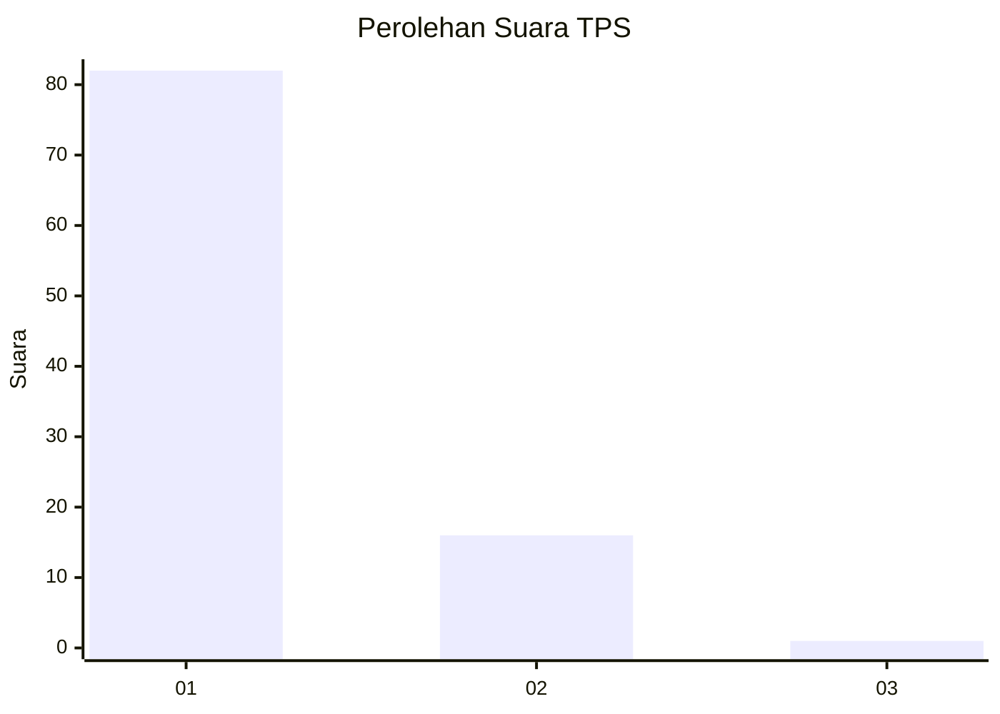
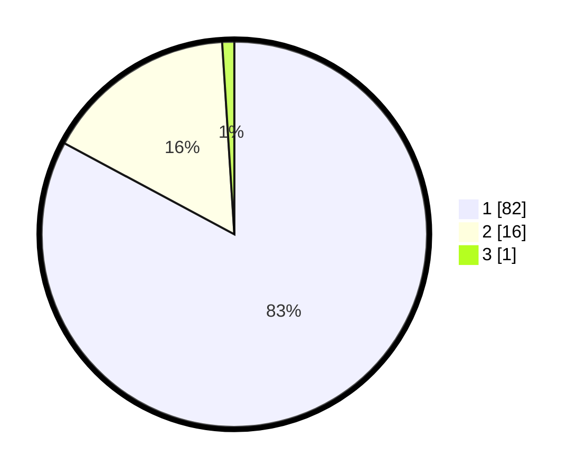

# Hasil

## Grafik

## Tabel

| No. | Nama Paslon    | Suara | Suara (raw) | Persentase |
|:--- |:-------------- | -----:| -----------:| ----------:|
| 1   | ANIES MUHAIMIN | 82    | [82][p-1]   | 82,83      |
| 2   | PRABOWO GIBRAN | 16    | [16][p-2]   | 16,16      |
| 3   | GANJAR MAHFUD  | 1     | [1][p-3]    | 1,01       |

[p-1]: https://github.com/gigit-pemilu/pemilu-2024-35-jawa-timur/blob/main/pilpres/hitung-suara/sub/35-jawa-timur/sub/29-sumenep/sub/25-sapeken/sub/2007-sapeken/sub/022-tps/sub/paslon-1.txt
[p-2]: https://github.com/gigit-pemilu/pemilu-2024-35-jawa-timur/blob/main/pilpres/hitung-suara/sub/35-jawa-timur/sub/29-sumenep/sub/25-sapeken/sub/2007-sapeken/sub/022-tps/sub/paslon-2.txt
[p-3]: https://github.com/gigit-pemilu/pemilu-2024-35-jawa-timur/blob/main/pilpres/hitung-suara/sub/35-jawa-timur/sub/29-sumenep/sub/25-sapeken/sub/2007-sapeken/sub/022-tps/sub/paslon-3.txt

## Foto C Plano

https://sirekap-obj-formc.kpu.go.id/0fea/pemilu/ppwp/35/29/25/20/07/3529252007022-20240215-063148--847b7011-6352-40ed-9f56-22939f00a8e7.jpg

https://sirekap-obj-formc.kpu.go.id/0fea/pemilu/ppwp/35/29/25/20/07/3529252007022-20240215-063351--0f9755e2-c60b-4bc7-8f9e-38b8d8bc537b.jpg

https://sirekap-obj-formc.kpu.go.id/0fea/pemilu/ppwp/35/29/25/20/07/3529252007022-20240215-063534--ac5a3c54-ff54-4997-9624-8e909ba59869.jpg

## Metadata

| Key        | Value               |
| ---------- | ------------------- |
| Time Stamp | 2024-02-24 22:31:28 |

