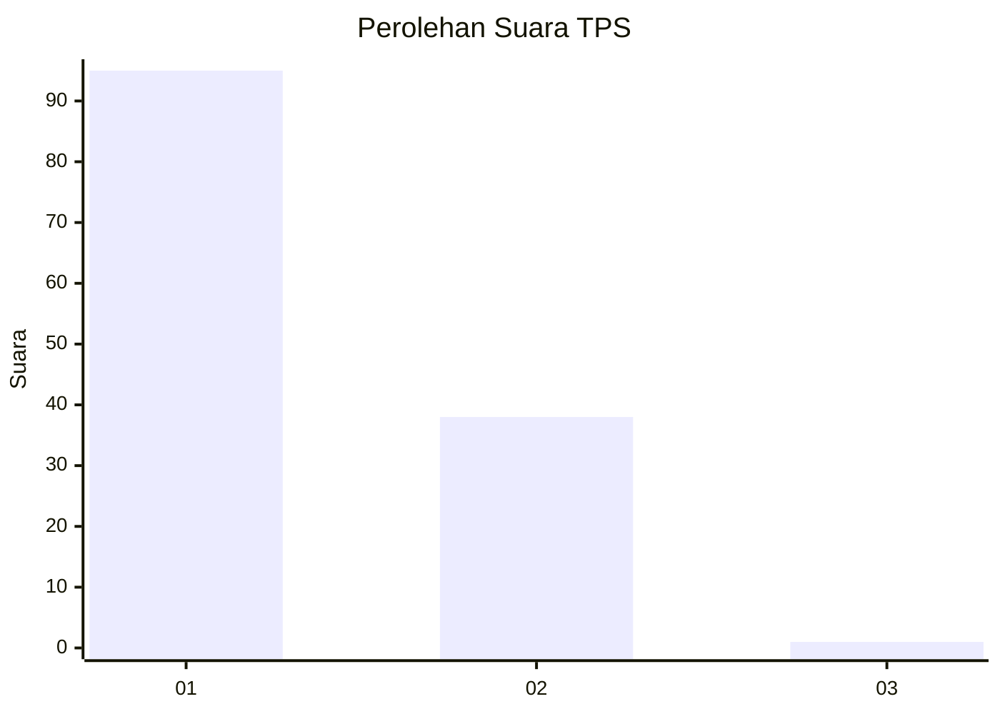
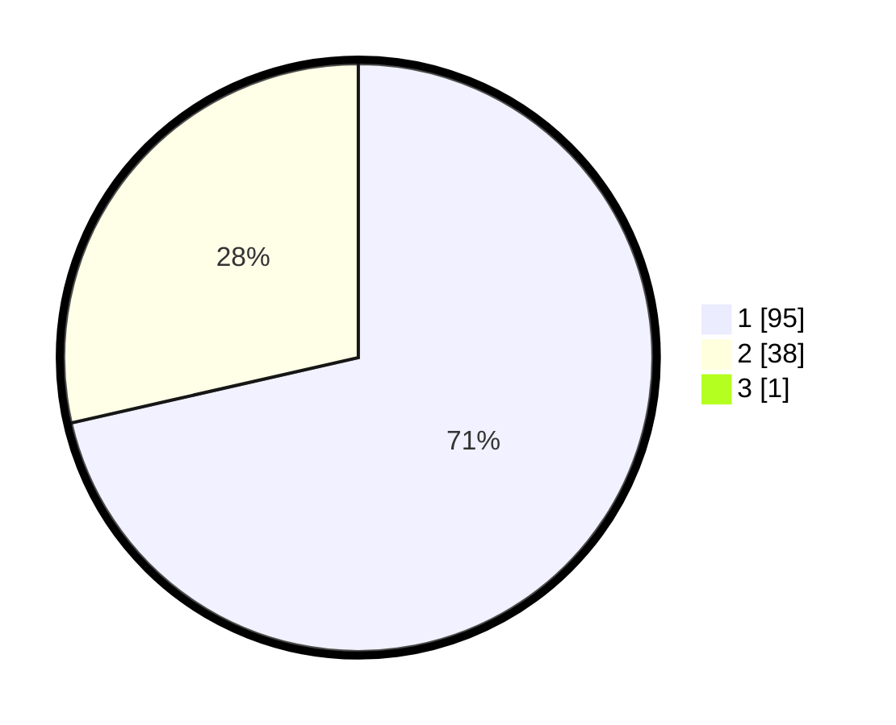

# Hasil

## Grafik

## Tabel

| No. | Nama Paslon    | Suara | Suara (raw) | Persentase |
|:--- |:-------------- | -----:| -----------:| ----------:|
| 1   | ANIES MUHAIMIN | 95    | [95][p-1]   | 70,90      |
| 2   | PRABOWO GIBRAN | 38    | [38][p-2]   | 28,36      |
| 3   | GANJAR MAHFUD  | 1     | [1][p-3]    | 0,75       |

[p-1]: https://github.com/gigit-pemilu/pemilu-2024/blob/main/pilpres/hitung-suara/sub/35-jawa-timur/sub/29-sumenep/sub/25-sapeken/sub/2007-sapeken/sub/031-tps/sub/paslon-1.txt
[p-2]: https://github.com/gigit-pemilu/pemilu-2024/blob/main/pilpres/hitung-suara/sub/35-jawa-timur/sub/29-sumenep/sub/25-sapeken/sub/2007-sapeken/sub/031-tps/sub/paslon-2.txt
[p-3]: https://github.com/gigit-pemilu/pemilu-2024/blob/main/pilpres/hitung-suara/sub/35-jawa-timur/sub/29-sumenep/sub/25-sapeken/sub/2007-sapeken/sub/031-tps/sub/paslon-3.txt

## Foto C Plano

https://sirekap-obj-formc.kpu.go.id/7359/pemilu/ppwp/35/29/25/20/07/3529252007031-20240214-234226--4da3c6d3-66fd-4c2b-863a-4571ce476ce3.jpg

https://sirekap-obj-formc.kpu.go.id/7359/pemilu/ppwp/35/29/25/20/07/3529252007031-20240215-022830--dfd9e8bc-9eb9-479d-be91-909e38c41a1c.jpg

https://sirekap-obj-formc.kpu.go.id/7359/pemilu/ppwp/35/29/25/20/07/3529252007031-20240214-234552--6576aea9-4de6-41eb-9e48-7f4ef8d2e329.jpg

## Metadata

| Key        | Value               |
| ---------- | ------------------- |
| Time Stamp | 2024-02-25 12:00:00 |

