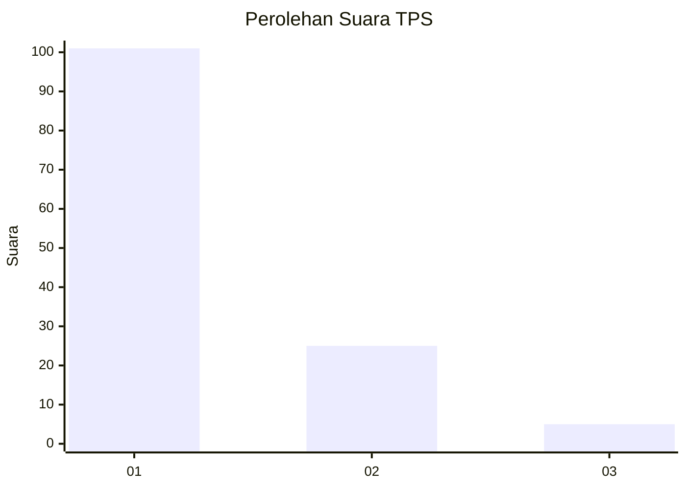
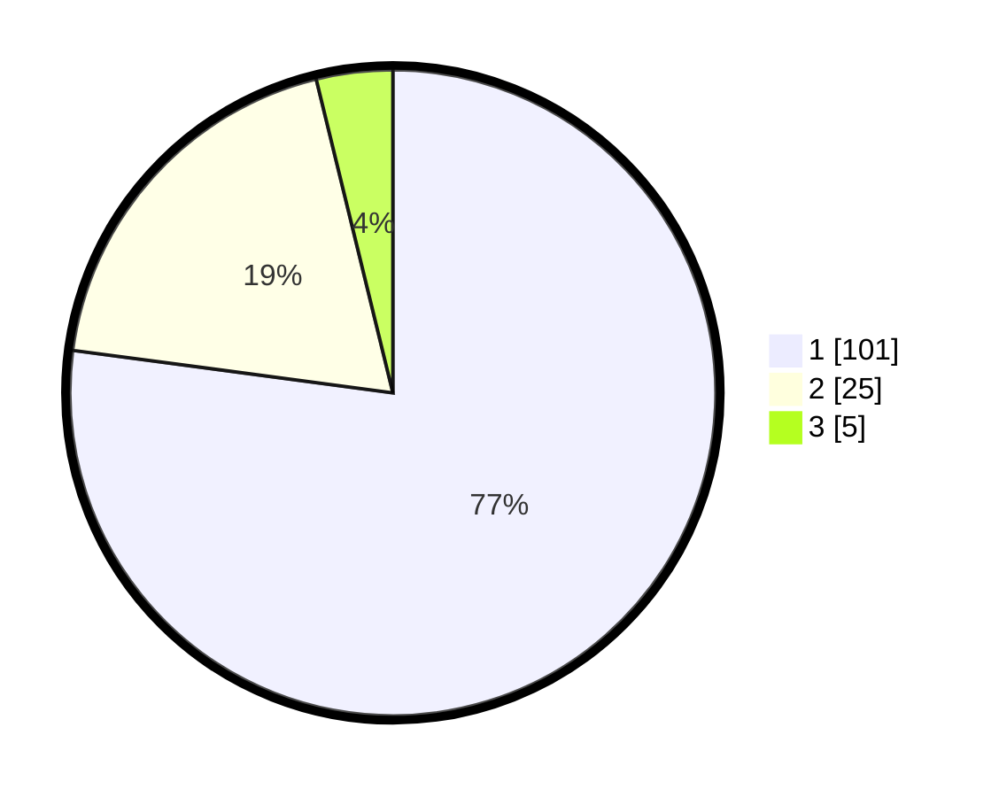

# Hasil

## Grafik

## Tabel

| No. | Nama Paslon    | Suara | Suara (raw) | Persentase |
|:--- |:-------------- | -----:| -----------:| ----------:|
| 1   | ANIES MUHAIMIN | 101   | [101][p-1]  | 77,10      |
| 2   | PRABOWO GIBRAN | 25    | [25][p-2]   | 19,08      |
| 3   | GANJAR MAHFUD  | 5     | [5][p-3]    | 3,82       |

[p-1]: https://github.com/gigit-pemilu/pemilu-2024-35-jawa-timur/blob/main/pilpres/hitung-suara/sub/35-jawa-timur/sub/29-sumenep/sub/25-sapeken/sub/2008-sabunten/sub/004-tps/sub/paslon-1.txt
[p-2]: https://github.com/gigit-pemilu/pemilu-2024-35-jawa-timur/blob/main/pilpres/hitung-suara/sub/35-jawa-timur/sub/29-sumenep/sub/25-sapeken/sub/2008-sabunten/sub/004-tps/sub/paslon-2.txt
[p-3]: https://github.com/gigit-pemilu/pemilu-2024-35-jawa-timur/blob/main/pilpres/hitung-suara/sub/35-jawa-timur/sub/29-sumenep/sub/25-sapeken/sub/2008-sabunten/sub/004-tps/sub/paslon-3.txt

## Foto C Plano

https://sirekap-obj-formc.kpu.go.id/9d6c/pemilu/ppwp/35/29/25/20/08/3529252008004-20240215-103222--123e6b39-c5b9-4b5e-beb3-0d30c6bb1a78.jpg

https://sirekap-obj-formc.kpu.go.id/9d6c/pemilu/ppwp/35/29/25/20/08/3529252008004-20240215-035943--889bed1f-4ebf-454a-9ac1-6faaf2ae0b26.jpg

https://sirekap-obj-formc.kpu.go.id/9d6c/pemilu/ppwp/35/29/25/20/08/3529252008004-20240215-040338--94f7c5c6-de74-4fee-9829-29430f0657d7.jpg

## Metadata

| Key        | Value               |
| ---------- | ------------------- |
| Time Stamp | 2024-02-25 13:00:00 |

