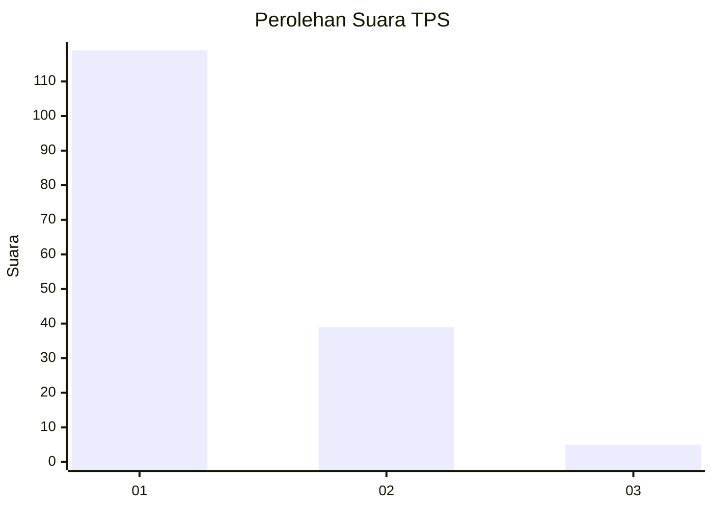
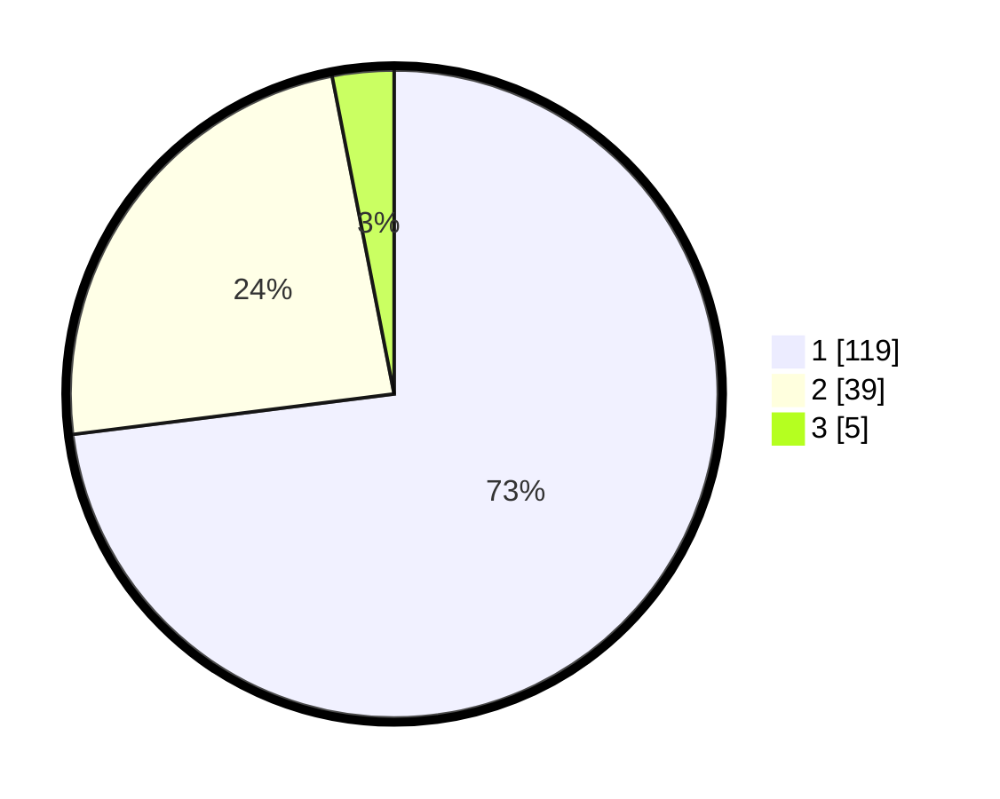

# Hasil

## Grafik

## Tabel

| No. | Nama Paslon    | Suara | Suara (raw) | Persentase |
|:--- |:-------------- | -----:| -----------:| ----------:|
| 1   | ANIES MUHAIMIN | 119   | [119][p-1]  | 73,01      |
| 2   | PRABOWO GIBRAN | 39    | [39][p-2]   | 23,93      |
| 3   | GANJAR MAHFUD  | 5     | [5][p-3]    | 3,07       |

[p-1]: https://github.com/gigit-pemilu/pemilu-2024/blob/main/pilpres/hitung-suara/sub/35-jawa-timur/sub/29-sumenep/sub/25-sapeken/sub/2008-sabunten/sub/007-tps/sub/paslon-1.txt
[p-2]: https://github.com/gigit-pemilu/pemilu-2024/blob/main/pilpres/hitung-suara/sub/35-jawa-timur/sub/29-sumenep/sub/25-sapeken/sub/2008-sabunten/sub/007-tps/sub/paslon-2.txt
[p-3]: https://github.com/gigit-pemilu/pemilu-2024/blob/main/pilpres/hitung-suara/sub/35-jawa-timur/sub/29-sumenep/sub/25-sapeken/sub/2008-sabunten/sub/007-tps/sub/paslon-3.txt

## Foto C Plano

https://sirekap-obj-formc.kpu.go.id/0eb9/pemilu/ppwp/35/29/25/20/08/3529252008007-20240215-092125--40d6fdc3-e800-46e8-9c60-971b58aa1958.jpg

https://sirekap-obj-formc.kpu.go.id/0eb9/pemilu/ppwp/35/29/25/20/08/3529252008007-20240215-102907--d9fc812b-4ca5-42a3-aae8-ab7d4ec3f1fc.jpg

https://sirekap-obj-formc.kpu.go.id/0eb9/pemilu/ppwp/35/29/25/20/08/3529252008007-20240215-091048--75b8d68e-3e3f-444b-989f-2060e2c5b3f7.jpg

## Metadata

| Key        | Value               |
| ---------- | ------------------- |
| Time Stamp | 2024-02-25 17:00:00 |

