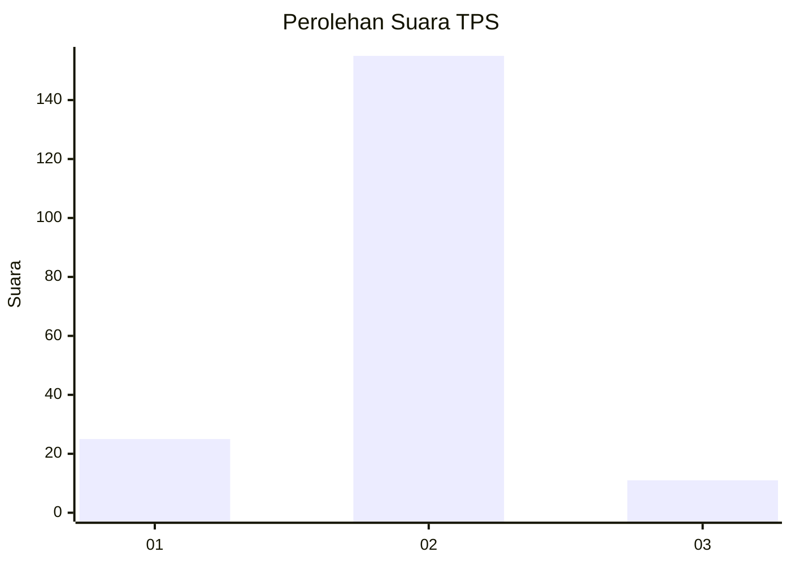
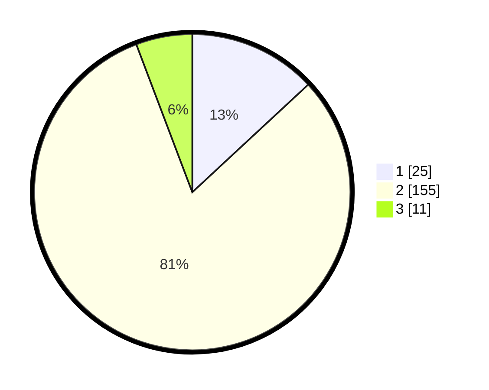

# Hasil

## Grafik

## Tabel

| No. | Nama Paslon    | Suara | Suara (raw) | Persentase |
|:--- |:-------------- | -----:| -----------:| ----------:|
| 1   | ANIES MUHAIMIN | 25    | [25][p-1]   | 13,09      |
| 2   | PRABOWO GIBRAN | 155   | [155][p-2]  | 81,15      |
| 3   | GANJAR MAHFUD  | 11    | [11][p-3]   | 5,76       |

[p-1]: https://github.com/gigit-pemilu/pemilu-2024/blob/main/pilpres/hitung-suara/sub/35-jawa-timur/sub/29-sumenep/sub/25-sapeken/sub/2011-saur-saebus/sub/009-tps/sub/paslon-1.txt
[p-2]: https://github.com/gigit-pemilu/pemilu-2024/blob/main/pilpres/hitung-suara/sub/35-jawa-timur/sub/29-sumenep/sub/25-sapeken/sub/2011-saur-saebus/sub/009-tps/sub/paslon-2.txt
[p-3]: https://github.com/gigit-pemilu/pemilu-2024/blob/main/pilpres/hitung-suara/sub/35-jawa-timur/sub/29-sumenep/sub/25-sapeken/sub/2011-saur-saebus/sub/009-tps/sub/paslon-3.txt

## Foto C Plano

https://sirekap-obj-formc.kpu.go.id/45cf/pemilu/ppwp/35/29/25/20/11/3529252011009-20240215-140814--6a584416-8288-4f00-a603-bd205b517df3.jpg

https://sirekap-obj-formc.kpu.go.id/45cf/pemilu/ppwp/35/29/25/20/11/3529252011009-20240215-141110--5ef721ae-33a7-404f-ba20-dc34ab680cbd.jpg

https://sirekap-obj-formc.kpu.go.id/45cf/pemilu/ppwp/35/29/25/20/11/3529252011009-20240215-141229--7b8bb52c-2e7e-4c92-88cd-ffdfe4f77f17.jpg

## Metadata

| Key        | Value               |
| ---------- | ------------------- |
| Time Stamp | 2024-02-16 21:01:00 |

