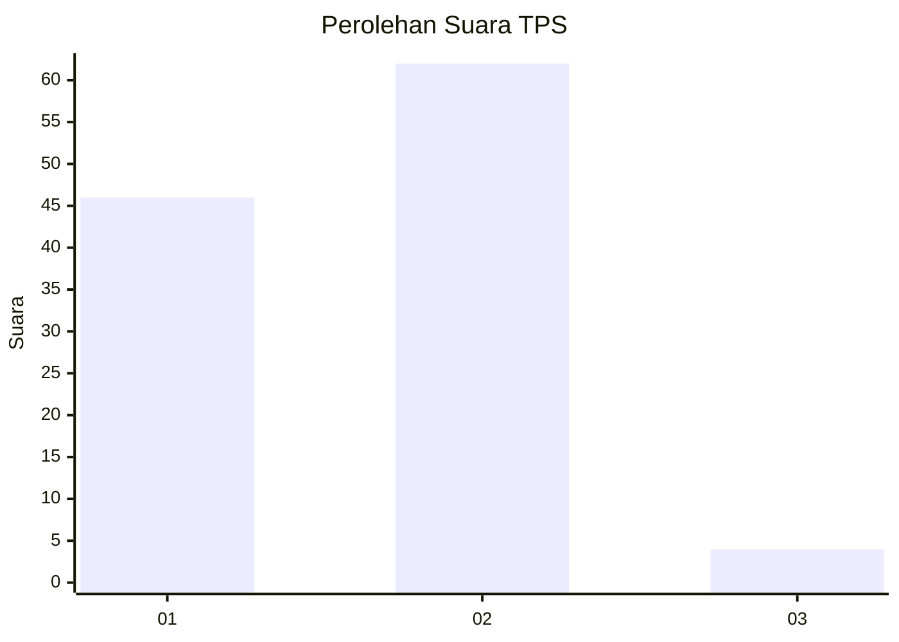
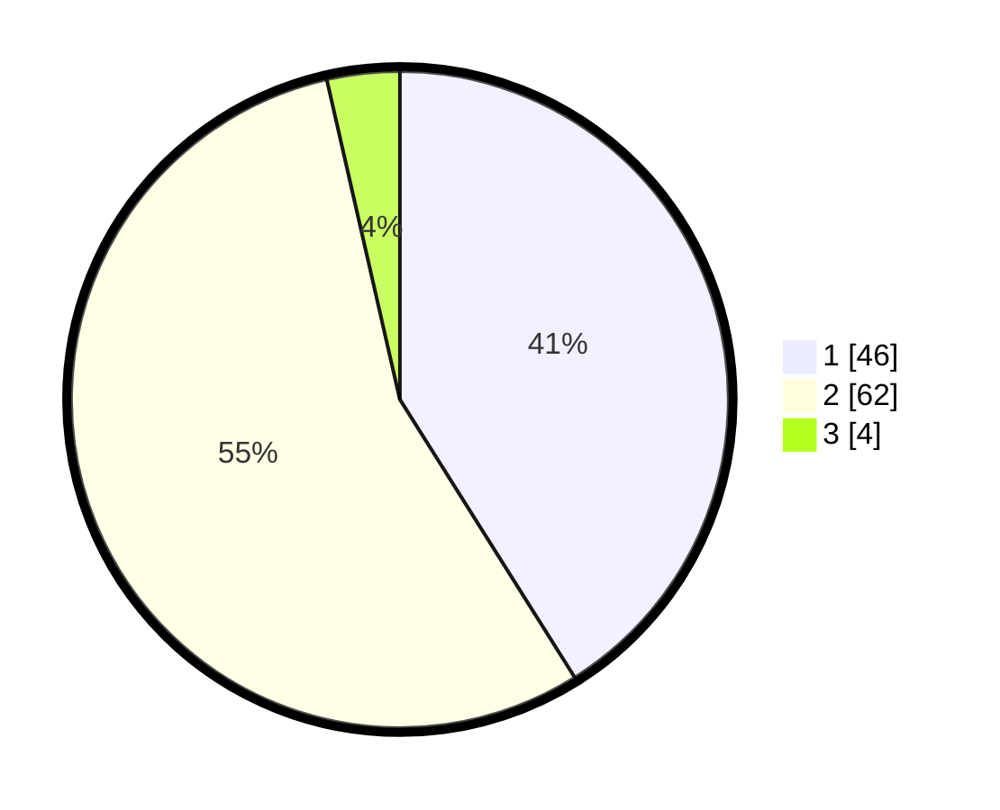

# Hasil

## Grafik

## Tabel

| No. | Nama Paslon    | Suara | Suara (raw) | Persentase |
|:--- |:-------------- | -----:| -----------:| ----------:|
| 1   | ANIES MUHAIMIN | 46    | [46][p-1]   | 41,07      |
| 2   | PRABOWO GIBRAN | 62    | [62][p-2]   | 55,36      |
| 3   | GANJAR MAHFUD  | 4     | [4][p-3]    | 3,57       |

[p-1]: https://github.com/gigit-pemilu/pemilu-2024-35-jawa-timur/blob/main/pilpres/hitung-suara/sub/35-jawa-timur/sub/29-sumenep/sub/25-sapeken/sub/2011-saur-saebus/sub/010-tps/sub/paslon-1.txt
[p-2]: https://github.com/gigit-pemilu/pemilu-2024-35-jawa-timur/blob/main/pilpres/hitung-suara/sub/35-jawa-timur/sub/29-sumenep/sub/25-sapeken/sub/2011-saur-saebus/sub/010-tps/sub/paslon-2.txt
[p-3]: https://github.com/gigit-pemilu/pemilu-2024-35-jawa-timur/blob/main/pilpres/hitung-suara/sub/35-jawa-timur/sub/29-sumenep/sub/25-sapeken/sub/2011-saur-saebus/sub/010-tps/sub/paslon-3.txt

## Foto C Plano

https://sirekap-obj-formc.kpu.go.id/aa6b/pemilu/ppwp/35/29/25/20/11/3529252011010-20240216-123317--dff3de4b-5e05-440e-b813-62fd2058805a.jpg

https://sirekap-obj-formc.kpu.go.id/aa6b/pemilu/ppwp/35/29/25/20/11/3529252011010-20240216-123019--71435026-1d5c-4e47-96b6-df4daedd77f9.jpg

https://sirekap-obj-formc.kpu.go.id/aa6b/pemilu/ppwp/35/29/25/20/11/3529252011010-20240216-123120--cf41a159-177a-4d8d-89b3-4a72f3bd9399.jpg

## Metadata

| Key        | Value               |
| ---------- | ------------------- |
| Time Stamp | 2024-02-16 13:00:29 |

## DATA PEMILIH TETAP

Jumlah pemilih dalam DPT: **118**.
 * L: **54**.
 * P: **64**.

## DATA PENGGUNA HAK PILIH

Jumlah pengguna hak pilih dalam DPT: **102**.
 * L: **45**.
 * P: **57**.

Jumlah pengguna hak pilih dalam DPTb: **0**.
 * L: **0**.
 * P: **0**.

Jumlah pengguna hak pilih dalam DPK: **14**.
 * L: **9**.
 * P: **5**.

Jumlah pengguna hak pilih: **116**.
 * L: **54**.
 * P: **62**.

## JUMLAH SUARA SAH DAN TIDAK SAH

JUMLAH SELURUH SUARA SAH: **182**.

JUMLAH SUARA TIDAK SAH: **4**.

JUMLAH SELURUH SUARA SAH DAN SUARA TIDAK SAH: **186**.

