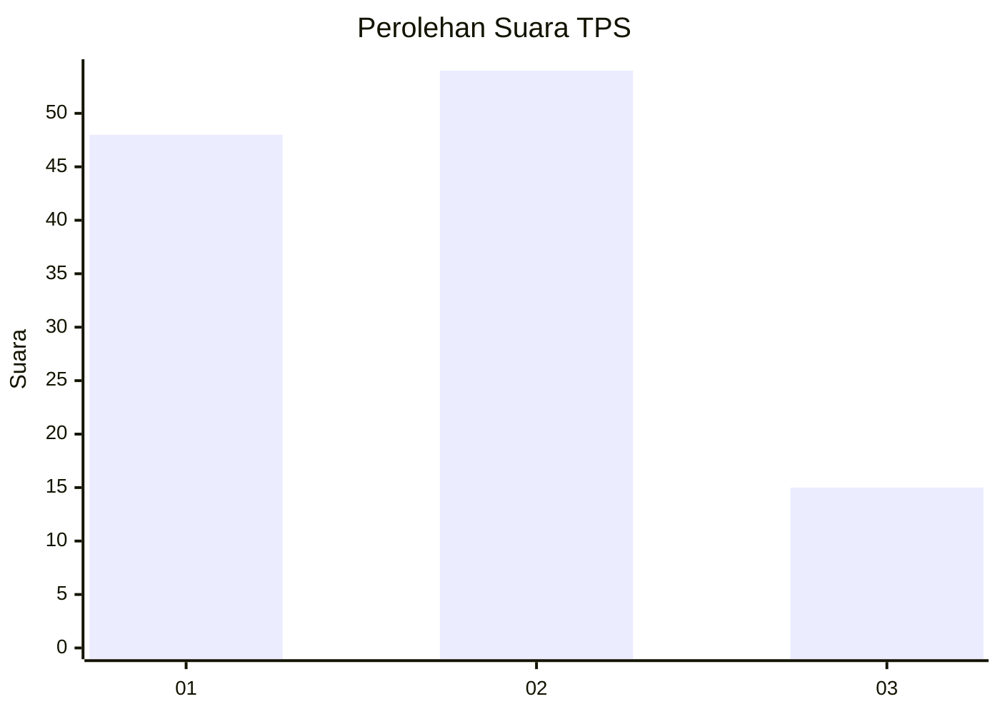
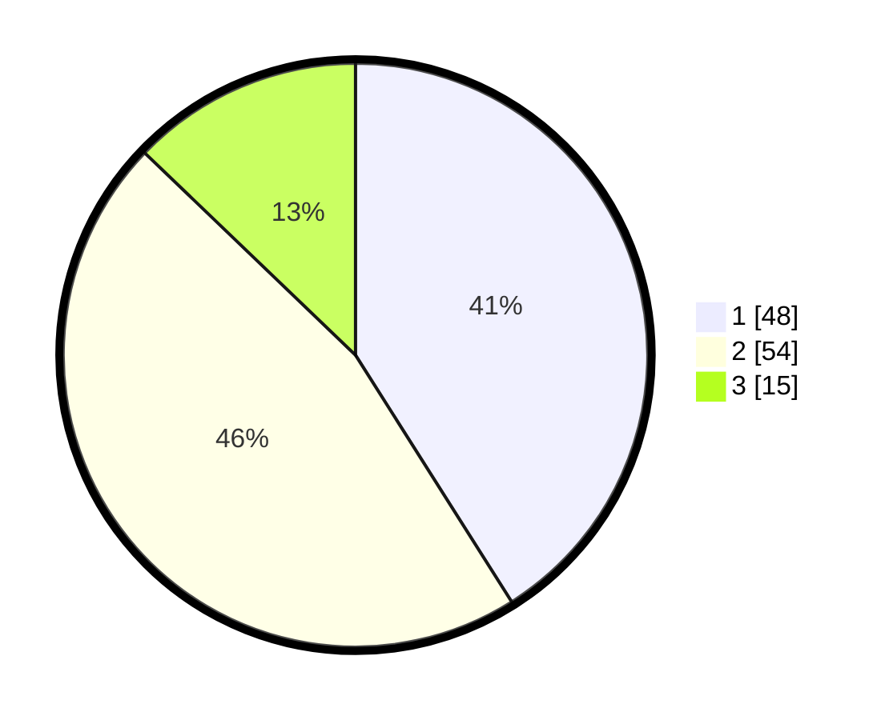

# Hasil

## Grafik

## Tabel

| No. | Nama Paslon    | Suara | Suara (raw) | Persentase |
|:--- |:-------------- | -----:| -----------:| ----------:|
| 1   | ANIES MUHAIMIN | 48    | [48][p-1]   | 41,03      |
| 2   | PRABOWO GIBRAN | 54    | [54][p-2]   | 46,15      |
| 3   | GANJAR MAHFUD  | 15    | [15][p-3]   | 12,82      |

[p-1]: https://github.com/gigit-pemilu/pemilu-2024/blob/main/pilpres/hitung-suara/sub/35-jawa-timur/sub/29-sumenep/sub/27-kangayan/sub/2001-saobi/sub/001-tps/sub/paslon-1.txt
[p-2]: https://github.com/gigit-pemilu/pemilu-2024/blob/main/pilpres/hitung-suara/sub/35-jawa-timur/sub/29-sumenep/sub/27-kangayan/sub/2001-saobi/sub/001-tps/sub/paslon-2.txt
[p-3]: https://github.com/gigit-pemilu/pemilu-2024/blob/main/pilpres/hitung-suara/sub/35-jawa-timur/sub/29-sumenep/sub/27-kangayan/sub/2001-saobi/sub/001-tps/sub/paslon-3.txt

## Foto C Plano

https://sirekap-obj-formc.kpu.go.id/d8c3/pemilu/ppwp/35/29/27/20/01/3529272001001-20240226-161543--8d060d28-d380-4459-b5cf-7483df2acc68.jpg

https://sirekap-obj-formc.kpu.go.id/d8c3/pemilu/ppwp/35/29/27/20/01/3529272001001-20240226-161609--ee1de929-5abb-4b1c-9a43-e1d30513999f.jpg

https://sirekap-obj-formc.kpu.go.id/d8c3/pemilu/ppwp/35/29/27/20/01/3529272001001-20240226-161651--c3200f82-e409-499c-ad52-a5acdf024d84.jpg

## Metadata

| Key        | Value               |
| ---------- | ------------------- |
| Time Stamp | 2024-02-28 20:00:00 |

