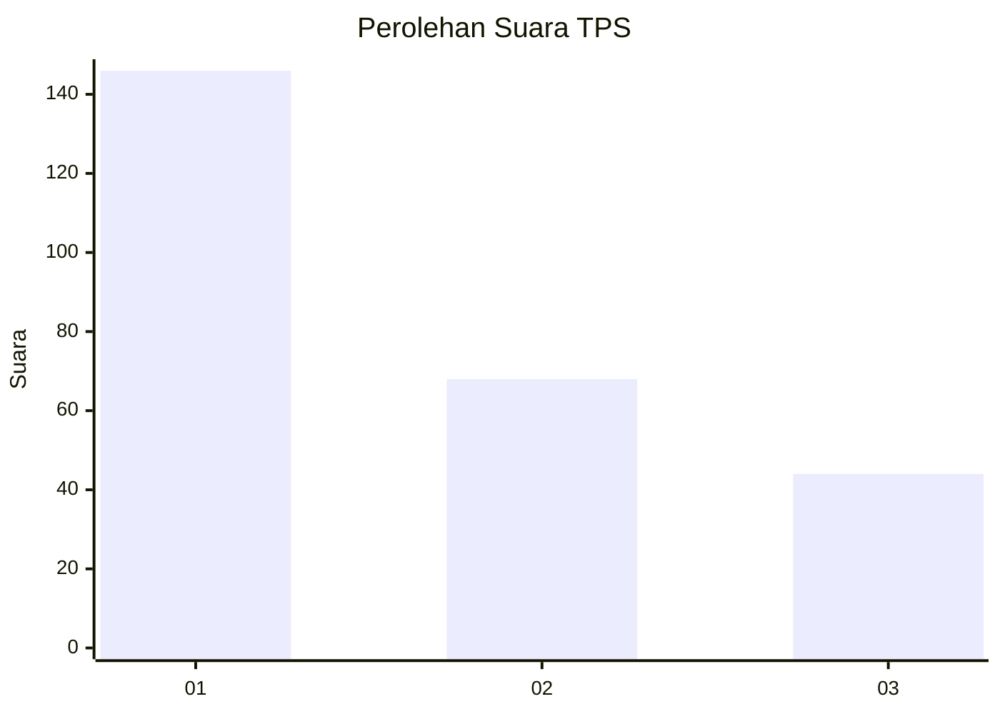
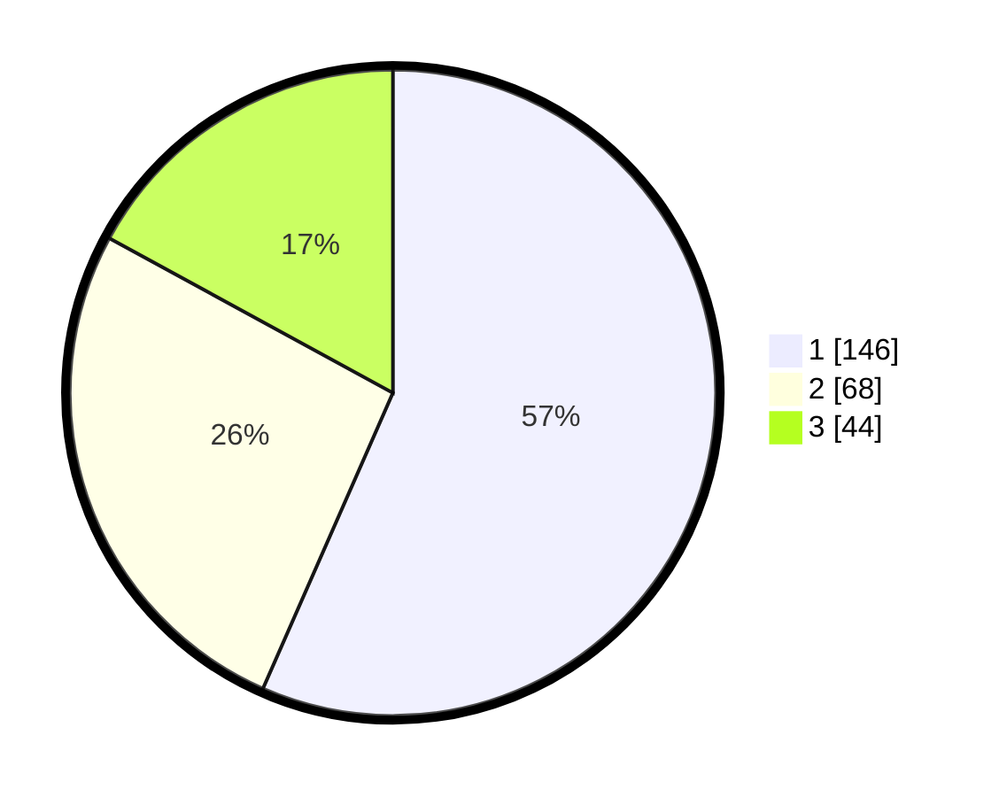

# Hasil

## Grafik

## Tabel

| No. | Nama Paslon    | Suara | Suara (raw) | Persentase |
|:--- |:-------------- | -----:| -----------:| ----------:|
| 1   | ANIES MUHAIMIN | 146   | [146][p-1]  | 56,59      |
| 2   | PRABOWO GIBRAN | 68    | [68][p-2]   | 26,36      |
| 3   | GANJAR MAHFUD  | 44    | [44][p-3]   | 17,05      |

[p-1]: https://github.com/gigit-pemilu/pemilu-2024/blob/main/pilpres/hitung-suara/sub/35-jawa-timur/sub/29-sumenep/sub/27-kangayan/sub/2001-saobi/sub/004-tps/sub/paslon-1.txt
[p-2]: https://github.com/gigit-pemilu/pemilu-2024/blob/main/pilpres/hitung-suara/sub/35-jawa-timur/sub/29-sumenep/sub/27-kangayan/sub/2001-saobi/sub/004-tps/sub/paslon-2.txt
[p-3]: https://github.com/gigit-pemilu/pemilu-2024/blob/main/pilpres/hitung-suara/sub/35-jawa-timur/sub/29-sumenep/sub/27-kangayan/sub/2001-saobi/sub/004-tps/sub/paslon-3.txt

## Foto C Plano

https://sirekap-obj-formc.kpu.go.id/a5d9/pemilu/ppwp/35/29/27/20/01/3529272001004-20240226-162429--99371899-dda4-40af-8bcb-8e37b0811ed2.jpg

https://sirekap-obj-formc.kpu.go.id/a5d9/pemilu/ppwp/35/29/27/20/01/3529272001004-20240226-162450--388a1dba-23a6-4a7f-bc6d-2318f8590e5f.jpg

https://sirekap-obj-formc.kpu.go.id/a5d9/pemilu/ppwp/35/29/27/20/01/3529272001004-20240226-162509--75626bf1-85cd-48b9-9c81-57fc1b3d625d.jpg

## Metadata

| Key        | Value               |
| ---------- | ------------------- |
| Time Stamp | 2024-02-28 21:00:00 |

