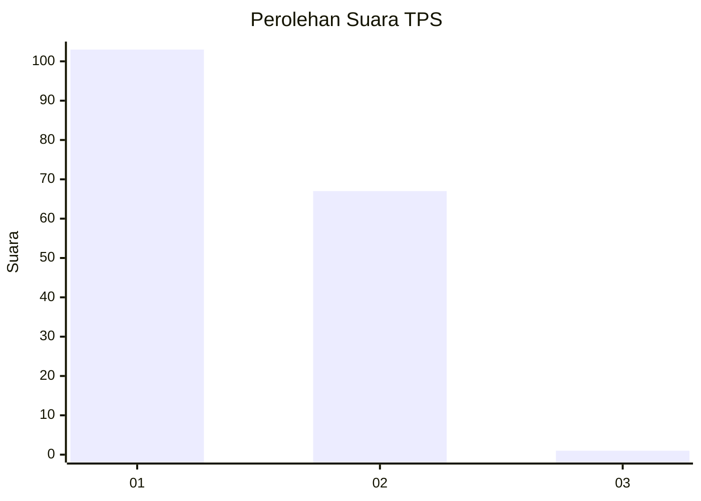
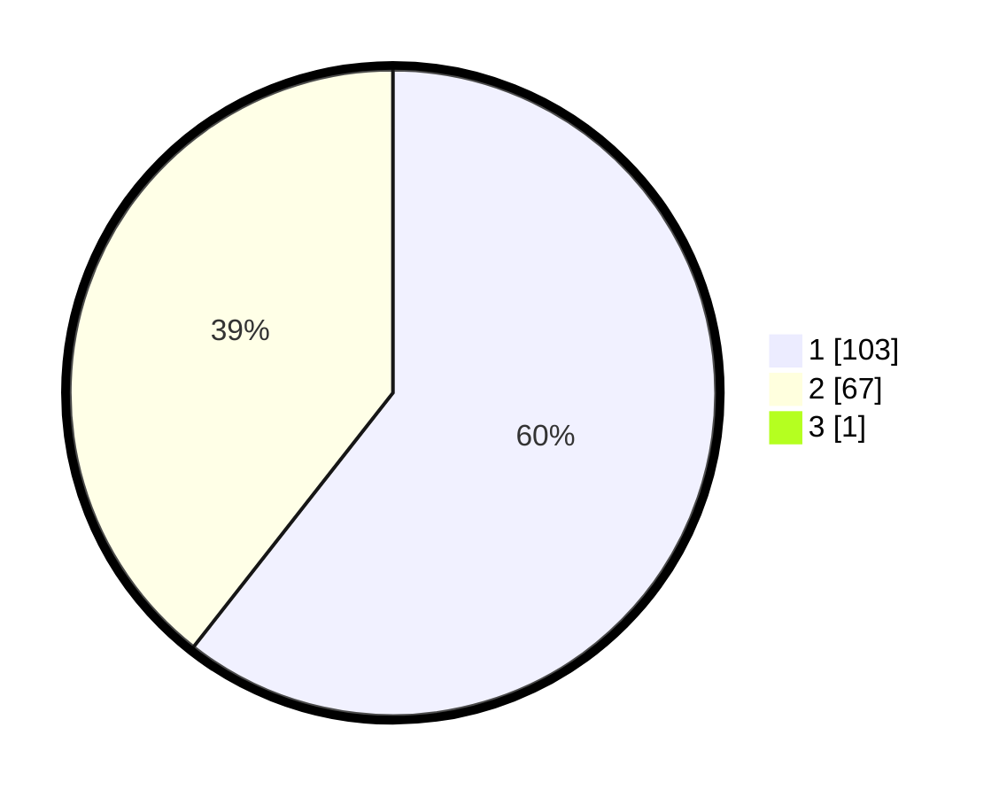

# Hasil

## Grafik

## Tabel

| No. | Nama Paslon    | Suara | Suara (raw) | Persentase |
|:--- |:-------------- | -----:| -----------:| ----------:|
| 1   | ANIES MUHAIMIN | 103   | [103][p-1]  | 60,23      |
| 2   | PRABOWO GIBRAN | 67    | [67][p-2]   | 39,18      |
| 3   | GANJAR MAHFUD  | 1     | [1][p-3]    | 0,58       |

[p-1]: https://github.com/gigit-pemilu/pemilu-2024/blob/main/pilpres/hitung-suara/sub/35-jawa-timur/sub/29-sumenep/sub/27-kangayan/sub/2001-saobi/sub/005-tps/sub/paslon-1.txt
[p-2]: https://github.com/gigit-pemilu/pemilu-2024/blob/main/pilpres/hitung-suara/sub/35-jawa-timur/sub/29-sumenep/sub/27-kangayan/sub/2001-saobi/sub/005-tps/sub/paslon-2.txt
[p-3]: https://github.com/gigit-pemilu/pemilu-2024/blob/main/pilpres/hitung-suara/sub/35-jawa-timur/sub/29-sumenep/sub/27-kangayan/sub/2001-saobi/sub/005-tps/sub/paslon-3.txt

## Foto C Plano

https://sirekap-obj-formc.kpu.go.id/8907/pemilu/ppwp/35/29/27/20/01/3529272001005-20240226-162728--a56a6136-6c2b-41e3-8feb-23f048766749.jpg

https://sirekap-obj-formc.kpu.go.id/8907/pemilu/ppwp/35/29/27/20/01/3529272001005-20240226-162748--0af6e408-ce07-4d59-a386-fe93b7e8c479.jpg

https://sirekap-obj-formc.kpu.go.id/8907/pemilu/ppwp/35/29/27/20/01/3529272001005-20240226-162807--9619ea10-6b37-45e1-bb48-209ee280404d.jpg

## Metadata

| Key        | Value               |
| ---------- | ------------------- |
| Time Stamp | 2024-02-28 19:00:00 |

