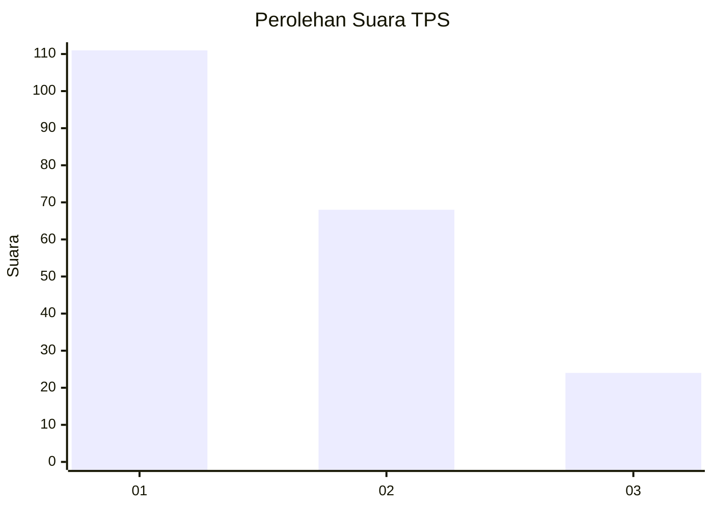
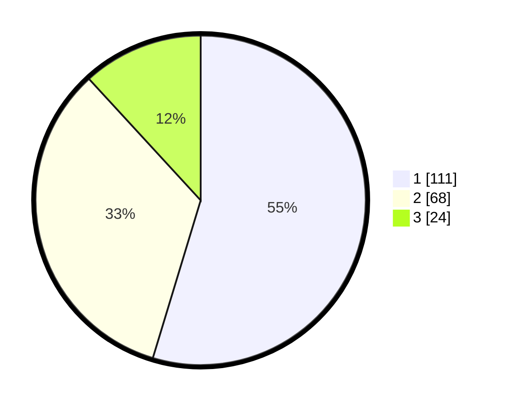

# Hasil

## Grafik

## Tabel

| No. | Nama Paslon    | Suara | Suara (raw) | Persentase |
|:--- |:-------------- | -----:| -----------:| ----------:|
| 1   | ANIES MUHAIMIN | 111   | [111][p-1]  | 54,68      |
| 2   | PRABOWO GIBRAN | 68    | [68][p-2]   | 33,50      |
| 3   | GANJAR MAHFUD  | 24    | [24][p-3]   | 11,82      |

[p-1]: https://github.com/gigit-pemilu/pemilu-2024-35-jawa-timur/blob/main/pilpres/hitung-suara/sub/35-jawa-timur/sub/29-sumenep/sub/27-kangayan/sub/2001-saobi/sub/007-tps/sub/paslon-1.txt
[p-2]: https://github.com/gigit-pemilu/pemilu-2024-35-jawa-timur/blob/main/pilpres/hitung-suara/sub/35-jawa-timur/sub/29-sumenep/sub/27-kangayan/sub/2001-saobi/sub/007-tps/sub/paslon-2.txt
[p-3]: https://github.com/gigit-pemilu/pemilu-2024-35-jawa-timur/blob/main/pilpres/hitung-suara/sub/35-jawa-timur/sub/29-sumenep/sub/27-kangayan/sub/2001-saobi/sub/007-tps/sub/paslon-3.txt

## Foto C Plano

https://sirekap-obj-formc.kpu.go.id/a676/pemilu/ppwp/35/29/27/20/01/3529272001007-20240226-163636--76a131df-3b04-4451-a066-ec6c43ecab88.jpg

https://sirekap-obj-formc.kpu.go.id/a676/pemilu/ppwp/35/29/27/20/01/3529272001007-20240226-163655--4f014b0a-111c-4ab9-8b8c-671b024fcb97.jpg

https://sirekap-obj-formc.kpu.go.id/a676/pemilu/ppwp/35/29/27/20/01/3529272001007-20240226-163714--075bb9f8-b291-4626-9438-04fd121f66d7.jpg

## Metadata

| Key        | Value               |
| ---------- | ------------------- |
| Time Stamp | 2024-02-28 19:00:00 |

