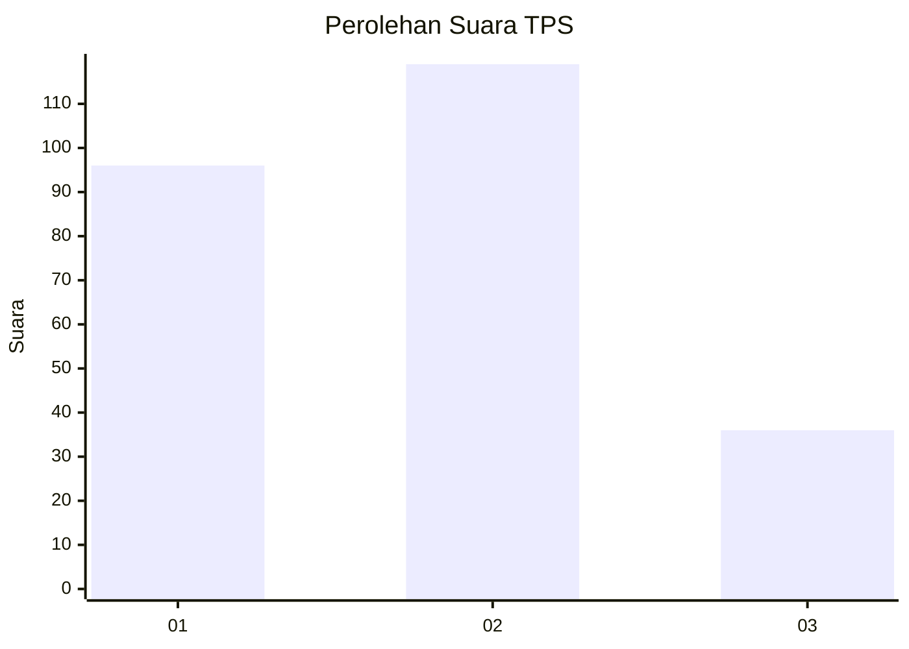
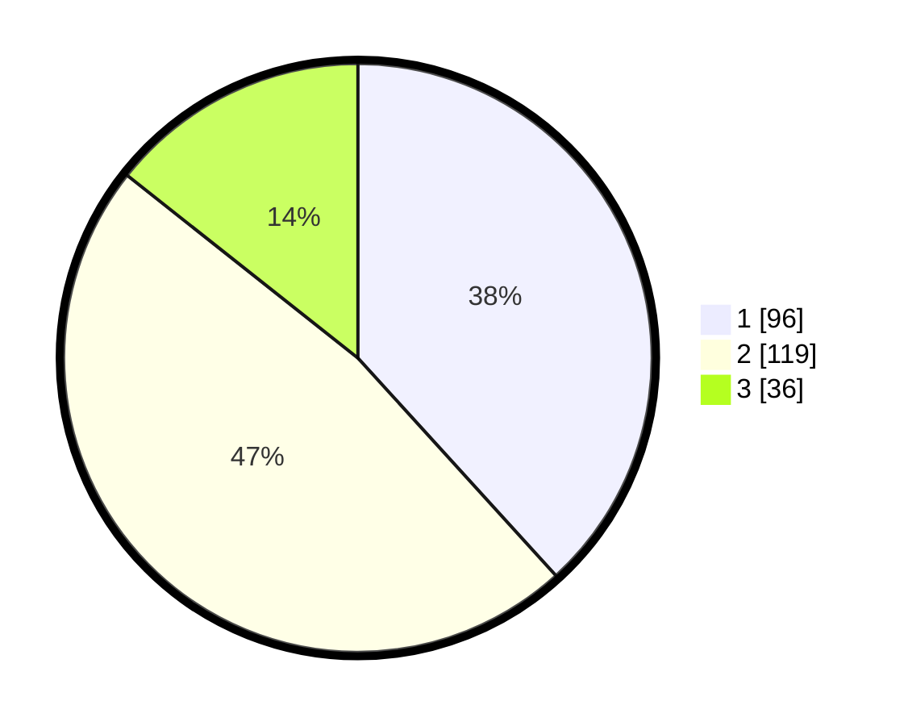

# Hasil

## Grafik

## Tabel

| No. | Nama Paslon    | Suara | Suara (raw) | Persentase |
|:--- |:-------------- | -----:| -----------:| ----------:|
| 1   | ANIES MUHAIMIN | 96    | [96][p-1]   | 38,25      |
| 2   | PRABOWO GIBRAN | 119   | [119][p-2]  | 47,41      |
| 3   | GANJAR MAHFUD  | 36    | [36][p-3]   | 14,34      |

[p-1]: https://github.com/gigit-pemilu/pemilu-2024-35-jawa-timur/blob/main/pilpres/hitung-suara/sub/35-jawa-timur/sub/29-sumenep/sub/27-kangayan/sub/2001-saobi/sub/008-tps/sub/paslon-1.txt
[p-2]: https://github.com/gigit-pemilu/pemilu-2024-35-jawa-timur/blob/main/pilpres/hitung-suara/sub/35-jawa-timur/sub/29-sumenep/sub/27-kangayan/sub/2001-saobi/sub/008-tps/sub/paslon-2.txt
[p-3]: https://github.com/gigit-pemilu/pemilu-2024-35-jawa-timur/blob/main/pilpres/hitung-suara/sub/35-jawa-timur/sub/29-sumenep/sub/27-kangayan/sub/2001-saobi/sub/008-tps/sub/paslon-3.txt

## Foto C Plano

https://sirekap-obj-formc.kpu.go.id/9c0d/pemilu/ppwp/35/29/27/20/01/3529272001008-20240226-163949--64b09ddf-5236-40de-a896-b7c4ea2bbbd4.jpg

https://sirekap-obj-formc.kpu.go.id/9c0d/pemilu/ppwp/35/29/27/20/01/3529272001008-20240226-164007--3692a00b-94d9-4556-a5a0-3d2e6e2068f9.jpg

https://sirekap-obj-formc.kpu.go.id/9c0d/pemilu/ppwp/35/29/27/20/01/3529272001008-20240226-164042--8cd5fd92-9cf6-4a77-a868-453e180bcb18.jpg

## Metadata

| Key        | Value               |
| ---------- | ------------------- |
| Time Stamp | 2024-02-28 20:00:00 |

