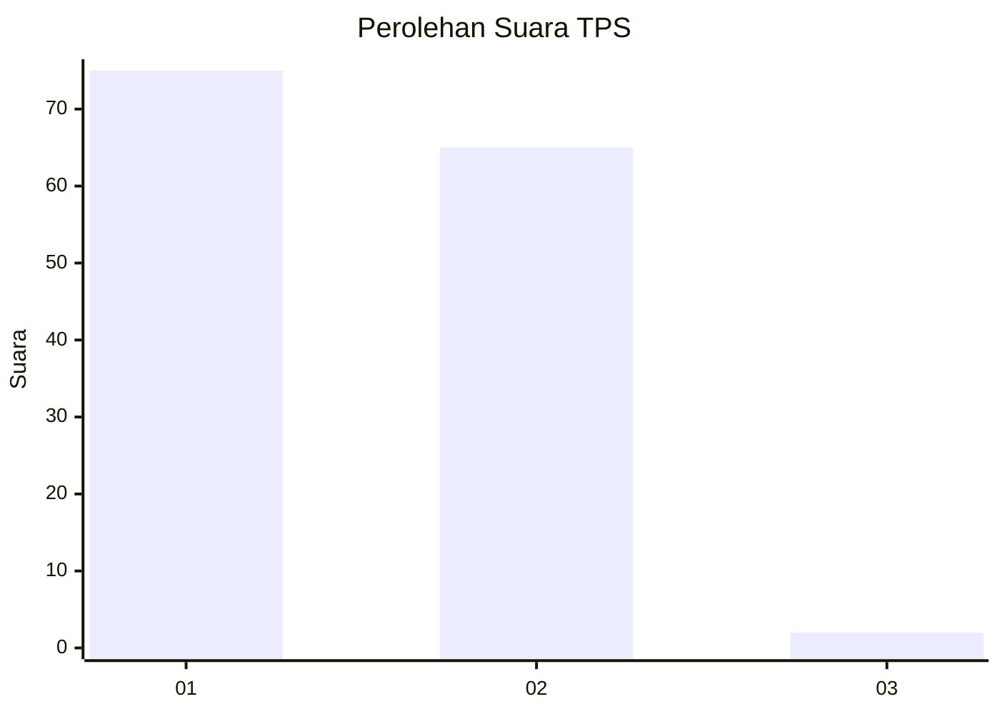
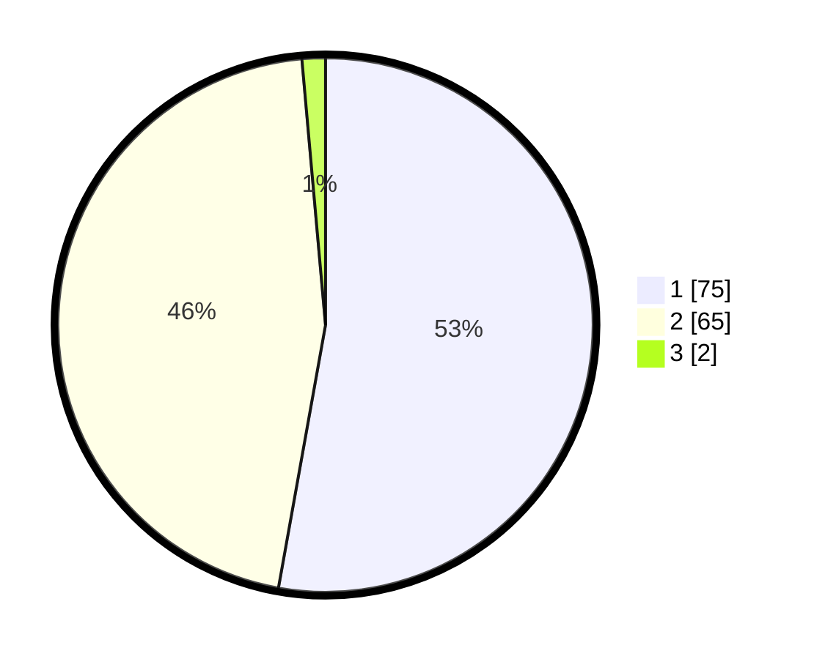

# Hasil

## Grafik

## Tabel

| No. | Nama Paslon    | Suara | Suara (raw) | Persentase |
|:--- |:-------------- | -----:| -----------:| ----------:|
| 1   | ANIES MUHAIMIN | 75    | [75][p-1]   | 52,82      |
| 2   | PRABOWO GIBRAN | 65    | [65][p-2]   | 45,77      |
| 3   | GANJAR MAHFUD  | 2     | [2][p-3]    | 1,41       |

[p-1]: https://github.com/gigit-pemilu/pemilu-2024/blob/main/pilpres/hitung-suara/sub/35-jawa-timur/sub/29-sumenep/sub/27-kangayan/sub/2001-saobi/sub/010-tps/sub/paslon-1.txt
[p-2]: https://github.com/gigit-pemilu/pemilu-2024/blob/main/pilpres/hitung-suara/sub/35-jawa-timur/sub/29-sumenep/sub/27-kangayan/sub/2001-saobi/sub/010-tps/sub/paslon-2.txt
[p-3]: https://github.com/gigit-pemilu/pemilu-2024/blob/main/pilpres/hitung-suara/sub/35-jawa-timur/sub/29-sumenep/sub/27-kangayan/sub/2001-saobi/sub/010-tps/sub/paslon-3.txt

## Foto C Plano

https://sirekap-obj-formc.kpu.go.id/3d0f/pemilu/ppwp/35/29/27/20/01/3529272001010-20240226-164524--77256b65-f617-4221-9502-c5c92146b299.jpg

https://sirekap-obj-formc.kpu.go.id/3d0f/pemilu/ppwp/35/29/27/20/01/3529272001010-20240226-164544--15148f04-e15f-4e65-91ff-818b88a156e6.jpg

https://sirekap-obj-formc.kpu.go.id/3d0f/pemilu/ppwp/35/29/27/20/01/3529272001010-20240226-164603--204e590a-0840-48c8-8909-ebae74d9bfc3.jpg

## Metadata

| Key        | Value               |
| ---------- | ------------------- |
| Time Stamp | 2024-02-28 19:00:00 |

