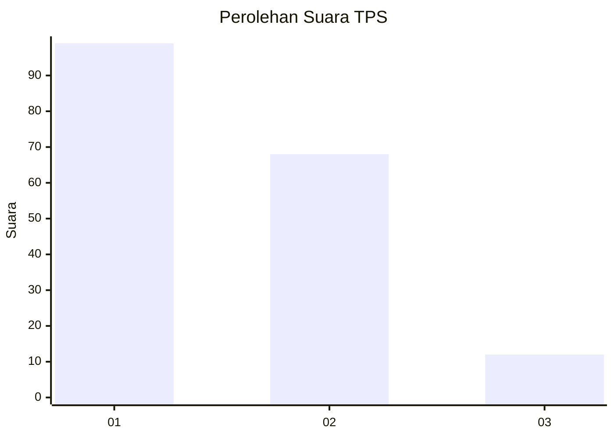
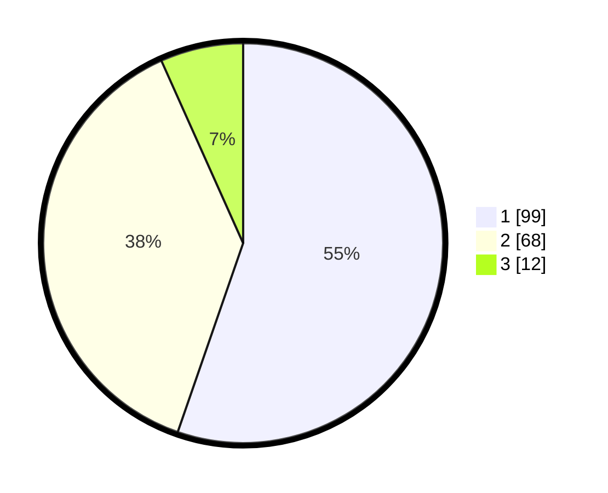

# Hasil

## Grafik

## Tabel

| No. | Nama Paslon    | Suara | Suara (raw) | Persentase |
|:--- |:-------------- | -----:| -----------:| ----------:|
| 1   | ANIES MUHAIMIN | 99    | [99][p-1]   | 55,31      |
| 2   | PRABOWO GIBRAN | 68    | [68][p-2]   | 37,99      |
| 3   | GANJAR MAHFUD  | 12    | [12][p-3]   | 6,70       |

[p-1]: https://github.com/gigit-pemilu/pemilu-2024-35-jawa-timur/blob/main/pilpres/hitung-suara/sub/35-jawa-timur/sub/29-sumenep/sub/27-kangayan/sub/2001-saobi/sub/011-tps/sub/paslon-1.txt
[p-2]: https://github.com/gigit-pemilu/pemilu-2024-35-jawa-timur/blob/main/pilpres/hitung-suara/sub/35-jawa-timur/sub/29-sumenep/sub/27-kangayan/sub/2001-saobi/sub/011-tps/sub/paslon-2.txt
[p-3]: https://github.com/gigit-pemilu/pemilu-2024-35-jawa-timur/blob/main/pilpres/hitung-suara/sub/35-jawa-timur/sub/29-sumenep/sub/27-kangayan/sub/2001-saobi/sub/011-tps/sub/paslon-3.txt

## Foto C Plano

https://sirekap-obj-formc.kpu.go.id/d5ae/pemilu/ppwp/35/29/27/20/01/3529272001011-20240226-164814--455687f5-0613-4518-9131-930622ffcca1.jpg

https://sirekap-obj-formc.kpu.go.id/d5ae/pemilu/ppwp/35/29/27/20/01/3529272001011-20240226-164833--4eebc43c-ce90-4c9f-9098-f00372dae787.jpg

https://sirekap-obj-formc.kpu.go.id/d5ae/pemilu/ppwp/35/29/27/20/01/3529272001011-20240226-164853--c4eb10cf-6c80-4e9f-8934-e744b7039369.jpg

## Metadata

| Key        | Value               |
| ---------- | ------------------- |
| Time Stamp | 2024-02-28 23:00:00 |

