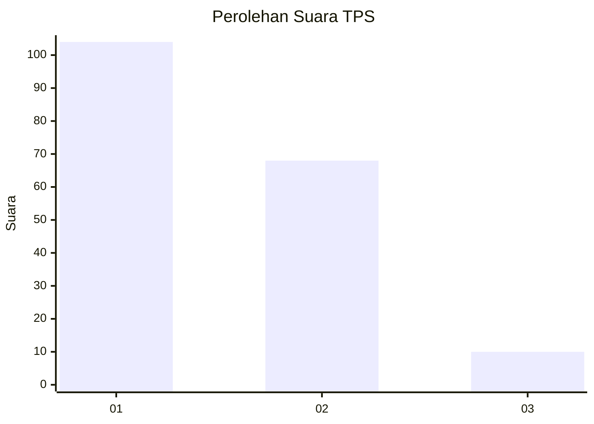
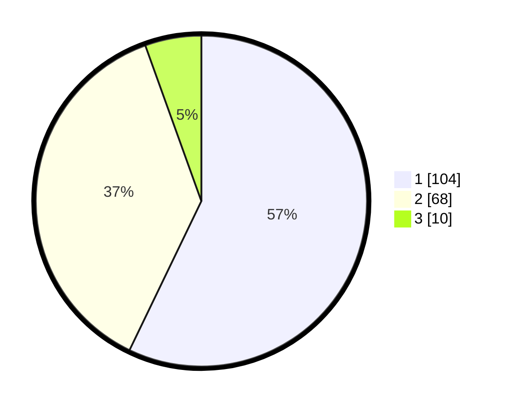

# Hasil

## Grafik

## Tabel

| No. | Nama Paslon    | Suara | Suara (raw) | Persentase |
|:--- |:-------------- | -----:| -----------:| ----------:|
| 1   | ANIES MUHAIMIN | 104   | [104][p-1]  | 57,14      |
| 2   | PRABOWO GIBRAN | 68    | [68][p-2]   | 37,36      |
| 3   | GANJAR MAHFUD  | 10    | [10][p-3]   | 5,49       |

[p-1]: https://github.com/gigit-pemilu/pemilu-2024/blob/main/pilpres/hitung-suara/sub/35-jawa-timur/sub/29-sumenep/sub/27-kangayan/sub/2001-saobi/sub/012-tps/sub/paslon-1.txt
[p-2]: https://github.com/gigit-pemilu/pemilu-2024/blob/main/pilpres/hitung-suara/sub/35-jawa-timur/sub/29-sumenep/sub/27-kangayan/sub/2001-saobi/sub/012-tps/sub/paslon-2.txt
[p-3]: https://github.com/gigit-pemilu/pemilu-2024/blob/main/pilpres/hitung-suara/sub/35-jawa-timur/sub/29-sumenep/sub/27-kangayan/sub/2001-saobi/sub/012-tps/sub/paslon-3.txt

## Foto C Plano

https://sirekap-obj-formc.kpu.go.id/310d/pemilu/ppwp/35/29/27/20/01/3529272001012-20240226-165103--6bdc21d4-b9c2-41d6-8a58-5ea8886a1501.jpg

https://sirekap-obj-formc.kpu.go.id/310d/pemilu/ppwp/35/29/27/20/01/3529272001012-20240226-165207--643a003d-314e-4e0a-bd5f-f69b5cac6516.jpg

https://sirekap-obj-formc.kpu.go.id/310d/pemilu/ppwp/35/29/27/20/01/3529272001012-20240226-165142--a2e63ce7-eeed-4f3f-9eaf-56ad4dd79ed6.jpg

## Metadata

| Key        | Value               |
| ---------- | ------------------- |
| Time Stamp | 2024-02-28 19:00:00 |

