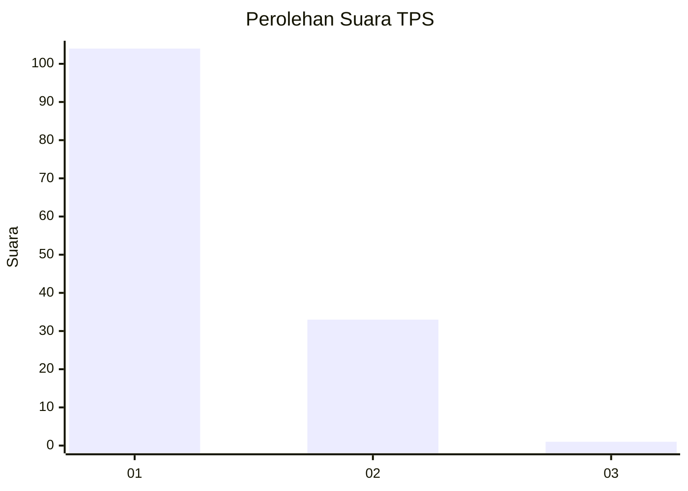
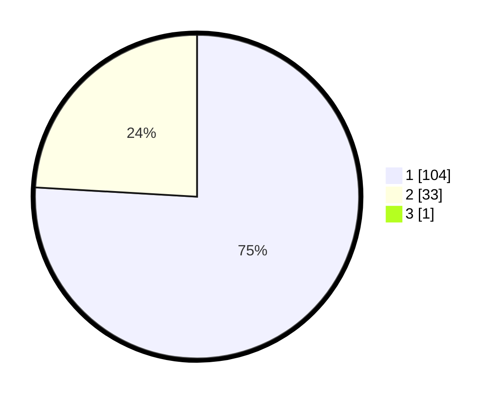

# Hasil

## Grafik

## Tabel

| No. | Nama Paslon    | Suara | Suara (raw) | Persentase |
|:--- |:-------------- | -----:| -----------:| ----------:|
| 1   | ANIES MUHAIMIN | 104   | [104][p-1]  | 75,36      |
| 2   | PRABOWO GIBRAN | 33    | [33][p-2]   | 23,91      |
| 3   | GANJAR MAHFUD  | 1     | [1][p-3]    | 0,72       |

[p-1]: https://github.com/gigit-pemilu/pemilu-2024/blob/main/pilpres/hitung-suara/sub/35-jawa-timur/sub/29-sumenep/sub/27-kangayan/sub/2001-saobi/sub/013-tps/sub/paslon-1.txt
[p-2]: https://github.com/gigit-pemilu/pemilu-2024/blob/main/pilpres/hitung-suara/sub/35-jawa-timur/sub/29-sumenep/sub/27-kangayan/sub/2001-saobi/sub/013-tps/sub/paslon-2.txt
[p-3]: https://github.com/gigit-pemilu/pemilu-2024/blob/main/pilpres/hitung-suara/sub/35-jawa-timur/sub/29-sumenep/sub/27-kangayan/sub/2001-saobi/sub/013-tps/sub/paslon-3.txt

## Foto C Plano

https://sirekap-obj-formc.kpu.go.id/dea3/pemilu/ppwp/35/29/27/20/01/3529272001013-20240226-165335--d2ceed1b-6e02-4eed-ab73-f34850fabe20.jpg

https://sirekap-obj-formc.kpu.go.id/dea3/pemilu/ppwp/35/29/27/20/01/3529272001013-20240226-165353--5629cad3-7c40-4ae1-adf9-2af53482cb28.jpg

https://sirekap-obj-formc.kpu.go.id/dea3/pemilu/ppwp/35/29/27/20/01/3529272001013-20240226-165415--d9627e62-d17c-4b93-bfbc-77d7f779af2e.jpg

## Metadata

| Key        | Value               |
| ---------- | ------------------- |
| Time Stamp | 2024-02-28 19:00:00 |

