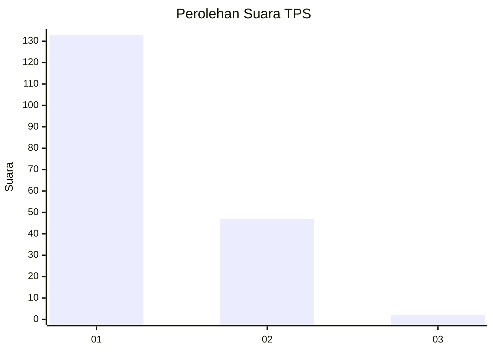
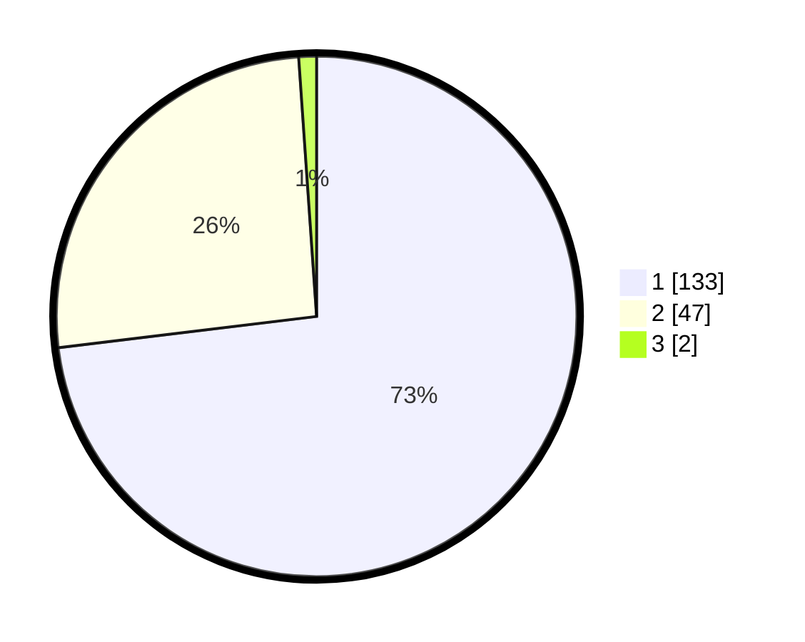

# Hasil

## Grafik

## Tabel

| No. | Nama Paslon    | Suara | Suara (raw) | Persentase |
|:--- |:-------------- | -----:| -----------:| ----------:|
| 1   | ANIES MUHAIMIN | 133   | [133][p-1]  | 73,08      |
| 2   | PRABOWO GIBRAN | 47    | [47][p-2]   | 25,82      |
| 3   | GANJAR MAHFUD  | 2     | [2][p-3]    | 1,10       |

[p-1]: https://github.com/gigit-pemilu/pemilu-2024-35-jawa-timur/blob/main/pilpres/hitung-suara/sub/35-jawa-timur/sub/29-sumenep/sub/27-kangayan/sub/2001-saobi/sub/014-tps/sub/paslon-1.txt
[p-2]: https://github.com/gigit-pemilu/pemilu-2024-35-jawa-timur/blob/main/pilpres/hitung-suara/sub/35-jawa-timur/sub/29-sumenep/sub/27-kangayan/sub/2001-saobi/sub/014-tps/sub/paslon-2.txt
[p-3]: https://github.com/gigit-pemilu/pemilu-2024-35-jawa-timur/blob/main/pilpres/hitung-suara/sub/35-jawa-timur/sub/29-sumenep/sub/27-kangayan/sub/2001-saobi/sub/014-tps/sub/paslon-3.txt

## Foto C Plano

https://sirekap-obj-formc.kpu.go.id/a9d9/pemilu/ppwp/35/29/27/20/01/3529272001014-20240226-165550--41899dd9-b6ab-4e2f-aa61-43d29bf58be5.jpg

https://sirekap-obj-formc.kpu.go.id/a9d9/pemilu/ppwp/35/29/27/20/01/3529272001014-20240226-165611--36fc6585-3573-4e08-9558-b674fa0e2885.jpg

https://sirekap-obj-formc.kpu.go.id/a9d9/pemilu/ppwp/35/29/27/20/01/3529272001014-20240226-165651--ed2dc79a-f45d-4e50-9329-7df10b1c511d.jpg

## Metadata

| Key        | Value               |
| ---------- | ------------------- |
| Time Stamp | 2024-02-28 19:00:00 |

